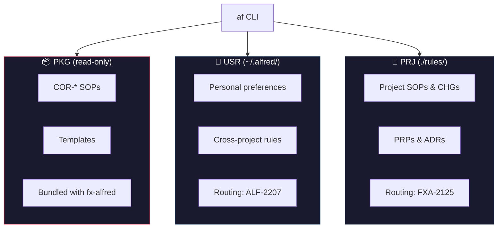
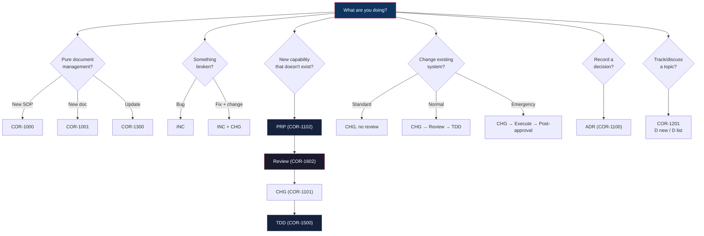

<p align="center">
  
</p>

<h1 align="center">Alfred</h1>
<p align="center"><strong>Agent Runbook</strong></p>

<p align="center">
  <em>Workflow routing, SOP checklists, and document management for AI agents and humans.</em>
</p>

<p align="center">
  <a href="https://pypi.org/project/fx-alfred/"></a>
  <a href="https://github.com/frankyxhl/alfred/actions"></a>
  
</p>

---

## What is Alfred?

Alfred is a CLI-based agent runbook (`af`) that manages SOPs, workflows, and structured documents across three layers (PKG, USR, PRJ). It provides:

- **Workflow Routing** — `af guide` tells AI agents which SOP to follow for any task
- **Workflow Checklists** — `af plan` generates step-by-step checklists from SOPs
- **Document Validation** — `af validate` enforces metadata format, status values, and section structure
- **Document Lifecycle** — Create, read, update, search, and index documents with consistent naming

Alfred is designed to be used by both AI agents (Claude Code, Codex, Gemini) and humans.

## Quick Start

```bash
pip install fx-alfred
cd my-project
af guide          # see workflow routing (PKG → USR → PRJ)
af list           # list all documents
af read COR-1000  # read a specific document
```

## Features

### Workflow Routing (`af guide`)

Scans three layers for routing documents and outputs a complete workflow guide:

```bash
af guide --root /path/to/project
```

```
═══ PKG: COR-1103 Workflow Routing ═══
  Intent-based router: ALWAYS → PRIMARY ROUTE → OVERLAYS
  Golden rules from all COR SOPs

═══ USR: ALF-2207 Workflow Routing USR ═══
  Cross-project user preferences

═══ PRJ: FXA-2125 Workflow Routing PRJ ═══
  Project-specific decision tree
```

### Workflow Checklists (`af plan`)

Generate step-by-step checklists from SOPs — optimized for LLM consumption:

```bash
af plan COR-1102 COR-1602 COR-1500    # LLM-optimized output
af plan --human COR-1102               # human-readable format
af plan --init                          # suggested prompts for agent config
```

```
# Session Workflow — Follow each phase in order.

## Phase 1: COR-1102 (Create Proposal)
- [ ] 1. Create the PRP document
- [ ] 2. Fill in required sections
- [ ] 3. Review via COR-1602

## Phase 2: COR-1602 (Multi Model Parallel Review)
- [ ] 1. Dispatch Reviewers
- [ ] 2. Both >= 9? Proceed. Otherwise revise.
⚠️ DO NOT PROCEED WITHOUT PASSING REVIEW

## RULES
- Complete each checkbox before moving to the next phase
- Declare active SOP at every phase transition
```

### Document Validation (`af validate`)

Enforces document health across all layers:

```bash
af validate --root /path/to/project
```

Checks:
- H1 format (`# TYP-ACID: Title`)
- Per-type required metadata fields (Applies to, Last updated, Last reviewed, Status)
- Status values against allowed set per document type
- Change History table structure
- SOP required sections (What Is It?, Why, When to Use, When NOT to Use, Steps)

```
86 documents checked, 0 issues found.
```

### Document Management

```bash
# Create
af create sop --prefix FXA --area 21 --title "My SOP"
af create prp --prefix FXA --area 21 --title "My Proposal"

# Read
af read COR-1000                    # by PREFIX-ACID
af read 1000                        # by ACID only

# Update
af update FXA-2107 --status "Completed"
af update FXA-2107 --history "Done" --by "Claude"
af update FXA-2107 --title "New Title" -y

# Search
af search "validation"              # search content across all docs

# List & Filter
af list --type SOP                  # filter by type
af list --prefix FXA --json         # filter + JSON output

# Other
af status                           # document counts by type/layer
af index                            # regenerate project index
af changelog                        # view version history
```

## Three-Layer Document Model



| Layer | Location | Writable | Scope |
|-------|----------|----------|-------|
| **PKG** | Bundled in package | No | Universal COR documents |
| **USR** | `~/.alfred/` | Yes | Personal, cross-project |
| **PRJ** | `./rules/` | Yes | Project-specific |

## Document Types

| Type | Purpose | Example |
|------|---------|---------|
| **SOP** | Standard Operating Procedure | How to create a document |
| **PRP** | Proposal | Design for a new feature |
| **CHG** | Change Request | Modify existing system |
| **ADR** | Architecture Decision Record | Record a decision |
| **REF** | Reference | Glossary, index, contract |
| **PLN** | Plan | Execution schedule |
| **INC** | Incident | Bug report, outage record |

## Document Format

```
<PREFIX>-<ACID>-<TYP>-<Title-With-Hyphens>.md

FXA-2134-PRP-AF-Plan-Command-Workflow-Checklist.md
COR-1103-SOP-Workflow-Routing.md
```

## For AI Agents

### Session Start

```bash
af guide --root /path/to/project    # 1. See routing + decision tree
af plan COR-1102 COR-1602 COR-1500 # 2. Generate workflow checklist
```

### First Time Setup

```bash
af plan --init                      # See suggested prompts for your agent config
```

### Decision Tree (COR-1103)



### Key SOPs

| SOP | What it does |
|-----|-------------|
| COR-1103 | Workflow routing — which SOP to follow for any task |
| COR-1102 | Create Proposal (PRP lifecycle) |
| COR-1101 | Submit Change Request (CHG) |
| COR-1500 | TDD Development Workflow |
| COR-1602 | Multi-Model Parallel Review |
| COR-1608 | PRP Review Scoring rubric |
| COR-1611 | Reviewer Calibration Guide |

### Review Scoring

Alfred includes a standardized review scoring framework:

- **COR-1608** — PRP scoring (6 weighted dimensions + OQ hard gate)
- **COR-1609** — CHG scoring (5 dimensions)
- **COR-1610** — Code scoring (5 dimensions)
- **COR-1611** — Shared reviewer calibration guide

Pass threshold: >= 9.0/10. All deductions must cite specific lines.

## Commands Reference

```
af guide [--root DIR]              Show workflow routing (PKG → USR → PRJ)
af plan SOP_ID [...] [--root DIR]  Generate workflow checklist from SOPs
af plan --human SOP_ID [...]       Human-readable checklist
af plan --init                     Suggested prompts for agent config
af list [--type] [--prefix] [--source] [--json]
af read IDENTIFIER [--json]
af create TYPE --prefix P --acid N|--area N --title T [--layer] [--subdir]
af update IDENTIFIER [--status] [--field K V] [--history] [--title] [--dry-run]
af search PATTERN
af validate [--root DIR]
af status [--json]
af index
af changelog
```

## Install / Upgrade

```bash
pip install fx-alfred              # install
pipx install fx-alfred             # install (isolated)
pipx upgrade fx-alfred             # upgrade
```

## Changelog

See [CHANGELOG.md](src/fx_alfred/CHANGELOG.md) or run `af changelog`.

## License

MIT
