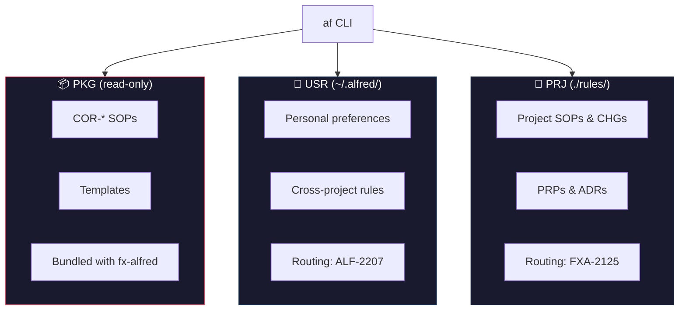
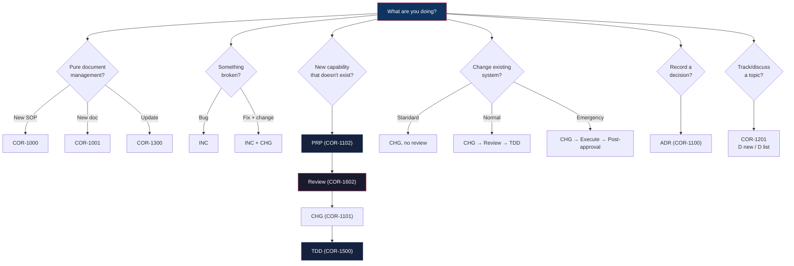

<p align="center">
  
</p>

<h1 align="center">Alfred</h1>
<p align="center"><strong>Agent Runbook</strong></p>

<p align="center">
  <em>Workflow routing, SOP checklists, and document management for AI agents and humans.</em>
</p>

<p align="center">
  <a href="https://pypi.org/project/fx-alfred/"></a>
  <a href="https://github.com/frankyxhl/alfred/actions"></a>
  
</p>

---

## What is Alfred?

Alfred is a CLI-based agent runbook (`af`) that manages SOPs, workflows, and structured documents across three layers (PKG, USR, PRJ). It provides:

- **Workflow Routing** — `af guide` tells AI agents which SOP to follow for any task
- **Workflow Checklists** — `af plan` generates step-by-step checklists from SOPs. With `--task "<description>"` auto-composes the SOP set from tags; `--todo` flattens into a unified checklist; `--graph` renders ASCII + Mermaid flowcharts with intra-SOP loops and gates
- **Document Validation** — `af validate` enforces metadata format, status values, and section structure
- **Document Formatting** — `af fmt` normalizes metadata order, whitespace, and table alignment to canonical style
- **File Path Lookup** — `af where` prints the absolute filesystem path of any document by identifier
- **Document Lifecycle** — Create, read, update, search, and index documents with consistent naming
- **Tags Metadata** — Optional `Tags:` field, exposed via `Document.tags` and filterable with `af list --tag`
- **JSON Output** — `--json` flag on guide/plan/search/validate for machine-readable output
- **Spec-driven Updates** — `--spec FILE` on create/update for batch metadata and section changes

Alfred is designed to be used by both AI agents (Claude Code, Codex, Gemini) and humans.

## Quick Start

```bash
pip install fx-alfred
cd my-project
af guide          # see workflow routing (PKG → USR → PRJ)
af list           # list all documents
af read COR-1000  # read a specific document
```

## Features

### Workflow Routing (`af guide`)

Scans three layers for routing documents and outputs a complete workflow guide:

```bash
af guide --root /path/to/project
```

```
═══ PKG: COR-1103 Workflow Routing ═══
  Intent-based router: ALWAYS → PRIMARY ROUTE → OVERLAYS
  Golden rules from all COR SOPs

═══ USR: ALF-2207 Workflow Routing USR ═══
  Cross-project user preferences

═══ PRJ: FXA-2125 Workflow Routing PRJ ═══
  Project-specific decision tree
```

### Workflow Checklists (`af plan`)

Generate step-by-step checklists from SOPs — optimized for LLM consumption:

```bash
af plan COR-1102 COR-1602 COR-1500            # phased checklist from named SOPs
af plan --human COR-1102                       # human-readable format
af plan --task "implement FXA-XXXX PRP"        # auto-compose SOPs from tags (COR-1202)
af plan --task "..." --todo --graph            # flat TODO + ASCII + Mermaid graph
af plan --task "..." --graph --graph-format=ascii    # ASCII only (terminal)
af plan --task "..." --graph --graph-format=mermaid  # Mermaid only (GitHub / Obsidian)
af setup                                       # suggested prompts for agent config
```

**Auto-compose** matches the task description against `Task tags:` SOP metadata
(deterministic, no LLM), includes any SOP with `Always included: true` as a
baseline (e.g., COR-1103 routing), and topologically orders the result via
`Workflow input`/`Workflow output` edges with layer+ASCII tiebreaks.

**`--todo`** flattens all phases into one continuously-numbered checklist with
`[SOP-ID]` provenance, `⚠️ gate` markers, and `🔁 loop-start` /
`🔁 back to N.M (max K)` markers driven by `Workflow loops:` SOP metadata.

**`--graph`** emits both an ASCII box-and-arrow diagram (Unicode-width aware,
terminal-friendly) and a fenced Mermaid block (pasteable into GitHub / Obsidian).
Use `--graph-format={ascii,mermaid,both}` to pick one.

See [COR-1202 (Compose Session Plan)](src/fx_alfred/rules/COR-1202-SOP-Compose-Session-Plan.md)
for the canonical usage procedure.

### Document Validation (`af validate`)

Enforces document health across all layers:

```bash
af validate --root /path/to/project
```

Checks:
- H1 format (`# TYP-ACID: Title`)
- Per-type required metadata fields (Applies to, Last updated, Last reviewed, Status)
- Status values against allowed set per document type
- Change History table structure
- SOP required sections (What Is It?, Why, When to Use, When NOT to Use, Steps)

```
207 documents checked, 0 issues found.
```

### Document Management

```bash
# Create
af create sop --prefix FXA --area 21 --title "My SOP"
af create prp --prefix FXA --area 21 --title "My Proposal"
af create sop --prefix FXA --area 21 --title "My SOP" --spec fields.yaml  # from spec file

# Read
af read COR-1000                    # by PREFIX-ACID
af read 1000                        # by ACID only

# Update
af update FXA-2107 --status "Active"
af update FXA-2107 --history "Done" --by "Claude"
af update FXA-2107 --title "New Title" -y
af update FXA-2107 --spec patch.yaml  # batch update via spec file

# Format
af fmt                              # show diff for all PRJ documents
af fmt FXA-2107                     # show diff for one document
af fmt --write                      # apply canonical formatting in-place
af fmt --check                      # CI check: exit 1 if any changes needed

# Search
af search "validation"              # search content across all docs
af search "validation" --json       # JSON output

# List & Filter
af list --type SOP                  # filter by type
af list --tag release               # filter by tag
af list --prefix FXA --json         # filter + JSON output

# Other
af guide --json                     # routing guide as JSON
af validate --json                  # validation results as JSON
af status                           # document counts by type/layer
af index                            # regenerate project index
af changelog                        # view version history

# Where (file path lookup)
af where FXA-2107                   # print absolute path
af where FXA-2107 --json            # JSON: {doc_id, path, source, filename}
vi $(af where FXA-2107)             # composable with shell tools
```

## Three-Layer Document Model



| Layer | Location | Writable | Scope |
|-------|----------|----------|-------|
| **PKG** | Bundled in package | No | Universal COR documents |
| **USR** | `~/.alfred/` | Yes | Personal, cross-project |
| **PRJ** | `./rules/` | Yes | Project-specific |

## Document Types

| Type | Purpose | Example |
|------|---------|---------|
| **SOP** | Standard Operating Procedure | How to create a document |
| **PRP** | Proposal | Design for a new feature |
| **CHG** | Change Request | Modify existing system |
| **ADR** | Architecture Decision Record | Record a decision |
| **REF** | Reference | Glossary, index, contract |
| **PLN** | Plan | Execution schedule |
| **INC** | Incident | Bug report, outage record |

## Document Format

```
<PREFIX>-<ACID>-<TYP>-<Title-With-Hyphens>.md

FXA-2134-PRP-AF-Plan-Command-Workflow-Checklist.md
COR-1103-SOP-Workflow-Routing.md
```

## For AI Agents

### Session Start

```bash
af guide --root /path/to/project    # 1. See routing + decision tree
af plan COR-1102 COR-1602 COR-1500 # 2. Generate workflow checklist
```

### First Time Setup

```bash
af setup                            # See suggested prompts for your agent config
```

### Decision Tree (COR-1103)



### Key SOPs

| SOP | What it does |
|-----|-------------|
| COR-1103 | Workflow routing — which SOP to follow for any task |
| COR-1202 | Compose Session Plan — `af plan --task … --todo --graph` for full session workflow |
| COR-1102 | Create Proposal (PRP lifecycle) |
| COR-1101 | Submit Change Request (CHG) |
| COR-1500 | TDD Development Workflow |
| COR-1602 | Multi-Model Parallel Review |
| COR-1612 | Respond to PR review comments on GitHub |
| COR-1608 | PRP Review Scoring rubric |
| COR-1611 | Reviewer Calibration Guide |

### Review Scoring

Alfred includes a standardized review scoring framework:

- **COR-1608** — PRP scoring (6 weighted dimensions + OQ hard gate)
- **COR-1609** — CHG scoring (5 dimensions)
- **COR-1610** — Code scoring (5 dimensions)
- **COR-1611** — Shared reviewer calibration guide

Pass threshold: >= 9.0/10. All deductions must cite specific lines.

## Commands Reference

```
af guide [--root DIR] [--json]
af plan [SOP_ID ...] [--root DIR] [--task TEXT] [--todo] [--graph] [--graph-format ascii|mermaid|both] [--human] [--json]
af list [--type TYPE] [--prefix PREFIX] [--source SOURCE] [--tag TAG] [--json]
af read IDENTIFIER [--json]
af create TYPE --prefix P --acid N|--area N --title T [--layer project|user] [--subdir DIR] [--spec FILE] [--dry-run]
af update IDENTIFIER [--status STATUS] [--field KEY VALUE] [--history TEXT] [--by NAME] [--title TITLE] [-y|--yes] [--dry-run] [--spec FILE]
af fmt [DOC_IDS...] [--write] [--check]
af where IDENTIFIER [--json]
af search PATTERN [--json]
af validate [--root DIR] [--json]
af setup
af status [--json]
af index
af changelog
```

## Install / Upgrade

```bash
pip install fx-alfred              # install
pipx install fx-alfred             # install (isolated)
pipx upgrade fx-alfred             # upgrade
```

## Changelog

See [CHANGELOG.md](src/fx_alfred/CHANGELOG.md) or run `af changelog`.

## License

MIT
