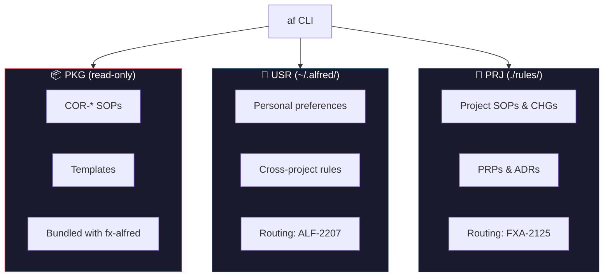
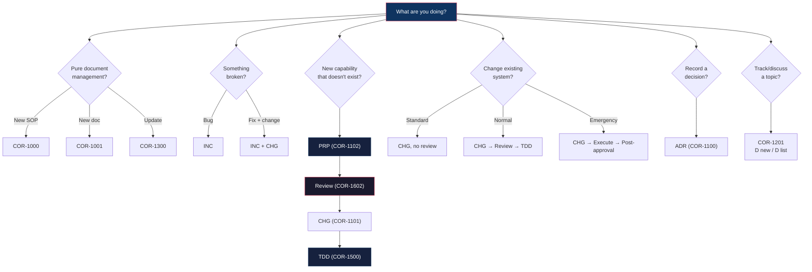

<p align="center">
  
</p>

<h1 align="center">Alfred</h1>
<p align="center"><strong>Agent Runbook</strong></p>

<p align="center">
  <em>Workflow routing, SOP checklists, and document management for AI agents and humans.</em>
</p>

<p align="center">
  <a href="https://pypi.org/project/fx-alfred/"></a>
  <a href="https://github.com/frankyxhl/alfred/actions"></a>
  
</p>

---

## What is Alfred?

Alfred is a CLI-based agent runbook (`af`) that manages SOPs, workflows, and structured documents across three layers (PKG, USR, PRJ). It provides:

- **NEW in v1.27.0** — [COR-1005 (Engineer Workflow Loops)](src/fx_alfred/rules/COR-1005-SOP-Engineer-Workflow-Loops.md): the loop-engineering discipline for non-sequential SOPs — a control-flow shape decision test (sequential vs `Workflow branches:` vs `Workflow loops:` vs cross-SOP back-edge), dual-exit design (observable success condition + defined exhaustion path), `max_iterations` budgeting, exact metadata syntax, and `af plan --graph` verification. Applied corpus-wide in the same release: eight bundled docs now declare ten machine-readable back-edges (review loops COR-1600/1601, PR-comment loop COR-1612, bot loop COR-1615, decision-matrix loops COR-1802, and COR-1617's twelve phases became parser-visible — `af plan COR-1617` previously extracted zero steps), all pinned by a new 17-test regression guard. Dev toolchain: ruff pinned `<0.16` to stop unpinned-lint drift breaking CI.
- **v1.26.0** — [COR-1209 (Session Handoff Prompt)](src/fx_alfred/rules/COR-1209-SOP-Session-Handoff-Prompt.md) joins the bundled session-lifecycle family: a standard for handing in-flight work to a new session/runtime with freshly fetched state, explicit exclusions, and a copy-pasteable template. Plus the review-backlog closeout: `af fmt` warns on ragged Change History rows before institutionalizing them, three raw-traceback paths turned into graceful errors (`af agent run` decode, unreadable docs in guide/plan, `af export -o` into a missing dir), one wcwidth authority for workflow graphs (gate-marker/tab/ZWJ alignment), `af guide --json` emits raw source values, Windows-safe stale-tmp cleanup, documented `uv sync --extra dev` bootstrap + `af agent` trust model, and a net-negative dead-code cleanup.
- **v1.25.2** — Ten-fix patch batch from the full-repo review (#266–#275): `af validate` reports duplicate IDs per file (no more shadowed same-ID docs), branch/loop validation agrees with the planner on step headings (`## Rule`/`## Rules`/`## Concepts`), `af plan` fails loudly on all-skipped requests (JSON gains a `skipped` list), `af update --dry-run` renders a real unified diff, Status changes reindex immediately, `af search --json` emits raw source values, `af fmt` field order re-synced with the schema, `af log-archive` runs without `os.fchmod`, atomic writes preserve file permissions, and case-only renames work on case-insensitive filesystems.
- **v1.25.1** — Patch release: two silent data-loss paths in the activity-log archive are closed (concurrent appends can no longer be lost mid-archive: #263/#289; re-archiving a reappeared loose file now merges same-named `archive.zip` members instead of destroying archived rows, with matching shadow-union read semantics: #264/#290), `af create` refuses empty-slug titles that produced scanner-invisible orphan files (#265/#291), and fence handling is unified across write/scan paths (#262/#288).
- **v1.25.0** — The sandboxed-worker development lane: [COR-1628 (Sandboxed Worker CLI Dispatch)](src/fx_alfred/rules/COR-1628-SOP-Sandboxed-Worker-CLI-Dispatch.md) is the dispatch contract for implementation workers running as external sandboxed one-shot CLIs (reference: `codex exec`) — invocation rules, task-brief template, sandbox scope clause, orchestrator verification, and an observed-failure-mode table; [COR-1629 (Loop Config Starter Template)](src/fx_alfred/rules/COR-1629-REF-Loop-Config-Starter-Template.md) instantiates the whole COR-1617 loop for a new repo in ~10 minutes (all 30 COR-1622 keys, codex lane + two-worker TDD pre-wired). Also three parser/formatter data-integrity fixes: wide Change History rows, metadata-block comments/blank lines, and sub-step ID / Mermaid rendering (#281, #282, #283).
- **NEW in v1.24.0** — Tagging governance promoted to the bundled COR layer: `COR-1003 (Tag Document)` makes the tag mechanism + process route via `af guide` in **every** project (COR-1103's intent router now has a tag/retag branch). It is an `optional-overlay`; a project records its own vocabulary in a PRJ SOP that declares `**Overlays:** COR-1003` (FXA-2315 is this repo's instance), and `af validate` enforces the Disposition/Overlays binding.
- **v1.23.0** — Document tagging: tag any document with a controlled vocabulary and filter the corpus with `af list --tag <tag>`. `af tag ls` lists the vocabulary, `af tag show <tag>` lists matching docs, and `af tag add/rm <ID> <tag>...` write tags directly (#247, #248, FXA-2315). Personal workflow markers (`todo`, `wip`, `later`, …) can be self-served without a code PR via `af tag vocab add/rm/ls`, which manages a per-user `custom_tags` list in `~/.alfred/preferences.yaml` that unions with the system vocabulary — so they stop warning in both `af tag add` and `af validate` (#256, #257, FXA-2317). `af validate` gains a tag-vocabulary check with `--tag-warnings={off,summary,detail}` and `--warn-untagged-sops` (#251, #254).
- **v1.22.0** — `~/.alfred/projects.json` sub-project layer: map any external repo root to a `~/.alfred/<NAME>/` subdir and it becomes that repo's PRJ layer — project-scoped routing for third-party repos that cannot host `rules/`, with automatic cwd resolution and no `--root` needed (FXA-2314). Also: an append-only activity usage ledger (`af log` / `af log-archive` / `af log-validate`); COR-1402 active-process declaration lines embedded in every `af plan` phase; per-doc `af validate <DOC_IDS>` targeting; and `af index` now shows document Status as a dedicated column.
- **v1.21.0** — `af issue lint` now enforces the [COR-1501](src/fx_alfred/rules/COR-1501-SOP-Create-GitHub-Issue.md) blueprint structure, not just TBD-phrases: it validates an issue body against the repo's own `.github/ISSUE_TEMPLATE/blueprint.md` (required sections derived from that template, `(optional)` headings exempt) and flags `missing-section` / `no-acceptance-criteria` violations with a COR-1501 pointer. The template is found by walking up from the invoking repo, bounded at the `.git` boundary; the check is skipped when the repo has no such template. Also: a cross-platform [agent-skill bundle](skills/alfred/README.md) (`skills/alfred/` — one contract, native carriers for Claude Code / Codex / Copilot / droid / opencode), multi-target localization bindings, and the [COR-1508 Minimal Code Ladder](src/fx_alfred/rules/COR-1508-SOP-Minimal-Code-Ladder.md) write-time gate.
- **v1.20.0** — `af export` — single-file runbook for zero-install consumption: flattens the layer-merged corpus (PKG + USR + PRJ) into one self-contained Markdown stream with a no-CLI preamble, routing documents first, and collision-safe delimiters; recipients (humans or AI agents) need nothing installed. Repeatable `--source`/`--type` filters (`--source pkg --source prj` shares project + bundled docs without the personal USR layer), `--include README.md` attaches project files, `--list` audits the exact set before sharing, `--source pkg` is the public-only safe path, deterministic output for clean vendoring diffs.
- **v1.19.0** — Project-root auto-discovery: every command now resolves the nearest ancestor directory whose `rules/` contains Alfred documents, so `af` works from any project subdirectory without `--root` (explicit `--root` still wins). `af plan` no longer silently drops steps: section extraction and step rendering are now fence-aware (bash comments and numbered lines inside code blocks are body content, not boundaries or steps) — 10 bundled/user SOPs were affected. `af validate` warns on unknown document TYPE codes instead of silently skipping type-specific checks (`--json` gains an additive `warnings` field). All `--json` output is now uniformly indented UTF-8 (CJK content renders as written instead of `\uXXXX` escapes). CI now tests Python 3.10/3.12/3.14 with pyright and format gates.
- **v1.18.0** — `af issue lint <body-file>` Phase 1 MVP — pre-creation lint for GitHub issue bodies; detects TBD-after-PR-review anti-patterns (5 canonical phrases, case-insensitive substring match) with `--json` output and `-` stdin support. Plus PKG SOP additions: [Two-Worker TDD Dispatch (PRP-1507)](src/fx_alfred/rules/COR-1507-PRP-Two-Worker-TDD-Dispatch.md) opt-in cross-validation pattern (new `<test-writer-worker-agent>` parameter in COR-1622, dispatch contract in COR-1619, Worker-assignment rule in COR-1500); [COR-1620 Primitive 5](src/fx_alfred/rules/COR-1620-SOP-Self-Pacing-Loop-Primitives.md) Status-Communication Contract forbidding silent wake-and-yield; [COR-1501 §Quality Criteria](src/fx_alfred/rules/COR-1501-SOP-Create-GitHub-Issue.md) author-side write-time targets; COR-1617/COR-1618 reconciled on loop-start triggers.
- **v1.17.1** — PRJ-layer documentation: FXA-1623 review thread watchdog, FXA-2285 pre-merge bot sweep gate, review-loop refinements (COR-1602/1612/1615).
- **v1.17.0** — [PR Review Thread Verification (COR-1623)](src/fx_alfred/rules/COR-1623-SOP-PR-Review-Thread-Verification.md) audits unresolved GitHub PR review threads against exact source content at the PR head SHA; [Review GitHub Issue Quality (COR-1506)](src/fx_alfred/rules/COR-1506-SOP-Review-GitHub-Issue-Quality.md) scores `blueprint-ready` issues with a weighted implementation-readiness rubric.
- **v1.16.0** — [Build Weighted Decision Matrix (COR-1802)](src/fx_alfred/rules/COR-1802-SOP-Build-Weighted-Decision-Matrix.md) codifies rubric design and calibration; COR-1200 gained retrospective scoring; COR-1617 added Phase 11 Retrospective; COR-1622 added resilience parameters.
- **v1.15.0** — COR-1501 aligned with iterwheel intake conventions (label taxonomy completed, `Applies to:` scoped, portability note); COR-1617 §Phase 7 closing-token prescription tightened (bare `Closes #N` required, verify via `closingIssuesReferences`); §Phase 10/11 advances on mergeable not merged.
- **v1.14.0** — [Multi-Agent Workflow Loop (COR-1617 cluster)](src/fx_alfred/rules/COR-1617-SOP-Multi-Agent-Workflow-Loop.md) — umbrella SOP for consensus-driven multi-agent task execution with consent gates, worker dispatch, and loop primitives. Ships COR-1617/1618/1619/1620/1621/1622. Also: COR-1612 §Scoping bot reviews via PR body; COR-1615 pointer; new `.github/ISSUE_TEMPLATE/blueprint.md` for iterwheel intake.
- **v1.13.0** — Per-user document bookmarking: `af star <ID>`, `af unstar <ID>`, `af starred`. Bookmark any doc directly by ACID; persists in `~/.alfred/preferences.yaml`; documents are not modified.
- **v1.12.0** — [Contract-First Delivery Workflow (COR-1616)](src/fx_alfred/rules/COR-1616-SOP-Contract-First-Delivery-Workflow.md) — project-neutral reviewed-delivery loop (contract → plan review → TDD/BDD/E2E → impl review → identity-correct PR → PR review loop → close out), promoted from Babs `BAB-1503`. Also: pytest test-marker governance gate, skills-absorption round 5 (COR-1207, COR-1208, FXA-2248).
- **v1.10.0** — Agent-editable helpers and skill documents: `af agent call/run`, `af skill list/read`, and `af plan --with-skills`
- **v1.9.1** — [GitHub App PR Review Bot Loop (COR-1615)](src/fx_alfred/rules/COR-1615-SOP-GitHub-App-PR-Review-Bot-Loop.md) for Codex Connector / Copilot PR review loops; v1.9.0 added [Council Review (COR-1613)](src/fx_alfred/rules/COR-1613-SOP-Council-Review.md) and [Diagnose Feedback Loop (COR-1503)](src/fx_alfred/rules/COR-1503-SOP-Diagnose-Feedback-Loop.md)
- **Workflow Routing** — `af guide` tells AI agents which SOP to follow for any task
- **Workflow Checklists** — `af plan` generates step-by-step checklists from SOPs. With `--task "<description>"` auto-composes the SOP set from tags; `--todo` flattens into a unified checklist; `--graph` renders ASCII + Mermaid flowcharts with intra-SOP loops and gates; `--with-skills` recommends matching skill docs
- **Agent Helpers & Skills** — `af agent` runs explicitly gated local Python helpers/scripts, while `af skill` discovers and reads reusable REF/SOP skill documents without executing code
- **Document Validation** — `af validate` enforces metadata format, status values, and section structure; warns on unknown TYPE codes
- **Single-File Export** — `af export` flattens the layer-merged corpus into one self-contained Markdown runbook for zero-install readers (AI agents included); `--list` audits the set before sharing
- **Cross-Platform Agent Skill** — `skills/alfred/` ships drop-in instructions that teach Claude Code, Codex, GitHub Copilot, droid, and opencode to drive the `af` CLI; one canonical contract + three native carriers (`SKILL.md`, `AGENTS.md`, `copilot-instructions.md`) kept in sync by a drift-guard test. See `skills/alfred/README.md`
- **Document Formatting** — `af fmt` normalizes metadata order, whitespace, and table alignment to canonical style
- **File Path Lookup** — `af where` prints the absolute filesystem path of any document by identifier
- **Document Lifecycle** — Create, read, update, search, and index documents with consistent naming
- **Tags Metadata** — Optional `Tags:` field, exposed via `Document.tags` and filterable with `af list --tag`
- **Issue Body Linting** — `af issue lint <body-file>` flags TBD-after-PR-review anti-patterns AND checks the COR-1501 blueprint structure (required `##` sections + an Acceptance-Criteria checkbox) against the repo's own `.github/ISSUE_TEMPLATE/blueprint.md`; `--json` machine output; `-` reads stdin
- **JSON Output** — `--json` flag on guide/plan/search/validate for machine-readable output
- **Spec-driven Updates** — `--spec FILE` on create/update for batch metadata and section changes

Alfred is designed to be used by both AI agents (Claude Code, Codex, Gemini) and humans.

## Quick Start

```bash
pip install fx-alfred
cd my-project
af guide          # see workflow routing (PKG → USR → PRJ)
af list           # list all documents
af validate --root .  # validate all documents
af export -o runbook.md  # single-file runbook for zero-install readers
af read COR-1000  # read a specific document
```

## Features

### Workflow Routing (`af guide`)

Scans three layers for routing documents and outputs a complete workflow guide:

```bash
af guide --root /path/to/project
```

```
═══ PKG: COR-1103 Workflow Routing ═══
  Intent-based router: ALWAYS → PRIMARY ROUTE → OVERLAYS
  Golden rules from all COR SOPs

═══ USR: ALF-2207 Workflow Routing USR ═══
  Cross-project user preferences

═══ PRJ: FXA-2125 Workflow Routing PRJ ═══
  Project-specific decision tree
```

### Workflow Checklists (`af plan`)

Generate step-by-step checklists from SOPs — optimized for LLM consumption:

```bash
af plan COR-1102 COR-1602 COR-1500            # phased checklist from named SOPs
af plan --human COR-1102                       # human-readable format
af plan --task "implement FXA-XXXX PRP"        # auto-compose SOPs from tags (COR-1202)
af plan --task "..." --todo --graph            # flat TODO + ASCII + Mermaid graph
af plan --task "..." --with-skills             # append matching skill docs
af plan --task "..." --graph --graph-format=ascii    # ASCII only (terminal)
af plan --task "..." --graph --graph-format=mermaid  # Mermaid only (GitHub / Obsidian)
af setup                                       # suggested prompts for agent config
```

**Auto-compose** matches the task description against `Task tags:` SOP metadata
(deterministic, no LLM), includes any SOP with `Always included: true` as a
baseline (e.g., COR-1103 routing), and topologically orders the result via
`Workflow input`/`Workflow output` edges with layer+ASCII tiebreaks.

**`--todo`** flattens all phases into one continuously-numbered checklist with
`[SOP-ID]` provenance, `⚠️ gate` markers, and `🔁 loop-start` /
`🔁 back to N.M (max K)` markers driven by `Workflow loops:` SOP metadata.

**`--graph`** emits both an ASCII box-and-arrow diagram (Unicode-width aware,
terminal-friendly) and a fenced Mermaid block (pasteable into GitHub / Obsidian).
Use `--graph-format={ascii,mermaid,both}` to pick one.

**`--graph-layout={nested,flat}`** (v1.7.0+, ASCII-only) chooses the DAG shape.
The default **`nested`** layout draws each SOP as an outer phase-box containing
inner step-boxes with `▼` connectors. Intra-SOP loops render as a `🔁 → N.M max K`
annotation line inside the phase box. Cross-SOP loops — declared via
`Workflow loops: [{from: N, to: "PREFIX-ACID.step", ...}]` metadata — render as a
right-side vertical track (`◄───┐ ... ───┘ max N`) that spans phase boundaries.
**`flat`** restores the v1.6.x layout (one phase-box per SOP, steps listed inside,
intra-SOP loops only) for downstream tooling pinned on the legacy shape.

See [COR-1202 (Compose Session Plan)](src/fx_alfred/rules/COR-1202-SOP-Compose-Session-Plan.md)
for the canonical usage procedure.

### Agent Helpers and Skills

Run explicit local helper code only after opting in:

```bash
ALFRED_AGENT_TOOLS=1 af agent call collect_review_pack --arg root=. --json
ALFRED_AGENT_TOOLS=1 af agent run scripts/check_release.py --json
```

`af agent call` loads public functions from `<project-root>/.alfred/agent_helpers.py`
first, then `~/.alfred/agent_helpers.py`. The exact
`ALFRED_AGENT_TOOLS=1` gate is checked before importing helper code.

**Trust model.** Setting `ALFRED_AGENT_TOOLS=1` is full arbitrary-code-execution
consent: `af agent call` imports the PRJ and USR helper modules at lookup time
(their import-time side effects run merely to resolve a name), `af agent run`
accepts absolute script paths outside the project root, and execution uses the
current Python interpreter with no sandboxing. Only set the gate when you trust
both the repository's `.alfred/` content and your global
`~/.alfred/agent_helpers.py` as you would any executable code.

Discover reusable skill documents without executing code:

```bash
af skill list
af skill list --task "release fx-alfred to pypi" --json
af skill read skill-release-to-pypi
```

A skill is a `REF` or `SOP` document with explicit `Tags: skill` metadata.
`af plan --task "..." --with-skills` appends matched skills to the plan; JSON
output adds `recommended_skills` and uses schema version `3`.

See [FXA-2237](rules/FXA-2237-REF-Agent-Helpers-And-Skills-Usage.md) for the
full usage reference.

### Testing

The pytest suite uses strict registered markers:

```bash
pytest --tb=short
pytest -m "not slow" --tb=short
pytest --cov=src/fx_alfred --cov-report=term-missing --cov-fail-under=95
```

Markers:
- `unit` — narrow module or pure-function tests
- `cli` — `af` command surface and Click command wiring
- `integration` — filesystem, packaging, subprocess, or cross-module behavior
- `docs` — document, rule, template, or documentation behavior
- `slow` — intentionally slower tests for local loop exclusion

Unknown markers fail because pytest runs with `--strict-markers`.

### Document Validation (`af validate`)

Enforces document health across all layers (H1 format, required metadata,
status values, Change History, SOP sections, layer rules). Unknown TYPE
codes emit a warning — type-specific checks are skipped but never silently:

```bash
af validate --root /path/to/project   # --root optional: nearest project root is auto-discovered
```

Checks:
- H1 format (`# TYP-ACID: Title`)
- Per-type required metadata fields (Applies to, Last updated, Last reviewed, Status)
- Status values against allowed set per document type
- Change History table structure
- SOP required sections (What Is It?, Why, When to Use, When NOT to Use, Steps)

```
207 documents checked, 0 issues found.
```

### Document Management

```bash
# Create
af create sop --prefix FXA --area 21 --title "My SOP"
af create prp --prefix FXA --area 21 --title "My Proposal"
af create sop --prefix FXA --area 21 --title "My SOP" --spec fields.yaml  # from spec file

# Read
af read COR-1000                    # by PREFIX-ACID
af read 1000                        # by ACID only

# Update
af update FXA-2107 --status "Active"
af update FXA-2107 --history "Done" --by "Claude"
af update FXA-2107 --title "New Title" -y
af update FXA-2107 --spec patch.yaml  # batch update via spec file

# Format
af fmt                              # show diff for all PRJ documents
af fmt FXA-2107                     # show diff for one document
af fmt --write                      # apply canonical formatting in-place
af fmt --check                      # CI check: exit 1 if any changes needed

# Search
af search "validation"              # search content across all docs
af search "validation" --json       # JSON output

# List & Filter
af list --type SOP                  # filter by type
af list --tag release               # filter by tag
af list --prefix FXA --json         # filter + JSON output

# Star (per-user bookmarks, ~/.alfred/preferences.yaml)
af star COR-1202                    # bookmark a doc (PREFIX-ACID, prefix-case-insensitive, or ACID-only)
af star 1202                        # ACID-only when unambiguous
af starred                          # list bookmarks; (missing) marks deleted docs
af starred --json                   # {schema_version, starred_docs, missing}
af unstar COR-1202                  # remove bookmark (works on stale entries too)

# Other
af guide --json                     # routing guide as JSON
af validate --json                  # validation results as JSON
af status                           # document counts by type/layer
af index                            # regenerate project index
af changelog                        # view version history
af log "summary" --ref COR-1205     # append an activity-ledger row
af log-validate [PATH]              # validate activity ledger JSONL / archive.zip
af log-archive                      # archive closed-day activity logs

# Where (file path lookup)
af where FXA-2107                   # print absolute path
af where FXA-2107 --json            # JSON: {doc_id, path, source, filename}
vi $(af where FXA-2107)             # composable with shell tools
```

## Three-Layer Document Model


```mermaid
graph TD
    AF["af CLI"] --> PKG
    AF --> USR
    AF --> PRJ

    subgraph PKG ["📦 PKG (read-only)"]
        direction LR
        P1["COR-* SOPs"]
        P2["Templates"]
        P3["Bundled with fx-alfred"]
    end

    subgraph USR ["👤 USR (~/.alfred/)"]
        direction LR
        U1["Personal preferences"]
        U2["Cross-project rules"]
        U3["Routing: ALF-2207"]
    end

    subgraph PRJ ["📁 PRJ (./rules/)"]
        direction LR
        R1["Project SOPs & CHGs"]
        R2["PRPs & ADRs"]
        R3["Routing: FXA-2125"]
    end

    style PKG fill:#1a1a2e,stroke:#e94560,color:#fff
    style USR fill:#1a1a2e,stroke:#0f3460,color:#fff
    style PRJ fill:#1a1a2e,stroke:#16213e,color:#fff
```

| Layer | Location | Writable | Scope |
|-------|----------|----------|-------|
| **PKG** | Bundled in package | No | Universal COR documents |
| **USR** | `~/.alfred/` | Yes | Personal, cross-project |
| **PRJ** | `./rules/` | Yes | Project-specific |

A `~/.alfred/projects.json` mapping can bind an external repo root to a
`~/.alfred/<NAME>/` subdirectory so it acts as that repo's PRJ layer — useful
for third-party repos that cannot host their own `rules/`. Pairs with
`af create --subdir <NAME>` to write documents into the subdir.

## Document Types

| Type | Purpose | Example |
|------|---------|---------|
| **SOP** | Standard Operating Procedure | How to create a document |
| **PRP** | Proposal | Design for a new feature |
| **CHG** | Change Request | Modify existing system |
| **ADR** | Architecture Decision Record | Record a decision |
| **REF** | Reference | Glossary, index, contract |
| **PLN** | Plan | Execution schedule |
| **INC** | Incident | Bug report, outage record |

## Document Format

```
<PREFIX>-<ACID>-<TYP>-<Title-With-Hyphens>.md

FXA-2134-PRP-AF-Plan-Command-Workflow-Checklist.md
COR-1103-SOP-Workflow-Routing.md
```

## For AI Agents

### Session Start

```bash
af guide --root /path/to/project    # 1. See routing + decision tree
af plan COR-1102 COR-1602 COR-1500 # 2. Generate workflow checklist
```

### First Time Setup

```bash
af setup                            # See suggested prompts for your agent config
```

### Decision Tree (COR-1103)


```mermaid
graph TD
    START["What are you doing?"] --> Q1{"Pure document\nmanagement?"}
    START --> Q2{"Something\nbroken?"}
    START --> Q3{"New capability\nthat doesn't exist?"}
    START --> Q4{"Change existing\nsystem?"}
    START --> Q5{"Record a\ndecision?"}
    START --> Q6{"Track/discuss\na topic?"}

    Q1 -->|New SOP| COR1000["COR-1000"]
    Q1 -->|New doc| COR1001["COR-1001"]
    Q1 -->|Update| COR1300["COR-1300"]

    Q2 -->|Bug| INC["INC"]
    Q2 -->|Fix + change| INC2["INC + CHG"]

    Q3 --> PRP["PRP (COR-1102)"]
    PRP --> REV["Review (COR-1602)"]
    REV --> CHG1["CHG (COR-1101)"]
    CHG1 --> TDD1["TDD (COR-1500)"]

    Q4 -->|Standard| CHG2["CHG, no review"]
    Q4 -->|Normal| CHG3["CHG → Review → TDD"]
    Q4 -->|Emergency| CHG4["CHG → Execute → Post-approval"]

    Q5 --> ADR["ADR (COR-1100)"]
    Q6 --> DT["COR-1201\nD new / D list"]

    style START fill:#0f3460,stroke:#e94560,color:#fff
    style PRP fill:#16213e,stroke:#0f3460,color:#fff
    style REV fill:#1a1a2e,stroke:#e94560,color:#fff
    style TDD1 fill:#16213e,stroke:#0f3460,color:#fff
```

### Key SOPs

| SOP | What it does |
|-----|-------------|
| COR-1103 | Workflow routing — which SOP to follow for any task |
| COR-1202 | Compose Session Plan — `af plan --task … --todo --graph` for full session workflow |
| COR-1102 | Create Proposal (PRP lifecycle) |
| COR-1101 | Submit Change Request (CHG) |
| COR-1500 | TDD Development Workflow |
| COR-1508 | Minimal Code Ladder — write-time minimal-code gate (reach for the cheaper option first) bound to COR-1500 |
| COR-1506 | Review GitHub Issue Quality — weighted rubric for `blueprint-ready` issue implementability |
| COR-1602 | Multi-Model Parallel Review |
| COR-1612 | Respond to PR review comments on GitHub |
| COR-1615 | GitHub App PR Review Bot Loop — trigger/poll/match-head loop for Codex Connector, Copilot, and other GitHub App reviewers |
| COR-1616 | Contract-First Delivery Workflow — project-neutral reviewed delivery loop (contract → plan review → TDD/BDD/E2E → impl review → identity-correct PR → PR review loop → close out) |
| COR-1617 | Multi-Agent Workflow Loop — consensus-driven task execution with consent gates, worker dispatch, and structured loop primitives |
| COR-1628 | Sandboxed Worker CLI Dispatch — contract for sandboxed one-shot CLI implementation workers (codex lane); pairs with the COR-1629 starter template |
| COR-1623 | PR Review Thread Verification — audit unresolved PR review threads against exact source content at the PR head SHA |
| COR-1802 | Build Weighted Decision Matrix — design, calibrate, and validate weighted scoring rubrics |
| COR-1608 | PRP Review Scoring rubric |
| COR-1611 | Reviewer Calibration Guide |
| COR-1613 | Council Review — multi-reviewer decision mechanism (14 voting rules) |
| COR-1503 | Diagnose Feedback Loop — disciplined bug/perf diagnosis |

### Review Scoring

Alfred includes a standardized review scoring framework:

- **COR-1608** — PRP scoring (6 weighted dimensions + OQ hard gate)
- **COR-1609** — CHG scoring (5 dimensions)
- **COR-1610** — Code scoring (5 dimensions)
- **COR-1611** — Shared reviewer calibration guide

Pass threshold: >= 9.0/10. All deductions must cite specific lines.

## Commands Reference

```
af guide [--root DIR] [--json]
af plan [SOP_ID ...] [--root DIR] [--task TEXT] [--with-skills] [--todo] [--graph] [--graph-format ascii|mermaid|both] [--human] [--json]
af agent call HELPER_NAME [--arg key=value ...] [--json]
af agent run SCRIPT_PATH [--json]
af skill list [--task TEXT] [--layer PKG|USR|PRJ|all] [--json]
af skill read ID_OR_NAME [--json]
af list [--type TYPE] [--prefix PREFIX] [--source SOURCE] [--tag TAG] [--json]
af tag ls [--json] | af tag show TAG [--json]
af tag add IDENTIFIER TAG... | af tag rm IDENTIFIER TAG...
af tag vocab ls | af tag vocab add TAG... | af tag vocab rm TAG...
af read IDENTIFIER [--json]
af create TYPE --prefix P --acid N|--area N --title T [--layer project|user] [--subdir DIR] [--spec FILE] [--dry-run]
af update IDENTIFIER [--status STATUS] [--field KEY VALUE] [--history TEXT] [--by NAME] [--title TITLE] [-y|--yes] [--dry-run] [--spec FILE]
af fmt [DOC_IDS...] [--write] [--check]
af where IDENTIFIER [--json]
af search PATTERN [--json]
af validate [--root DIR] [--tag-warnings off|summary|detail] [--warn-untagged-sops] [--json]
af setup
af status [--json]
af index
af changelog
af log SUMMARY [--ref ID ...]
af log-validate [PATH]
af log-archive [--force]
```

> **Rendering Markdown to HTML:** Alfred no longer includes built-in rendering. Use external tool marky (`marky doc.md --diagrams`) instead.

## Install / Upgrade

```bash
pip install fx-alfred              # install
pipx install fx-alfred             # install (isolated)
pipx upgrade fx-alfred             # upgrade
```

## Changelog

See [CHANGELOG.md](src/fx_alfred/CHANGELOG.md) or run `af changelog`.

## License

MIT
