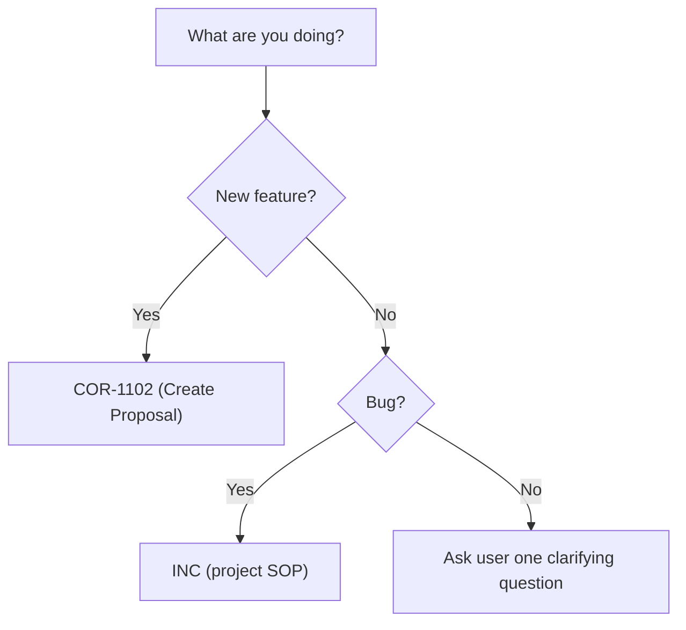

# PRP-2138: Create Routing Document SOP

**Applies to:** FXA project
**Last updated:** 2026-03-22
**Last reviewed:** 2026-03-22
**Status:** Approved
**Reviewed by:** Codex 9.23/10, Gemini 10.0/10
**Related:** COR-1103, COR-1401, COR-0002

---

## What Is It?

A proposal to create COR-1004, a new PKG-level SOP standardizing how to write routing documents for the USR and PRJ layers. Covers language, structure, decision tree format, and the rule that every branch must resolve to a specific SOP or escalate to the user.

---

## Problem

1. **No SOP for writing routing docs.** COR-1103 has a brief "Creating Routing Documents" section with two bash examples, but no rules about content, language, or format.
2. **Language violations.** FXA-2125 (active PRJ routing doc) is written in Chinese, violating COR-1401. No existing rule enforces this.
3. **No decision tree format standard.** COR-1103 uses tree-style indentation (`├──`, `└──`). FXA-2125 uses a different numbered style. No canonical format exists.
4. **No rule requiring SOP references.** Branches in routing docs can say anything — there is no requirement that each branch resolve to a concrete SOP. This allows branches that are vague or unactionable.
5. **COR-0002 does not reference COR-1401.** The Document Format Contract does not mention the language policy.

---

## Proposed Solution

### Why COR-1004, not an expansion of COR-1103

COR-1103 is a session-start routing SOP — its purpose is to be read by an AI agent at session start to route the current task. Embedding creation procedures into COR-1103 would bloat a document that must remain concise and fast to read. Routing doc creation is a distinct lifecycle operation, parallel to COR-1000 (Create SOP) and COR-1001 (Create Document).

**Relationship to COR-1103:** Upon approval of this PRP, the "Creating Routing Documents for USR/PRJ Layers" section in COR-1103 is reduced to a pointer:
```
To create a routing document, follow COR-1004 (Create Routing Document).
```
COR-1004 becomes the single authoritative source for routing doc creation rules.

### New SOP: COR-1004 "Create Routing Document"

A PKG-level SOP that defines the rules for writing any routing document (USR or PRJ layer).

#### Language

All routing documents must be written in English per COR-1401. This applies to all layers (PKG, USR, PRJ).

#### Required Sections

**PRJ routing document** must contain:
- `## Project Decision Tree` — branching router (see format below)
- `## Project Context` — key paths, prefixes, root flags
- `## Project Golden Rules` — 3–7 short rules in a code block
- `## Steps` — state: "This is a routing SOP. Follow the decision tree above; no procedural steps."
- `## Change History`

**USR routing document** must contain:
- `## User Context` — cross-project preferences
- `## User Golden Rules` — code block, same constraints as above
- `## Steps` — same note as PRJ
- `## Change History`

#### Decision Tree Format

Two formats are accepted. Both are equivalent and must satisfy the same structural rules.

**Structural rules (apply to both formats):**
- Each terminal node (leaf) must resolve to one or more concrete SOP IDs, OR be the explicit "ask user" node
- The "ask user" node must be the last branch and reachable from all unmatched paths
- Branch numbers are sequential integers starting at 1

**Format A — ASCII tree** (default):

```
1. <Question or condition>?
   ├── <Case A>   → <SOP-ID> (<SOP name>)
   ├── <Case B>   → <SOP-ID> + <SOP-ID>
   └── <Case C>   → <SOP-ID>

N. None of the above?
   └── Ask user one clarifying question
```

Connector characters: `├──` for non-last items, `└──` for last item. Indent: 3 spaces per level.

**Format B — Mermaid graph** (alternative):



Use `graph TD` (top-down) orientation. The same structural rules apply: every terminal node must contain a SOP ID or be "ask user."

Both formats are valid. A single routing document must use one format consistently throughout its decision tree.

#### COR-0002 Update

Add a `## Language` section to COR-0002 (Document Format Contract):

```
## Language

All documents must be written in English. See COR-1401 (Documentation Language Policy).
```

### Out of Scope

- Updating FXA-2125 to conform (separate CHG after this SOP is approved)
- Automated validation of decision tree branch SOP references in `af validate` (future tooling)

---

## Risks

| Risk | Likelihood | Mitigation |
|------|-----------|-----------|
| Dual-format drift — ASCII and Mermaid trees diverge in structural rules over time | Low | Both formats share the same structural rules section; any rule update applies to both |
| Reviewer inconsistency — reviewers apply different standards to the two formats | Low | Structural rules are format-agnostic; COR-1608 reviews the rules, not the syntax |
| Interim nonconformance — existing routing docs (FXA-2125) violate the new SOP during the transition period | Medium | Out of Scope explicitly defers FXA-2125 update to a separate CHG; nonconformance is intentional and time-bounded |
| COR-1103 dual source-of-truth during transition | Low | COR-1103's "Creating Routing Documents" section is reduced to a pointer in the same CHG that creates COR-1004 |

---

## Open Questions

None — all resolved.

---

## Change History

| Date | Change | By |
|------|--------|----|
| 2026-03-22 | Initial version | Frank + Claude Code |
| 2026-03-22 | Round 1 fixes: resolved all OQs (Mermaid support, COR-1004 target, OQ-2 moved to Out of Scope), removed broken ALF-2206 reference | Frank + Claude Code |
| 2026-03-22 | Round 2 fixes: added COR-1103 relationship + pointer strategy, normalized Mermaid rules, defined Steps content, justified COR-1004 vs COR-1103 expansion, added Risks section | Frank + Claude Code |
| 2026-03-22 | Approved — Codex 9.23/10, Gemini 10.0/10, COR-1602 strict passed | Codex + Gemini |
