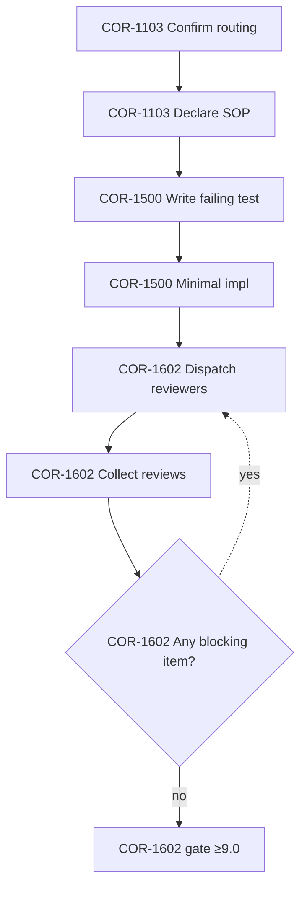

# PRP-2205: AF Plan Auto Compose Todo And Graph

**Applies to:** FXA project
**Last updated:** 2026-04-18
**Last reviewed:** 2026-04-15
**Status:** Implemented

---

## What Is It?

Four complementary enhancements to `af plan` that turn it from a per-SOP checklist emitter into an **auto-composing planner** that emits a single unified TODO list and a Mermaid graph, so agents/humans stop forgetting steps across multi-SOP workflows.

This PRP does **NOT** introduce any runtime, orchestrator, or new external dependency. Alfred remains a compiler/planner; Claude Code (or any other executor) still runs the plan. See §Scope and §Alternatives Considered for why LangGraph/similar were rejected.

---

## Problem

### The concrete pain

`af list --type SOP` currently returns 47 SOPs across PKG/USR/PRJ layers (e.g., COR-1103, 1402, 1500, 1600, 1602, 1608/9/10, 1611, FXA-2148, 2149, 2100, 2102, 2125, 2127, 2136, NRV-2501…2508…). Every real task spans **3–7 SOPs** at once. Today:

1. Authors must **manually enumerate** which SOP IDs apply (`af plan COR-1500 COR-1600 COR-1602 …`). Wrong guess → missing steps → rework. This is the single biggest source of forgotten steps in practice (addressed by G1).
2. Output is **per-SOP phases** side-by-side; there is no single continuous TODO the agent can check off in order, which makes it hard to track where we are across SOP boundaries (addressed by G2).
3. **Loops are prose**. `COR-1600` documents "max 5 rounds" in English (line 98), `COR-1602` documents "max 3 rounds" (line 94), `FXA-2148` describes evolve-loop iterations narratively. No structured hint tells the executor where to jump back to or when to give up. Miss the loop → infinite review cycles or missed iterations (addressed by G3).
4. There is **no visual graph** (a distinct UX gap, not a missed-step cause). For workflows with branches (pass/fail gates) and loops, a text list is hard to reason about at-a-glance (addressed by G4).

### Why this is Alfred's job (not Claude Code's, not LangGraph's)

Claude Code is the executor. LangGraph would be a heavy runtime duplicating that role (see §Alternatives). Alfred's identity is **the compiler that feeds executors perfect typed context**. Making the compiled plan more complete, visual, and machine-readable is exactly in-scope.

---

## Scope

### In scope (v1)

Four independent enhancements, each mapped to one Goal → one rollout PR:

- **G1 Auto-compose** (C1, §Proposed Solution): Given a short task description, Alfred auto-selects the correct set of SOPs via explicit `Task tags:` metadata plus an `Always included: true` metadata flag for SOPs that must run every session (e.g., COR-1103 routing, COR-1402 declare active SOP). No LLM. Fail-closed on true dependency cycles or on empty tag match.
- **G2 Unified TODO** (C2): Emit a single continuously-numbered TODO list across selected SOPs with phase/source provenance on each item.
- **G3 Loop structure** (C3): Make loops (repeat-until, max-N) first-class metadata in SOP documents via `Workflow loops:` frontmatter; surface them in plan output.
- **G4 Graph visualization** (C4): Emit a Mermaid flowchart of the composed plan so branches and loops are visible at a glance.

### Out of scope (v1, will not ship)

- ❌ No runtime/executor. Alfred still does not execute plans.
- ❌ No new external dependencies beyond the current `click>=8.0` + `pyyaml>=6.0`. Mermaid is pure text.
- ❌ No LangGraph, LangChain, or any LLM-framework integration (see §Alternatives).
- ❌ No TodoWrite/MCP integration in v1. The JSON output format is designed so it *could* be consumed by TodoWrite later, without committing to it now.
- ❌ No changes to document CRUD or `af guide`. **`af validate` will gain new advisory (non-blocking) checks** for the two new optional metadata fields (`Task tags`, `Workflow loops`) — schema registration + structural validation only. No existing validation behaviour for any other docs is altered. **Existing SOP content is modified only by opt-in metadata backfill** in the rollout PRs (initially: COR-1602, COR-1500, FXA-2148 — see §Rollout). No prose or steps are rewritten. SOPs without the new fields remain byte-identical and behave exactly as today.
- ❌ No execution state tracking (no "which step am I on" persistence inside Alfred — that is the executor's concern).
- ❌ **No routing-doc fallback in C1 v1.** The first draft of this PRP proposed walking `COR-1103` / `ALF-2207` / `FXA-2125` intent-router sections as a fallback when tag-matching returned nothing. That parser does not exist in `plan_cmd.py` (see `plan_cmd.py:27` — only `Steps / Rule / Rules / Concepts` headings are recognised). Building it is deferred to a follow-up PRP; v1 fails closed with a clear diagnostic when `--task` matches zero tagged SOPs.
- ❌ No Mermaid node-count limit in v1 (see §Open Questions, Q3).
- ❌ No `af guide` auto-composition (separate scope).

---

## Proposed Solution

### C1 — `af plan --task "<description>"` (auto-composition)

Add a `--task` flag that accepts a natural-language task description and auto-selects SOPs via explicit tag matching.

**Matching strategy (deterministic, no LLM, no routing-doc fallback):**

1. **Tokenize the task.** Lowercase. Strip the following fixed stopword set (versioned in `core/compose.py`):

   ```python
   STOPWORDS = frozenset({
       "a", "an", "the", "is", "are", "was", "were", "be", "been", "being",
       "to", "for", "of", "in", "on", "at", "by", "with", "from",
       "and", "or", "but", "if", "then", "else",
       "this", "that", "these", "those", "it", "its",
       "do", "does", "did", "please", "need", "needs", "needed",
   })
   ```

   Tokenize: lowercase → strip `string.punctuation` from each raw whitespace-split token → drop tokens in `STOPWORDS` → drop empty tokens. So `"implement FXA-2117 PRP, please."` yields `{"implement", "fxa-2117", "prp"}`. Multi-word tags are handled via bigrams in step 3 (not here). No external NLP library.

2. **Tag match.** SOPs opt in via an `Task tags:` metadata field (space-separated Title Case to match existing `Workflow input` / `Applies to` convention in `core/schema.py:40-65`):

   ```yaml
   Task tags: [implement, feature, tdd, code-change]
   ```

   Tag values are lowercase; multi-word tags use `-` (e.g., `code-change`).

3. **Multi-word task handling.** Bigrams of adjacent task tokens (after stopword strip) are also tested, joined with `-`. So task input `code change` also probes tag `code-change`.

4. **Candidate selection.** `tag_candidates = {sop | sop.task_tags ∩ (tokens ∪ bigrams) is non-empty}`.

5. **Always-included SOPs.** SOPs may opt in via an optional `Always included: true` metadata field. These SOPs are **unconditionally added** to the composition regardless of task input, and are **prepended** in front of tag-matched SOPs (subject to ordering in Step 6). This closes the "routing is every-session" requirement from COR-1103 without reintroducing routing-doc parsing.

   ```yaml
   Always included: true
   ```

   PR 1 backfills `Always included: true` on COR-1103 (Workflow Routing) and COR-1402 (Declare Active Process) — the two SOPs COR-1103 itself names as "ALWAYS — every session, every task". No other SOP may be tagged as always-included in v1; adding more is a CHG.

   `candidates = set(positional_ids) ∪ tag_candidates ∪ always_included_sops`.

6. **Ordering** (new helper, **not** `check_composition()`). `core/compose.py` introduces `compose_order(candidates) -> list[SOP]`. The existing `check_composition()` (`core/workflow.py:140-170`) only validates compatibility of adjacent pairs in a chain *supplied by the caller*; it cannot derive an order. The new helper:
   1. **Build edges** from `Workflow input` / `Workflow output` metadata (both are OPTIONAL per `core/schema.py:50-65`; many SOPs will have neither).
   2. **Kahn's algorithm** topological sort. **Deterministic tiebreak** when multiple nodes are simultaneously available: source-layer priority (PKG → USR → PRJ), then SOP-ID ASCII order. This handles the common case of independent SOPs (no edges) without fail-closed.
   3. **Fail-closed only on a true cycle** in `Workflow input`/`Workflow output` edges — not on multiple valid orderings. The tiebreak above guarantees a single deterministic order whenever edges form a DAG.
   4. After ordering, `check_composition()` is still called to validate adjacent edges (typed-output → typed-input compatibility), as today.

7. **Empty result.** If `candidates == always_included_sops` (i.e. tag-matching produced nothing and no positional IDs given), print:
   ```
   af plan: --task "<input>" matched 0 tagged SOPs. No routing fallback in v1.
   Try: af plan <SOP_ID> ... explicitly, or tag a relevant SOP with `Task tags:`.
   ```
   Exit code 2. (Always-included SOPs alone are not a meaningful plan.)

8. **Manual override remains.** `af plan COR-1500 COR-1600` (current usage) is unchanged. `--task` is purely additive. Combining positional IDs with `--task` pins the positional IDs and allows `--task` to *add* missing ones; if a positional ID is also matched by tags or always-included, it is not duplicated.

**Output header.** The resolved SOP list is printed once at the top of the plan:
```
Composed from: COR-1103(always) → COR-1402(always) → COR-1500(auto) → COR-1602(auto)
```
`(auto)` marks tag-matched IDs so users can audit and copy-paste back as explicit IDs.

**Determinism guarantee.** Given a fixed SOP corpus and a fixed stopword list (both versioned in repo), `af plan --task "<X>"` is deterministic: same X → same output byte-for-byte.

### C2 — `af plan --todo` (flat unified checklist)

Flatten the current phased output into one continuously-numbered TODO list. **Numbering is always dotted `{phase}.{step}` — this is the single canonical step-identifier format across all outputs (TODO, Mermaid, JSON).** See §Step-identifier convention below.

```
- [ ] 1.1 [COR-1103] Confirm routing
- [ ] 1.2 [COR-1103] Declare active SOP
- [ ] 2.1 [COR-1500] Write failing test
- [ ] 2.2 [COR-1500] Minimal implementation to pass
- [ ] 3.1 [COR-1602] 🔁 loop-start: dispatch to N reviewer models
- [ ] 3.2 [COR-1602] Collect reviews
- [ ] 3.3 [COR-1602] 🔁 if any blocking item → revise + back to 3.1 (max 3, per COR-1602:94)
- [ ] 3.4 [COR-1602] ⚠️ gate: all reviewers ≥ 9.0
```

- **Numbering**: `{phase}.{step}`; phase = order in composition (1-indexed), step = order within that SOP (1-indexed).
- **Provenance**: `[SOP-ID]` tag on every item for fast lookup.
- **Loop markers**: `🔁 loop-start` / `🔁 if … → back to N.M (max K)` emitted from SOP loop metadata (C3).
- **Gate markers**: `⚠️ gate` kept from existing convention.
- **`--json` output** gains a flat `todo` array so programmatic consumers (future TodoWrite integration) can use it without re-flattening.

**Flag combinations:**

| Flags | Effect |
|---|---|
| (no new flags) | Current phased text output (byte-identical to today) |
| `--todo` | Flat TODO only (replaces phased output) |
| `--human` | Current human-readable phased output (unchanged) |
| `--todo --human` | Flat TODO with human-style headings (□ checkboxes instead of `- [ ]`) |
| `--graph` | Phased text + Mermaid block at end |
| `--todo --graph` | Flat TODO + Mermaid block at end |
| `--json` | Structured JSON (adds `todo` and `graph_mermaid` keys when their flags are set; otherwise emits current schema) |
| `--json --todo` / `--json --graph` | JSON with the relevant keys populated |
| `--json --human` | **Error** — mutually exclusive (unchanged from today) |

### C3 — First-class loop metadata in SOPs

Extend SOP YAML metadata with an optional `Workflow loops:` field. **Step references inside loop metadata use step-index within the SOP only (integer).** The phase prefix is unknown at SOP-authoring time; `plan_cmd` synthesises the dotted `{phase}.{step}` form at render time.

```yaml
Workflow loops:
  - id: review-retry
    from: 3                # step index within this SOP that conditionally jumps back
    to: 1                  # target step index within this SOP
    max_iterations: 3
    condition: "review has actionable items"
```

- **Metadata key naming**: `Workflow loops` (space-separated Title Case, matching existing `Workflow input` / `Workflow output` / `Workflow requires` / `Workflow provides` in `core/schema.py:50-65`).
- **Parsing** lives in `core/workflow.py` alongside existing workflow parsing. Still pure lint — no execution semantics.
- **Validation** (new helper `validate_loops(parsed) -> list[LoopError]` in `core/workflow.py`; purely intra-SOP):
  - `from` / `to` must be positive integers and reference existing step indexes in the same SOP's Steps section.
  - `from > to` (loops are back-edges only; a forward jump or zero-length loop is a spec error).
  - `max_iterations` must be a positive integer.
  - **No cross-SOP logic.** By design (see §Step-identifier convention), `Workflow loops` reference step indexes inside a single SOP. Cross-SOP cycles cannot be expressed through this field and therefore cannot be validated here. Cross-SOP dependency cycles via `Workflow input`/`Workflow output` are a separate concern, handled by `compose_order()` Kahn-cycle check (see C1 Step 5 and Risk 2).
  - Reachability is not checked: since steps are sequential and `Workflow loops` only add backward edges, no step can become unreachable.
- **Rendering**:
  - In `--todo`: `🔁 if {condition} → back to {phase}.{to} (max {max_iterations})` on the `from` step; `🔁 loop-start` marker on the `to` step.
  - In `--graph`: dashed back-edge from `S{phase}_{from}` to `S{phase}_{to}`.
- **Backward compatible**: SOPs without `Workflow loops` behave exactly as today.

### C4 — `af plan --graph` (Mermaid flowchart)

Emit a Mermaid `flowchart TD` with one node per step, forward edges between sequential steps, dashed back-edges for loops, and diamond nodes for explicit gates:



The diamond-shaped node `S3_3` is still a step (one node per step rule is preserved); its shape indicates it is a conditional gate that participates in a back-edge defined by `Workflow loops`. Loop `from: 3, to: 1, max_iterations: 3` on COR-1602 produces the dashed back-edge from `S3_3` to `S3_1`.

- **Node id format**: `S{phase}_{step}` (underscore form is Mermaid-safe; this is the *Mermaid-internal* identifier only — the *user-visible* step identifier remains dotted `{phase}.{step}` everywhere else).
- **Pure markdown output** — can be pasted into any Mermaid renderer (GitHub, Obsidian, docs site), preserving Alfred's greppable/auditable identity.
- Combines with `--todo` (TODO above the diagram) and `--json` (mermaid string embedded under `graph_mermaid`).

### Step-identifier convention (single source of truth)

To close the Round-1 review finding about mismatched step IDs, this PRP establishes **one canonical format**:

| Layer | Format | Example | Notes |
|---|---|---|---|
| SOP YAML (`Workflow loops`) | Integer, within-SOP only | `from: 3` | Phase unknown at authoring time |
| Flat TODO rendering | Dotted `{phase}.{step}` | `3.3` | User-facing, canonical |
| JSON output (`loops[].from/to`) | Dotted `{phase}.{step}` | `"3.3"` | Rendered, not authored |
| Mermaid node id | Underscored `S{phase}_{step}` | `S3_3` | Mermaid-safe internal id |
| User references in prose | Dotted `{phase}.{step}` | `back to 3.1` | Matches TODO |

Conversion is one-way (author → rendered); `plan_cmd` synthesises phase prefix when composing.

---

## Design Details

### Affected files

| Area | File | Change |
|---|---|---|
| CLI | `src/fx_alfred/commands/plan_cmd.py` | Add `--task`, `--todo`, `--graph`; keep existing phased output as default |
| Core | `src/fx_alfred/core/workflow.py` | Parse `Workflow loops`; add intra-SOP `validate_loops()`. `check_composition()` remains adjacency-only — it is NOT extended to derive order or detect cycles across SOPs (those live in `core/compose.py`). |
| Core | `src/fx_alfred/core/schema.py` | Register `Task tags`, `Workflow loops`, and `Always included` as optional metadata keys for SOPs |
| New | `src/fx_alfred/core/compose.py` | `tokenize(s)`, `resolve_sops_from_task(task, docs) -> list[SOP]`, `compose_order(candidates) -> list[SOP]` (Kahn's topological sort with layer+ASCII tiebreak, fail-closed on true cycles); embedded `STOPWORDS` constant |
| New | `src/fx_alfred/core/mermaid.py` | `render_mermaid(phases, loops) -> str` |
| Tests | `tests/test_plan_cmd.py` | Add cases for `--task`, `--todo`, `--graph`, combined-flag matrix, fail-closed on true Workflow input/output cycles (not on multiple valid topological orders), fail-closed on empty tag match, always-included prepended regardless of task |
| Tests | `tests/test_workflow_loops.py` (new) | Intra-SOP loop metadata parsing and `validate_loops()` (integer `from` > `to`, `max_iterations` > 0, step indexes exist). No cross-SOP cycle tests — impossible by design (see C3). |
| Tests | `tests/test_compose.py` (new) | `tokenize` (lowercase + `string.punctuation` strip + STOPWORDS drop), bigram probing, `compose_order()` Kahn's + layer+ASCII tiebreak determinism, true-cycle fail-closed, always-included prepend order |
| Docs | `src/fx_alfred/CHANGELOG.md`, `README.md` | New flags and examples |

### JSON schema additions (backward-compatible)

```json
{
  "schema_version": "2",
  "composed_from": {"always": ["COR-1103", "COR-1402"], "auto": ["COR-1500", "COR-1602"], "explicit": []},
  "phases": [ /* unchanged */ ],
  "todo": [
    {"index": "1.1", "sop": "COR-1103", "text": "...", "gate": false, "loop_marker": null}
  ],
  "loops": [
    {"id": "review-retry", "from": "3.3", "to": "3.1", "max_iterations": 3}
  ],
  "graph_mermaid": "flowchart TD\n  ..."
}
```

Existing consumers keep working (all old keys preserved; new keys optional). `schema_version` bumps to `"2"` only when any new key is present.

### Composition algorithm (C1) — pseudocode

```
input: task_description (str), all_sops (list[SOP]), positional_ids (list[str])
output: ordered list of SOP IDs

1. tokens       = tokenize(task_description)           # lowercase, strip string.punctuation,
                                                       # drop STOPWORDS, drop empty
2. bigrams      = {"{a}-{b}" for adjacent (a, b) in tokens}
3. probes       = tokens ∪ bigrams
4. tag_cands    = {sop for sop in all_sops if sop.task_tags ∩ probes}
5. always       = {sop for sop in all_sops if sop.always_included}
6. candidates   = set(positional_ids) ∪ tag_cands ∪ always
7. if candidates == always:                            # nothing matched beyond the always-set
       fail_closed("0 SOPs matched; no routing fallback in v1")
8. order = compose_order(candidates)                   # Kahn's with deterministic tiebreak
                                                       # (layer PKG→USR→PRJ, then SOP-ID ASCII);
                                                       # always-included prepended when
                                                       # topologically unconstrained;
                                                       # fail_closed only on a true cycle
9. check_composition(order)                            # adjacent typed-edge compatibility
10. return order
```

Determinism: same `task_description` + same SOP corpus + same STOPWORDS list → same output bytes. Ties in topological order are broken by the fixed layer + ASCII rule, so independent SOPs (no edges) still produce a stable order. No LLM, no randomness, no cache.

---

## Open Questions

All questions below are **RESOLVED**. Each is a binding decision for v1; any reversal requires a follow-up CHG. Per COR-1608 Hard Gate, PRPs cannot be approved with genuinely open questions; inline resolution is explicit here.

1. **RESOLVED — `Task tags` vocabulary is free-form with lint warning.** Start free-form; `af validate` emits an advisory (non-blocking) warning for tags that appear on fewer than 2 SOPs after corpus is tagged. A closed vocabulary can be promoted later via CHG if synonym clustering shows real drift. Rationale: closed sets harden too early; free-form + lint is the minimum useful constraint.
2. **RESOLVED — `--task` is explicit-only in v1.** When no SOP IDs and no `--task` given, `af plan` keeps today's "Usage" error. `--task` never fires implicitly. Rationale: zero behavior change for current invocations; silent auto-selection surprises are worse than an extra flag.
3. **RESOLVED — Mermaid graph emitted unconditionally in v1, no size threshold.** If a composed plan produces an unreadable diagram, that is itself a signal the plan is too large and the user should split the task. A concrete node-count threshold (e.g., >40 nodes → warning) is **deferred** to a follow-up CHG if real usage shows demand; v1 collects data by emitting unconditionally.
4. **RESOLVED — Loop metadata lives in YAML frontmatter as `Workflow loops`.** Space-separated Title Case key, matching existing `Workflow input` / `Workflow output` convention (`core/schema.py:50-65`). A dedicated `## Workflow Loops` section is rejected because it would split metadata across two locations and complicate `core/workflow.py` parsing.
5. **RESOLVED — `af guide` auto-composition is out of scope.** Routing there is already automated via routing documents. `--task` is a `plan`-only feature. Revisiting `af guide` requires its own PRP.

---

## Risks

Risks explicitly tracked so implementation PRs can mitigate or flag them:

1. **Tag-vocabulary drift (synonym explosion).** Over a ~50-SOP corpus, authors will write `implement` vs `implementation` vs `feature` vs `build`. Pure set-intersection matching misses synonyms. **Mitigation**: the `af validate` lint warning on tags appearing in fewer than 2 SOPs (Open Question 1 resolution) surfaces outliers for consolidation. If drift becomes material (>10 singleton tags), a follow-up CHG will introduce either an explicit alias map or a closed vocabulary.
2. **Composition cycles via `Workflow input`/`Workflow output`.** If an author writes SOPs such that A.output → B.input → A.input, the composed chain forms a DAG cycle. This is orthogonal to `Workflow loops` (which are strictly intra-SOP). **Mitigation**: `compose_order()` (C1 Step 5) uses Kahn's algorithm; a genuine cycle leaves unresolved nodes and triggers a fail-closed diagnostic naming the offending SOPs. `af validate` surfaces the same check at lint time. Intra-SOP `Workflow loops` are a separate mechanism (bounded by `max_iterations` by definition) and cannot create cross-SOP cycles.
3. **Empty-result dead-end for `--task`.** `--task "<rare input>"` matches zero tagged SOPs. **Mitigation**: C1 step 6 — explicit fail-closed with a diagnostic pointing to (a) explicit SOP-ID invocation, (b) the SOP-tagging step. No silent default.
4. **Pilot tagging coverage.** `Task tags` backfill is only 3 SOPs at rollout end (§Success Criteria). `--task` will match nothing outside those pilots. **Mitigation**: ship C1 last in rollout (PR 4) after C3/C2/C4 are in, and coordinate a tagging sweep in the same PR — explicitly stated in §Rollout Plan.
5. **Mermaid renderer ceiling.** Large composed plans (>50 nodes) may produce diagrams that GitHub truncates or Obsidian renders slowly. **Mitigation**: v1 deliberately emits unconditionally (Open Question 3); telemetry via user complaints drives a follow-up CHG with a size threshold.
6. **Metadata-key collision with existing `Applies to` field.** `Applies to` is already `REQUIRED_METADATA` for every DocType (`schema.py:40-47`, e.g., `Applies to: FXA project`). This PRP introduces `Task tags` (not `Applies to`) specifically to avoid that collision, flagged in Round-1 review. **Mitigation**: distinct key name; schema.py registration as optional SOP-only field; tests assert the two keys do not interfere.

---

## Alternatives Considered

- **Adopt LangGraph (`af run <SOP>`)** — rejected. Independent reviews on 2026-04-15 returned NO-GO: narrative-markdown → strict-DAG impedance mismatch, heavy dep footprint (langgraph + langchain-core + pydantic v2 + orjson + httpx), SOP authoring would become API versioning, and Claude Code already owns the executor role.
- **Homegrown state machine inside Alfred** — rejected as out of scope. Execution still belongs to Claude Code, not Alfred.
- **Only improve `--json` without `--todo`/`--graph`** — insufficient; the user-facing pain is the unified human-readable view, not just machine consumers.
- **Use LLM for SOP selection instead of tag matching** — rejected. Breaks determinism and makes the planner depend on a model. Tag-matching is fully deterministic and auditable.
- **"Do nothing in Alfred, solve downstream" (Claude Code skill + template)** — rejected. A downstream-only solution would still require machine-readable step IDs, loop structure, and composition metadata. Those are compiler concerns that belong in Alfred. A skill can still wrap `af plan --todo --graph --json`, but the compiler work comes first.
- **Routing-doc fallback for C1** — deferred (explicitly out of scope for v1). Round-1 review flagged that `plan_cmd.py` has no routing-doc parser; building one is its own non-trivial task with its own PRP.

---

## Rollout Plan

Ship in 4 independent PRs (each pass TDD per COR-1500 + review per COR-1600):

1. **PR 1 — C3 loop metadata + `Always included` registration**: foundation; `Workflow loops` parsing and intra-SOP validation in `core/workflow.py` (no cross-SOP cycle logic — see C3); `Always included` registration in `core/schema.py`. Backfills: `Workflow loops` on **COR-1602** (review-retry loop, `from: 3, to: 1, max_iterations: 3`, per COR-1602:94); `Always included: true` on **COR-1103** and **COR-1402** (per COR-1103's own "ALWAYS — every session, every task" list). This makes PR 2 demonstrate end-to-end and satisfies the Success Criteria routing requirement without needing C1 yet.
2. **PR 2 — C2 `--todo`**: flat output; consumes loop metadata from PR 1.
3. **PR 3 — C4 `--graph`**: Mermaid; consumes the same step IDs as C2.
4. **PR 4 — C1 `--task` auto-compose**: `core/compose.py` (`tokenize`, `resolve_sops_from_task`, `compose_order` with Kahn's + layer+ASCII tiebreak, always-included prepend), stopword list, tag matching, bigram probing, fail-closed on true cycles and on empty result. Backfills `Task tags` on **COR-1500, COR-1602, FXA-2148** in the same PR (consistent with §Success Criteria).

Each PR is independently useful; no big-bang merge.

---

## Success Criteria

- All four flags ship with tests (target ≥ 95% line coverage on new files: `core/compose.py`, `core/mermaid.py`, loop-metadata paths in `core/workflow.py`).
- Existing `af plan` invocations (no new flags) produce byte-identical output to today.
- At least 3 PKG/PRJ SOPs tagged with `Task tags` by end of rollout (COR-1500, COR-1602, FXA-2148 as pilot — specified in PR 4). Additionally, COR-1602 gets its `Workflow loops` backfill in PR 1.
- A single `af plan --task "implement FXA-2117 PRP" --todo --graph` call produces a complete checklist covering routing → TDD → review loop → scoring, with no manual SOP-ID enumeration.
- First COR-1200 retrospective after rollout explicitly records whether the "forgot-a-step" failure mode has recurred since C1 shipped (yes/no + incident count). This replaces the earlier qualitative-only criterion.

---

## Change History

| Date       | Change                                                                                                                                                                                                                                                                                                                                                                                                                                                                                                                                                                                                                                                                                                                                                                                                                                                                                              | By                |
|------------|-----------------------------------------------------------------------------------------------------------------------------------------------------------------------------------------------------------------------------------------------------------------------------------------------------------------------------------------------------------------------------------------------------------------------------------------------------------------------------------------------------------------------------------------------------------------------------------------------------------------------------------------------------------------------------------------------------------------------------------------------------------------------------------------------------------------------------------------------------------------------------------------------------|-------------------|
| 2026-04-15 | Initial version | Claude (Opus 4.6) |
| 2026-04-15 | Round 1 review fixes: restructure Goals/Non-Goals into `## Scope`; rename `Resolved Questions` → `Open Questions` with inline RESOLVED markers; rename `Applies_To` → `Task tags` and `Workflow_Loops` → `Workflow loops` (space-Title-Case, no collision with existing `Applies to`); canonicalise step-ID format (integer in YAML, dotted `{phase}.{step}` elsewhere, `S{p}_{s}` Mermaid-internal); define `STOPWORDS` explicitly; defer routing-doc fallback to follow-up PRP; add `## Risks` section with 6 tracked risks; add flag-combination table; tighten Success Criteria measurement (COR-1200 retro yes/no). | Claude (Opus 4.6) |
| 2026-04-15 | Round 2 review fixes (Gemini 3 + Codex GPT-5.4, both via real CLI): introduce explicit `compose_order()` helper with Kahn's topological sort + deterministic layer+ASCII tiebreak, replacing incorrect claim that `check_composition()` performs ordering; remove "fail-closed on multiple valid orders" (common case given `Workflow input/output` is OPTIONAL); remove cross-SOP cycle detection from C3 (impossible by design — `Workflow loops` are intra-SOP only); remove redundant reachability check; rewrite Scope boundary to honestly describe the new advisory `af validate` checks and opt-in SOP metadata backfill; fix COR-1600 vs COR-1602 round-limit conflation (COR-1600 max 5, COR-1602 max 3 — examples now use COR-1602 throughout); add missing `S3_3` node to Mermaid example; rewrite Risk 2 to distinguish DAG cycles (via `Workflow input/output`) from intra-SOP loops. | Claude (Opus 4.6) |
| 2026-04-15 | Round 3 review integration (Gemini 3 PASS 9.8/10, Codex GPT-5.4 FIX 8.9/10 — max 3 rounds reached, Leader final-call per COR-1602:102 incorporating all Codex blockers + both models' advisories). Introduce `Always included: true` SOP metadata (backfill COR-1103 + COR-1402 in PR 1) so routing SOPs are prepended without resurrecting routing-doc parsing — closes Codex R3-B3 headline-example feasibility gap. Fix PR 4 pilot set COR-1600 → COR-1602 (Codex R3-B1). Update Affected Files test descriptions to match revised C1/C3 semantics (Codex R3-B2). Update `Composed from:` header example and JSON `composed_from` schema to show `always` bucket. Strengthen `tokenize` spec to strip `string.punctuation` before stopword drop (Gemini adv 1). Strengthen `validate_loops` from `from != to` to `from > to` (Gemini adv 2). Renumber C1 steps after insertion. | Claude (Opus 4.6) |
| 2026-04-15 | Round 3 final: Gemini 9.8 PASS, Codex 8.9 FIX. Leader final-call per COR-1602:102 (max 3 rounds reached). All Codex R3 blockers + both models' advisories incorporated into this revision. Status: Draft → Approved. | Frank (Leader, on Claude's recommendation) |
| 2026-04-18 | Shipped in fx-alfred v1.6.1 (2026-04-18) — 4 merged PRs #43/#44/#45/#46 covering --task auto-compose / --todo / --graph Mermaid / Workflow loops metadata / Task tags / Always included. | Frank |
