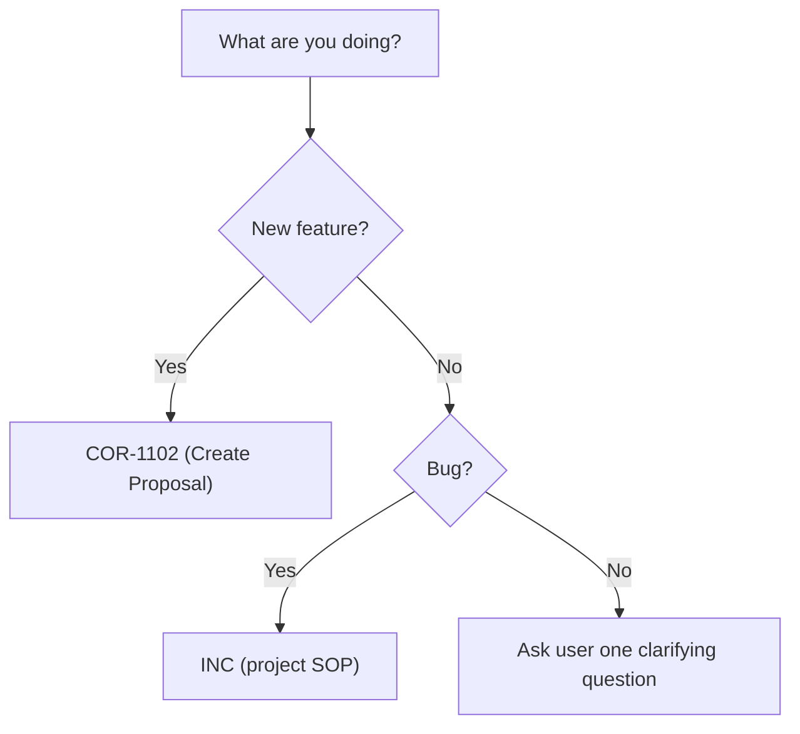

# COR-1004: Create Routing Document

**Applies to:** All projects using the COR document system
**Last updated:** 2026-03-22
**Last reviewed:** 2026-03-22
**Status:** Active
**Related:** COR-1103, COR-1401, COR-0002

---

## What Is It?

The process for creating a routing document for the USR or PRJ layer. Routing documents drive `af guide` and direct agents to the correct SOPs at session start. This SOP is the single authoritative source for routing document creation rules; COR-1103 points here.

---

## Why

Without a standard for writing routing documents, each document would use different structure, language, or decision tree formats — making routing inconsistent across projects and users.

---

## When to Use

- Creating a new PRJ-layer routing document for a project
- Creating a new USR-layer routing document for cross-project personal preferences
- Updating an existing routing document to conform to current standards

---

## When NOT to Use

- Reading or following a routing document at session start (use COR-1103 instead)
- Creating non-routing SOPs (use COR-1000)
- Creating any other document type (use COR-1001)

---

## Prerequisites

- Follow COR-1001 (Create Document) for naming convention and ACID numbering
- Follow COR-1302 (Maintain Document Index) after creation
- All documents must comply with COR-0002 (Document Format Contract)

---

## Language

All routing documents must be written in English per COR-1401. This applies to all layers (PKG, USR, PRJ).

---

## Required Sections

### PRJ routing document

A PRJ routing document must contain these sections in order:

- `## Project Decision Tree` — branching router (see Decision Tree Format below)
- `## Project Context` — key paths, prefixes, root flags
- `## Project Golden Rules` — 3–7 short rules in a code block
- `## Steps` — state: "This is a routing SOP. Follow the decision tree above; no procedural steps."
- `## Change History`

### USR routing document

A USR routing document must contain these sections in order:

- `## User Context` — cross-project preferences
- `## User Golden Rules` — 3–7 short rules in a code block
- `## Steps` — state: "This is a routing SOP. Follow the decision tree above; no procedural steps."
- `## Change History`

---

## Decision Tree Format

Two formats are accepted. Both are equivalent and must satisfy the same structural rules. A single routing document must use one format consistently throughout its decision tree.

### Structural Rules (apply to both formats)

- Each terminal node (leaf) must resolve to one or more concrete SOP IDs, OR be the explicit "ask user" node
- The "ask user" node must be the last branch and reachable from all unmatched paths
- Branch numbers are sequential integers starting at 1

### Format A — ASCII tree (default)

```
1. <Question or condition>?
   ├── <Case A>   → <SOP-ID> (<SOP name>)
   ├── <Case B>   → <SOP-ID> + <SOP-ID>
   └── <Case C>   → <SOP-ID>

N. None of the above?
   └── Ask user one clarifying question
```

Connector characters: `├──` for non-last items, `└──` for last item. Indent: 3 spaces per level.

### Format B — Mermaid graph (alternative)



Use `graph TD` (top-down) orientation. The same structural rules apply: every terminal node must contain a SOP ID or be "ask user."

---

## Relationship to COR-1103

COR-1103 is the session-start routing SOP. Its "Creating Routing Documents for USR / PRJ Layers" section is a pointer to this SOP. COR-1004 is the single authoritative source for all routing document creation rules. Any update to creation rules must be made here, not in COR-1103.

---

## Steps

1. **Determine layer** — decide whether you are creating a PRJ (project-specific) or USR (cross-project) routing document.
2. **Create file** — run `af create sop` with the appropriate prefix, area, and title:
   - PRJ: `af create sop --prefix <PREFIX> --area 21 --title "Workflow Routing PRJ"`
   - USR: `af create sop --prefix ALF --area 22 --title "Workflow Routing USR" --layer user`
3. **Write in English** — all content must be in English per COR-1401.
4. **Add required sections** — add all required sections for the layer type (see Required Sections above).
5. **Build decision tree** (PRJ only) — choose Format A (ASCII) or Format B (Mermaid) and apply it consistently. Ensure every leaf resolves to a SOP ID or the "ask user" node. USR routing documents use `## User Context` and `## User Golden Rules` instead; skip to step 6.
6. **Verify structure** (PRJ only) — confirm all structural rules are met: sequential branch numbers, "ask user" as last branch, all leaves have SOP IDs.
7. **Update index** — follow COR-1302 (Maintain Document Index).
8. **Verify routing** — run `af guide --root <project-root>` to confirm all layers appear correctly.

---

## Change History

| Date | Change | By |
|------|--------|----|
| 2026-03-22 | Initial version, implementing FXA-2138 PRP | GLM |
