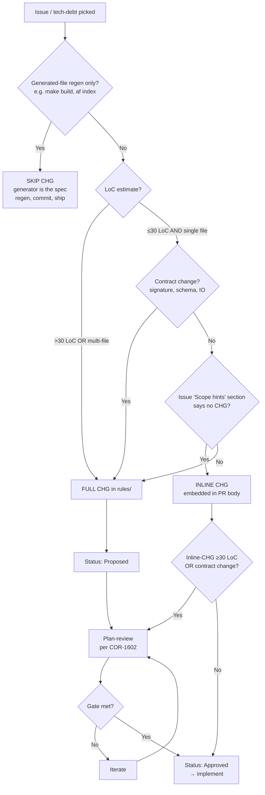

# SOP-1104: CHG Sizing Decision Tree

**Applies to:** All projects using the COR document system; required by COR-1617 phase 3
**Last updated:** 2026-05-09
**Last reviewed:** 2026-05-09
**Status:** Active
**Related:** COR-1101 (Submit Change Request), COR-1102 (Create Proposal), COR-1617 (Multi-Agent Workflow Loop)

---

## What Is It?

The decision tree that determines what artifact a substantive change needs *before* it goes to plan-review:

- **Skip** — generated-file regeneration where the generator is the spec; no CHG needed.
- **Inline** — a CHG embedded in the PR body, used for small single-file changes the issue itself has already scoped.
- **Full** — a standalone CHG document under `rules/` (or the project's spec directory), used for anything that crosses files, changes a contract, or exceeds the project's LoC threshold.

The choice is binary at each branch but the tree (rather than a flat heuristic) is what keeps the call defensible.

---

## Why

Two failure modes:

1. **Over-formal** — writing a full CHG for a typo fix wastes time and clutters `rules/` with low-signal entries.
2. **Under-formal** — skipping a CHG for a contract change (signature, schema, IO) means plan-review has nothing concrete to score, and the inevitable mid-implementation rewrite is unanchored.

The decision tree forces the call to be made consciously, not by default.

---

## When to Use

- Before drafting any spec for a substantive PR.
- When the issue's "Scope hints" section is ambiguous about CHG necessity.
- When inheriting a half-drafted spec and deciding whether to upgrade or downgrade its form.

## When NOT to Use

- Pure documentation polish that doesn't change a contract or behavior (README rewording, CHANGELOG re-flow). No CHG; commit and ship.
- Reverts of an already-reviewed change. The original PR carried the spec; the revert inherits it.

---

## Decision Tree

The "Scope hints" branch refers to the optional `## Scope hints` section of the project's GitHub issue template. When the filer has explicitly written e.g. *"no CHG needed; one-line fix"*, treat that as authorisation for inline. Absent that section, default to FULL.

---

## Steps

1. Apply the decision tree top-down. The first branch that matches determines the form.
2. **For SKIP**: commit the regenerated artifacts directly; no spec required.
3. **For INLINE**: draft the spec in the PR body using the FULL skeleton below, condensed to ~10–20 lines.
4. **For FULL**: create a CHG document via `af create CHG --prefix <PRJ> --area <area> --title <Title>` and use the standard skeleton.

### CHG skeleton (FULL or INLINE)

- **Frontmatter** — `Applies to`, `Last updated`, `Last reviewed`, `Status: Proposed`, `Date`, `Requested by`, `Priority`, `Change Type`, `Targets`, `Closes #<issue>` (FULL only).
- **What** — one paragraph: what changes.
- **Why** — one paragraph: why this matters; cite session evidence, failed CI, or PR-review finding.
- **Out of Scope** — bullets; defer items to follow-up CHGs by name.
- **Surfaces** — table: # | Surface | Change. One row per file or symmetric class.
- **Acceptance Criteria** — bullets `A1: ...`, `A2: ...`. Each observable and testable.
- **Implementation Order** — numbered steps; final step is verify + CHANGELOG + commit.
- **Change History** — table: Date | Change | By.

---

## Heuristic for the borderline call

When in doubt, write the FULL CHG. Five minutes drafting is cheaper than a panel reviewing the wrong thing, and a FULL CHG can always be condensed into the PR body if it turned out to be small. Going the other direction (upgrading INLINE to FULL mid-review) loses the round-zero context the panel would have used.

---

## Guard Rails

- Never run plan-review against an INLINE-CHG that crossed the LoC or contract threshold. Upgrade to FULL first.
- Never SKIP for a generated-file change that *also* edits the generator. The generator change itself needs a spec; only the regenerated outputs are SKIP-eligible.
- Never default to INLINE because "the issue is small." Issue size is an estimate; the LoC threshold is on the actual diff.

---

## Examples

| Change | Decision | Rationale |
|--------|----------|-----------|
| Fix a typo in a README | SKIP | Pure docs polish; no contract change |
| Run `make build` after a code edit that already had a FULL CHG | SKIP | Generated-file regen; original CHG is the spec |
| Add a new optional CLI flag, single file, ~20 LoC | FULL | Contract change (CLI surface) |
| Rewrite an internal helper, single file, 25 LoC, no contract | INLINE if issue says so, else FULL | Hits the borderline; defer to issue scope hints |
| Multi-file rename across 8 files | FULL | Multi-file always |
| Add 8-test integration suite for an existing module | FULL | Tests can introduce contracts (fixture shape, mock surface) |

---

## Change History

| Date | Change | By |
|------|--------|----|
| 2026-05-09 | Initial version — extracted from TRN-1008 §3 for COR-1617 cluster promotion (alfred#115) | Claude Opus 4.7 |
