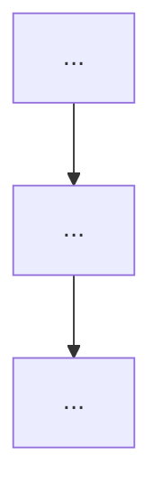

# SOP-1202: Compose Session Plan

**Applies to:** All projects using the COR document system
**Last updated:** 2026-04-18
**Last reviewed:** 2026-04-18
**Status:** Active
**Related:** COR-1103, COR-1402, COR-1200

---

## What Is It?

A procedure for turning a one-sentence session task description into a complete workflow plan — ASCII graph + Mermaid + flat TODO — covering every SOP from session-start through task-completion. Built on the `af plan --task … --todo --graph` capability (FXA-2205 / FXA-2206).

---

## Why

Provides a named, ID-addressable entry point for session planning, replacing the need to memorize flags. Matches Alfred's "SOP as system of record" identity and closes the discoverability gap from FXA-2205 where users had to know the `--task` / `--todo` / `--graph` options. The Step-4 feedback loop drives Task-tags coverage improvement across the SOP corpus.

---

## When to Use

- Start of a non-trivial session
- User says "follow COR-1202", "show me the plan", or "compose the session plan"
- Unsure which SOPs apply to the task
- Before opening a long-running PR

---

## When NOT to Use

- A single obvious SOP applies (no composition benefit)
- Mid-session after the plan is already running (don't re-plan unless scope changed)

Note: The "too thin Task tags coverage" case is NOT a reason to avoid COR-1202 — run it anyway and use the Step-4 empty-match recovery flow (positional pin + deferred tag backfill).

---

## Steps

### 1. Run routing

Run `af guide --root .` for routing. Use `--root .` throughout the SOP (assume CWD = project root).

### 2. Write the task

Write the task in one sentence. Keep it concrete and tag-rich — tag-rich descriptions help the auto-compose layer match SOPs.

### 3. Generate the plan

Run:
```bash
af plan --root . --task "<description>" --todo --graph
```

The default `--graph-format=both` emits ASCII + Mermaid together. Use `--graph-format=ascii` or `--graph-format=mermaid` to pick one. Use `--json` when a programmatic consumer is downstream.

### 4. Review provenance

Review the `Composed from:` header. Provenance markers: `(always)` / `(auto)` / `(explicit)`. If an expected SOP is missing:

- Immediate in-session fix = positional pin, re-run:
  `af plan --root . --task "<description>" MISSING-1234 --todo --graph`
- Durable fix = backfill the SOP's `Task tags` metadata so it auto-matches next time; this is deferred to the session retrospective (COR-1200) to avoid mid-session context switching.
- Don't skip gaps silently — pin now or record for retro.

### 5. Copy TODO

Copy the flat TODO into the session's working surface: issue / Discussion Tracker per COR-1201 / agent memory / PR body. The `{phase}.{step}` numbering is stable and greppable.

### 6. Execute

Execute step by step. At each phase transition the executor (agent or human running the plan) declares the active SOP per COR-1402 and honours any `Workflow loops` `max N` bound rendered in the plan. (A `Workflow loops` entry is SOP metadata declaring a bounded retry — e.g. review loop "max 3". In the ASCII/Mermaid output it appears as a dashed back-edge; in the flat TODO it appears as `🔁 back to N.M (max K)` on the loop's `from` step. Stop the loop when `max K` is reached; escalate per the SOP's own rules.)

### 7. Close and compare

At session end, compare completion against the plan. Unchecked items enter the retrospective (COR-1200) with a reason: genuinely skipped (note why) or forgotten (process failure this SOP exists to prevent). `Task tags` gaps noted in Step 4 also go here.

---

## Examples

### 1. Standard auto-compose

A tagged task description resolves to a full routing → TDD → review → scoring chain without any explicit SOP IDs. `FXA-2208` below is illustrative — substitute the real PRP ACID you are implementing.

```bash
af plan --root . --task "implement FXA-2208 PRP" --todo --graph
```

Expected output (abbreviated):

```text
# Composed from: COR-1103(always) → COR-1402(always) → COR-1500(auto)
                → COR-1602(auto) → COR-1608(auto) → COR-1610(auto)

# Flat TODO — Follow each item in order
- [ ] 1.1 [COR-1103] (session routing)
- [ ] 2.1 [COR-1402] Declare active SOP
- [ ] 3.1 [COR-1500] (TDD)
  ...



┌──────────────────────────────────────────┐
│ Phase 1: COR-1103 (always)               │
│ [1.1] ...                                │
└─────────────────────┬────────────────────┘
                      ▼
(one phase box per SOP; ▼ connects them)
```

### 2. Mixing tags with explicit pins

Positional SOP IDs combine with tag-matched ones (union, de-duplicated, normalised to PREFIX-ACID). COR-1501 is "Create GitHub Issue" — a real existing SOP naturally paired with implement-feature work.

```bash
af plan --root . --task "implement feature" COR-1501 --todo --graph
```

Expected output header (abbreviated):

```text
# Composed from: COR-1103(always) → COR-1402(always) → COR-1501(explicit)
                → COR-1500(auto) → COR-1602(auto) → COR-1610(auto)
```

COR-1501 carries the `(explicit)` marker because it was pinned positionally. Explicit pins precede tag-matched SOPs in the default ordering.

### 3. Empty-match recovery

A task description with no tag matches exits 2 with a diagnostic. Workaround: add a positional SOP to proceed in-session; defer the `Task tags` backfill to retrospective.

```bash
# first: exits 2 with diagnostic "matched 0 tagged SOPs"
af plan --root . --task "xyzzy unmatched" --todo --graph
```

```text
Error: --task "xyzzy unmatched" matched 0 tagged SOPs. No routing fallback in v1.
Try: af plan <SOP_ID> ... explicitly, or tag a relevant SOP with `Task tags:`.
```

Exit code 2. Workaround — add a positional SOP:

```bash
af plan --root . --task "xyzzy unmatched" COR-1500 --todo --graph
```

Now exits 0 with `COR-1500(explicit)` in the `Composed from:` header.

---

## Change History

| Date       | Change          | By              |
|------------|-----------------|-----------------|
| 2026-04-18 | Initial version (per CHG-FXA-2207). | Frank + Claude |
