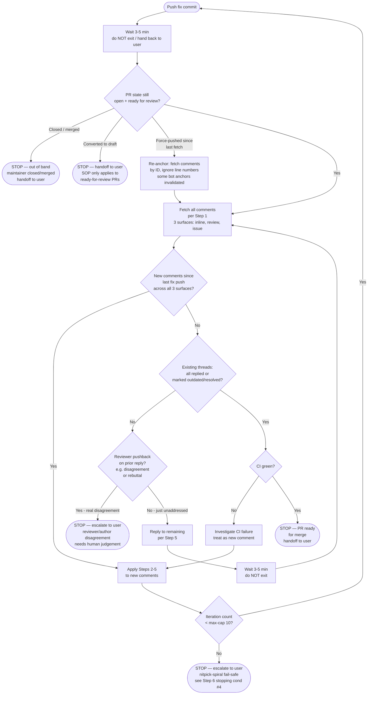

# SOP-1612: Respond To PR Review Comments

**Applies to:** All projects using the COR document system
**Last updated:** 2026-05-15
**Last reviewed:** 2026-05-15
**Status:** Draft
**Related:** COR-1602 (Multi Model Parallel Review), COR-1615 (GitHub App PR Review Bot Loop)
**Disposition:** inherit-only

---

## What Is It?

The standard process for responding to review comments on a Pull Request. Covers comments from any source — human reviewers, GitHub App automated review bots, multi-model panel review tooling (when available), or any other source. This SOP is a universal overlay that works with any workflow (COR-1600–1605).

### Reviewer Detector Classes (orthogonal, not interchangeable)

Different reviewer types catch different failure modes. Always treat them as a **set of orthogonal detectors**, not substitutes. Which classes are available depends on the project's tooling — pick whatever subset applies:

| Detector | Strengths (catches reliably) | Blind spots | Availability |
|---|---|---|---|
| **GitHub App review bot** — e.g. `copilot-pull-request-reviewer[bot]` (GitHub/Copilot official reviewer), `chatgpt-codex-connector[bot]` (Codex Connector), CodeRabbit, Greptile, Sourcery. Auto-runs or responds to a PR comment depending on the installed GitHub App. | Cross-reference inconsistencies, stale references, "shipped" / placeholder elision, shell-example execution failures (`set -e` brittleness, unmatched globs, invalid jq, syntax errors), cross-file contract drift | Architectural judgment, design tradeoffs, calibration scoring, out-of-scope debates | Always check repo settings — exact bot identity varies. The SOP applies identically to any bot of this class. |
| **Multi-model panel review** — N independent LLM reviewers scoring against a rubric (e.g. COR-1608). Project-specific tooling: `/trinity` skill, CodeRabbit Pro, Greptile-team-review, custom orchestration, or none. | Architecture, risk awareness, scope precision, calibration scoring (COR-1608), competing-tradeoff judgments | Cross-reference drift after R+1 (panel internalizes a model and stops re-checking), shell-execution last-mile bugs, "review pack framed-out" issues | **Project-specific.** Many projects have no multi-model panel — that is normal. When unavailable, the bot inline + author self-review is the entire reviewer pool. |
| **CI-side static analyzer** — type checker (`mypy`, `pyright`, `tsc`), linter (`ruff`, `eslint`, `clippy`), security scanner (`bandit`, `semgrep`, `gitleaks`), shellcheck. Runs on every PR via the project's CI workflow. | Type errors, lint violations, dead code, security anti-patterns, shell-script bugs (when `shellcheck` is wired). Deterministic, no LLM. | Architectural judgment, semantic correctness beyond type/lint rules, intent verification. Misses cross-reference drift in prose. | Project-dependent — check `.github/workflows/`. Treat as a hard gate when present (CI fail = blocker). |
| **Human reviewer** | Domain intent, "is this what the user actually wants", historical context, cross-PR strategic decisions | Patience for diff-mode rescanning, real-shell mental simulation | Project-dependent (solo vs team). |
| **Author self-review** | Knows intent + recent context | Author-self bias ("I just wrote this, it's fine"), inability to diff-mode read own work | Always available. |

**Rule of thumb (calibrate to what your project actually has):**
- **Doc-only PR (≤ 5 file changes, no architectural decision)** → GitHub App review bot inline alone is **likely sufficient** if iterated through every fix round per the §Step 6 loop. Multi-model panel optional.
- **PRP / architectural / cross-vendor protocol PR** → Multi-model panel **strongly recommended when available**; bot still runs in parallel and catches what panel misses. **If your project has no multi-model panel tooling**, lean harder on §Step 8 (`set -euo pipefail` pre-publish testing) and human review.
- **Implementation PR with code** → bot inline + (panel if available). Bot's execution simulator extends to test code.

**Important — multi-model panel is NOT universally available.** This SOP describes how to respond to *whatever* reviewers your project actually has. Don't block a PR waiting for a panel review that the project's tooling doesn't support; don't write fix commits expecting a panel pass that won't happen.

---

## Why

Without a standard process, review comments get fixed without replies, missed entirely, or self-resolved without reviewer confirmation. This leads to unverified fixes and broken review trust.

---

## When to Use

- A PR has received review comments (inline, review summary, or bot suggestions)
- After pushing code to a PR that has pending review threads
- Any workflow that involves a PR merge step
- Before declaring a PR merge-ready, after COR-1615's pre-merge sweep has fetched GitHub-side review threads

---

## When NOT to Use

- Triggering, polling, or matching a GitHub App review bot pass to the current PR head before comments are ready to process. Use COR-1615 first, then return here for fetched findings.
- Review scoring during COR-1602 parallel review (that's a separate scoring flow)
- Draft PRs where comments are self-notes
- Comments on closed/merged PRs (address in a follow-up PR if needed)

---

## Pre-Merge Sweep

Before declaring any PR merge-ready, run the COR-1615 pre-merge sweep. This is required even when COR-1602 or another in-conversation panel has already passed: panel PASS is necessary for that review lane, but GitHub-side review threads are an independent detector surface.

Route every non-bookkeeping GitHub-side review thread found by COR-1615 into this SOP:

- **Resolved or outdated on GitHub:** record the sweep result; no further reply is required.
- **Unresolved with an existing author reply that addresses the finding:** record the reply as the resolution evidence. For bots that cannot resolve threads, this counts as addressed and the user can manually resolve the thread if desired.
- **Unresolved with no addressing reply:** classify it under Step 2 below, then fix/reply/escalate through Steps 3-6 before merge-ready can be declared.

Bookkeeping bot markers, such as `iterwheel-clearance[bot]` thread-conclusion comments, are excluded by COR-1615 before findings enter this SOP. If the repo has no GitHub App review bot installed, the bot-specific portion of the sweep is empty, but human and code-review-app GitHub threads still enter this SOP. The pre-merge gate is satisfied only when the sweep returns zero non-bookkeeping GitHub-side review threads, or every such thread is resolved, outdated, or author-addressed.

---

## Steps

### 1. Fetch all PR review feedback

Fetch inline review comments, review summary comments, and top-level PR conversation comments:

```bash
OWNER="${OWNER:?set OWNER=<github-org-or-user>}"
REPO="${REPO:?set REPO=<repo-name>}"
PR_NUM="${PR_NUM:?set PR_NUM=<pr-number>}"

# Inline review comments on changed lines.
# IMPORTANT: keep `in_reply_to_id`, `created_at`, and `user.login` in the
# projection — §Step 6 stopping condition #1 needs them to (a) distinguish
# top-level vs reply comments, (b) detect "since last fix push" boundary,
# (c) attribute the comment to a reviewer (bot vs human).
gh api repos/"$OWNER"/"$REPO"/pulls/"$PR_NUM"/comments --paginate --jq '.[] | {type: "inline", id, in_reply_to_id, path, line, user: .user.login, created_at, body}'

# Review summary comments (review bodies). Keep CHANGES_REQUESTED reviews even
# if body is empty. Includes `user.login` for bot-vs-human attribution.
# IMPORTANT: GitHub's reviews endpoint exposes `submitted_at` (not `created_at`);
# alias it to `created_at` here so §Step 6 stopping condition #1 can apply a
# UNIFIED `created_at` timestamp filter across all three surfaces. Without the
# alias, a `created_at`-keyed "since last fix push" check silently drops new
# review summaries (including new CHANGES_REQUESTED reviews).
# Reviews don't have `in_reply_to_id` (no thread structure).
gh api repos/"$OWNER"/"$REPO"/pulls/"$PR_NUM"/reviews --paginate --jq '.[] | select(.state == "CHANGES_REQUESTED" or (.body != null and .body != "")) | {type: "review_summary", id, state, user: .user.login, created_at: .submitted_at, body}'

# Top-level PR conversation comments. Same field rationale.
gh api repos/"$OWNER"/"$REPO"/issues/"$PR_NUM"/comments --paginate --jq '.[] | {type: "issue_comment", id, user: .user.login, created_at, body}'
```

### 2. Categorize each comment

Read each comment and classify:

| Category | Definition | Action required |
|----------|-----------|----------------|
| **Blocking** | Code bug, logic error, missing test, security issue | Must fix before merge |
| **Advisory** | Style suggestion, naming preference, minor improvement | Fix or explain why not |
| **Question** | Reviewer asks for clarification | Reply with explanation |
| **Incorrect** | Reviewer suggestion is wrong or inapplicable | Reply with reasoning, escalate to user |

### 3. Process each comment

**Blocking:**
1. Fix the code

**Advisory:**
1. If adopting: fix the code
2. If declining: reply with reasoning why the change is not needed

**Question:**
1. Reply with explanation on GitHub

**Incorrect:**
1. Reply on GitHub: explain why the suggestion is incorrect or inapplicable
2. Escalate to user for confirmation before proceeding

### 4. Push all fixes in one commit

If any blocking or adopted advisory comments required code changes, group those fixes into a single commit referencing the PR:

Recipe form (pseudocode). Substitute `<changed-files>` with the actual paths and `<PR>` with the PR number before running.
```text
git add <changed-files>
git commit -m "fix: address PR review comments (#<PR>)"
git push
```

If there were no code changes (for example, only Question, Incorrect, or declined Advisory comments), skip this step and continue to Step 5.

### 5. Reply to each fixed comment — with VERIFIED behavior claims

If Step 4 produced a fix commit, reply on GitHub for each blocking or adopted advisory comment with:

GitHub only auto-marks line-anchored comments as outdated when the referenced diff line changes. Diff position comments with `line: null` (common for Codex/Copilot bot comments) and issue-level/top-level comments are not auto-outdated, so reply to those manually after the fix lands.

1. The commit hash
2. What changed
3. **Behaviour verification (mandatory when the reply asserts behaviour).** If the reply makes a claim about how the fixed code behaves under any condition (e.g., "real errors still surface", "set -e safe", "race resolves to content-identical"), that claim **MUST** be backed by an executed verification: either cite the test fixture that exercises it, or include the local sanity-test command + observed exit code + observed output. Reasoning-only assertions about behaviour are forbidden — they have produced reviewer-self-correction loops where a subsequent bot review caught the assertion was false (PR #84 R6 precedent).

If there was no fix commit, reply only where applicable for Question, Incorrect, or declined Advisory comments.

### 6. Wait for CI **and the next bot review pass** — agent self-driven loop, no user prompting

After every fix push, the agent **MUST** wait 3–5 minutes and self-poll for new comments before handing control back to the user. Asking the user "anything new?" or "should I check again?" is **forbidden** — see §Pitfalls. The agent's job is to drive the loop until a stopping condition is hit.

#### Decision tree (canonical)



#### Force-push re-anchoring

The `FP → C` branch (re-anchor: fetch by ID, ignore line numbers, since some bot anchors invalidate when force-push rewrites history) does NOT count as a fix round. Force-push iteration counter increments ONLY when a new fix commit was pushed (Mermaid edge `E → M`); re-anchor is housekeeping. This prevents history-rewrite churn from consuming the cap-10 fail-safe budget.

#### Why "wait 3-5 min, do not exit" is mandatory

Some GitHub App review bots auto-trigger a fresh review pass on every new commit, typically within 30–90 seconds; comment-triggered apps may instead require one explicit request per new head. Either way, a reply or review that arrives later is invisible to an agent that returned control to the user immediately after pushing. PR #84 in the COR-1612 evidence base ran **7 fix rounds**, each round catching new shell / cross-reference bugs introduced by the prior round's fix; if the agent had handed back control after round 1, rounds 2–7 would have required the user to manually prompt "Round N — check again". That is exactly the anti-pattern this Step 6 prevents.

#### How to wait (harness-specific)

| Harness | Mechanism |
|---|---|
| **Claude Code** | Use the `ScheduleWakeup` tool (or `/loop` skill) to schedule a wake-up at +5 min. Do NOT use a long synchronous `sleep` that burns prompt-cache cycles. If neither is available, sleep 180 seconds via `Bash` (cache loss accepted). |
| **GitHub Actions / CI** | `sleep 300 && <re-fetch script>` |
| **Manual / shell** | `sleep 300 && <re-fetch>` |

#### Stopping conditions (all four required)

1. **No new comments since last fix push, across all three surfaces** that §Step 1 fetches. Set `LAST_PUSH_TS` to the **UTC `Z`-form** ISO timestamp of when the head commit was actually pushed to GitHub (server-side ack), so it lex-compares cleanly against GitHub `created_at` (also `Z`-form). The push moment, not the commit moment, is the boundary that matters: a commit can sit locally for hours before push, or be pushed earlier with a future-skewed clock — using commit time misclassifies feedback (pulls in pre-push comments as "new", or drops real post-push comments). Query GitHub's record of when the head SHA actually arrived; fall back to commit time only if no server-side push record exists yet:

   ```bash
   # Required vars: same as §Step 7 / §Step 1 examples. Guard explicitly so
   # this block is copy-paste runnable under `set -euo pipefail` rather than
   # tripping nounset on the first $OWNER reference.
   OWNER="${OWNER:?set OWNER=<github-org-or-user>}"
   REPO="${REPO:?set REPO=<repo-name>}"

   HEAD_SHA=$(git rev-parse HEAD)
   LAST_PUSH_TS=""

   # Primary: GitHub Actions run created_at = server-side ack of the SHA arriving.
   # Fetch all runs for the SHA and exclude events that can re-fire independently
   # of the push (`workflow_dispatch`, `repository_dispatch`, `schedule`,
   # `deployment*`); of the remaining push-coupled events (push, pull_request,
   # check_run, etc.), take the EARLIEST created_at — that's the closest
   # server-side observation of the push moment. Narrowing to `event=push`
   # alone would silently fall through to commit-time in the very common case
   # of PR-only CI workflows (repos where `on:` lists only `pull_request`).
   # Catch gh api failures explicitly (Actions disabled, missing actions:read,
   # 5xx, etc.): under `set -e` a bare `LAST_PUSH_TS=$(gh api ...)` aborts the
   # script before the fallback below can run. Wrapping in `if` suspends `set
   # -e` for the assignment and lets the fallback handle the empty case.
   # Use --paginate: a single SHA may have > 100 runs across many workflows /
   # reruns, and the API's true earliest push-coupled run can sit on a later
   # page. Without pagination, LAST_PUSH_TS is computed too LATE (using a
   # later page-1 result) and legitimate post-push comments get dropped.
   # Note: per-page `--jq '[...] | sort | .[0]'` would return each page's
   # local minimum, not the global minimum, so the sort is moved to the
   # shell and runs across the full concatenated stream.
   # GitHub's `actions/runs?head_sha=...` query is also capped server-side at
   # 1,000 results regardless of `--paginate`. For a SHA accumulating > 1k
   # workflow runs (extremely long-lived PR with many workflows × reruns), the
   # earliest run can be truncated; the commit-time fallback handles this
   # conservatively (over-approximates safely as above).
   # Pre-check: GitHub server-caps `actions/runs?head_sha=...` at 1,000
   # results. If TOTAL_RUNS >= 1,000, the paginate below cannot guarantee
   # the true earliest run is in the result set (truncation hazard); skip
   # it and use commit-time fallback. If TOTAL_RUNS == 0, no CI runs exist
   # — also skip directly to fallback.
   #
   # IMPORTANT: capture stderr to a tempfile rather than redirecting to
   # /dev/null. Blindly suppressing stderr conflates four distinct failure
   # modes (API 5xx, rate-limit, missing actions:read scope, Actions
   # disabled) with the legitimate "0 runs" case, hiding real permissions
   # bugs. The captured stderr is emitted as a single >&2 WARN so the
   # operator can disambiguate.
   PRE_ERR=$(mktemp -t cor1612.preerr.XXXXXX 2>/dev/null) \
            || PRE_ERR=/tmp/cor1612.preerr.$$
   TOTAL_RUNS=$(gh api \
       "repos/$OWNER/$REPO/actions/runs?head_sha=$HEAD_SHA&per_page=1" \
       --jq '.total_count // 0' 2>"$PRE_ERR") || TOTAL_RUNS=""

   # POSIX-portable numeric guard (bash 3.2-safe). Empty / non-digit input
   # trips this branch — emit captured stderr if any, treat as 0, fall
   # through to the commit-time fallback below.
   case "$TOTAL_RUNS" in
     ''|*[!0-9]*)
       if [ -s "$PRE_ERR" ]; then
         echo "WARN: actions/runs total_count pre-check failed:" >&2
         sed 's/^/  /' "$PRE_ERR" >&2
       fi
       TOTAL_RUNS=0
       ;;
   esac
   rm -f "$PRE_ERR" 2>/dev/null || true

   # Threshold `< 1000` (gate fires at >= 1000): exact-1000 is ambiguous
   # (10 full pages might be complete OR might be exactly capped); over-
   # fallback is harmless, under-fallback drops post-push comments.
   if [ "$TOTAL_RUNS" -gt 0 ] && [ "$TOTAL_RUNS" -lt 1000 ]; then
     if RUN_TS_RAW=$(gh api --paginate \
                       "repos/$OWNER/$REPO/actions/runs?head_sha=$HEAD_SHA&per_page=100" \
                       --jq '.workflow_runs[]
                             | select(.event != "workflow_dispatch"
                                      and .event != "repository_dispatch"
                                      and .event != "schedule"
                                      and .event != "deployment"
                                      and .event != "deployment_status")
                             | .created_at' 2>/dev/null); then
       # Z-form ISO timestamps lex-sort = chronological-sort. The awk filter
       # picks the first non-empty line and exits with status 0 in BOTH cases
       # (line found / no lines) — critical under `set -euo pipefail`, where
       # `grep -v '^$' | head -n1` would exit 1 (grep's "no match") on an
       # empty stream and abort the script before the commit-time fallback
       # block can run. `NF` is true only for lines with at least one field;
       # an empty (whitespace-only) line has NF==0 and is skipped.
       LAST_PUSH_TS=$(printf '%s\n' "$RUN_TS_RAW" | LC_ALL=C sort | awk 'NF{print; exit}')
     fi
   fi

   # Fallback: no push workflow ran for this SHA, OR Actions API was unavailable.
   # Approximate with commit time and warn. Acceptable in the common case
   # (commit-then-push within seconds); the explicit stderr warning makes the
   # approximation visible to the operator, who can re-run the loop later when
   # the API recovers if precision matters.
   # When the fallback fires, LAST_PUSH_TS becomes the local committer date,
   # which is USUALLY earlier than actual push (over-approximates safely:
   # extra iteration on some pre-push comments, no post-push loss).
   # CAVEAT: committer date is client-controlled — a future-skewed system
   # clock, `git commit --date <future>`, or an amended commit with a future
   # explicit date can place committer time AFTER the real push, in which
   # case `.created_at > $push` silently drops post-push comments arriving
   # between actual-push and committer-date. The fallback path is therefore
   # non-authoritative when both (a) the Actions API was unavailable AND
   # (b) the committer date is suspect; verify by re-running the loop after
   # the API recovers, or set LAST_PUSH_TS manually.
   if [ -z "$LAST_PUSH_TS" ]; then
     EPOCH=$(git log -1 --format=%ct HEAD)
     LAST_PUSH_TS=$(date -u -r "$EPOCH" +%Y-%m-%dT%H:%M:%SZ 2>/dev/null \
                    || date -u -d "@$EPOCH" +%Y-%m-%dT%H:%M:%SZ)   # BSD || GNU
     echo "WARN: no usable push workflow_run for $HEAD_SHA (one of:" \
          "no CI runs configured for this SHA;" \
          "actions/runs search truncated by GitHub 1,000-result cap;" \
          "Actions disabled / actions:read scope missing / API failure;" \
          "or no push trigger configured);" \
          "falling back to commit time — boundary precision degraded" >&2
   fi
   # Now LAST_PUSH_TS looks like "2026-05-02T07:35:27Z", same offset as GitHub.
   ```

   Both ends in `Z`-form means lexicographic compare is time-order-safe (within a single offset, ISO 8601 lex order = chronological order). Earlier drafts hit four sequential hazards, all now avoided above:
   - `git log %cI`: local-offset string, lex-miscompares across offsets.
   - `git log %ct`: commit time, not push time — misclassifies feedback when commit-vs-push gap is non-trivial (amend → late push, future-skewed clock).
   - Bare `LAST_PUSH_TS=$(gh api ...)`: `set -e` aborts the loop before the fallback runs when Actions is unavailable.
   - `head_sha` alone: matches `workflow_dispatch` / `repository_dispatch` runs that may post-date the push, drifting the boundary forward.

   The unified `created_at` filter (made possible by the `submitted_at → created_at` alias in §Step 1's review-summary projection) lets one jq predicate apply to all three surfaces:

   ```bash
   PR_OWNER="${PR_OWNER:?set PR_OWNER=<github-login-of-pr-author>}"
   PR_NUM="${PR_NUM:?set PR_NUM=<pr-number>}"
   # REPLY_ACTORS: comma-separated GitHub logins of every account that may post
   # replies on behalf of the author (PR owner, plus any bot/service account the
   # agent uses to reply). All of these must be excluded from "new feedback" or
   # the agent's own replies re-trigger stop-condition #1 -> infinite loop.
   # Default: just the PR owner. Set explicitly when running from a service
   # account, e.g. REPLY_ACTORS="alice-the-author,my-bot[bot]".
   REPLY_ACTORS="${REPLY_ACTORS:-$PR_OWNER}"

   # Stream all 3 surfaces through a single new-since-push filter
   {
     gh api repos/"$OWNER"/"$REPO"/pulls/"$PR_NUM"/comments --paginate \
       --jq '.[] | {type:"inline", id, in_reply_to_id, user:.user.login, created_at, body}'
     gh api repos/"$OWNER"/"$REPO"/pulls/"$PR_NUM"/reviews --paginate \
       --jq '.[] | select(.state == "CHANGES_REQUESTED" or (.body != null and .body != "")) | {type:"review_summary", id, state, user:.user.login, created_at:.submitted_at, body}'
     gh api repos/"$OWNER"/"$REPO"/issues/"$PR_NUM"/comments --paginate \
       --jq '.[] | {type:"issue_comment", id, user:.user.login, created_at, body}'
   } | jq -s --arg push "$LAST_PUSH_TS" --arg actors "$REPLY_ACTORS" '
     map(select(
       # Both timestamps are Z-form (LAST_PUSH_TS normalised above; GitHub
       # created_at is Z by default), so lex compare = chronological compare.
       # The in_reply_to_id == null clause was removed: it silently dropped
       # reviewer pushback comments posted as replies to a prior author
       # reply, which could cause merge of contested PRs. The .user check
       # against $actors already excludes all reply actors own comments —
       # that was the only legitimate reason to filter on in_reply_to_id.
       # The .user comparison checks against $REPLY_ACTORS (comma-list)
       # rather than just the PR owner: when the agent posts replies from a
       # service account that is NOT the PR owner, those self-replies would
       # otherwise pass the filter and re-trigger condition #1 forever.
       # NOTE: do NOT introduce apostrophes (U+0027) inside this comment
       # block — the entire jq program is a single-quoted shell string, so
       # an apostrophe here terminates the string and breaks bash -n.
       .created_at > $push
       and ((.user as $u | $actors / "," | index($u)) | not)   # not authored by any reply actor
     ))
   '
   ```

   Stop-condition #1 holds when this jq pipeline returns `[]` (empty array). The earlier draft only counted inline comments and didn't show the actual filter expression, which created a Step 1↔Step 6 contract drift — fetched three surfaces but stopped on one with no executable filter for the other two. All three surfaces are now covered by one composable filter that an implementer can copy-paste. The Z-form normalisation above eliminates the lex-vs-chronological hazard; `jq fromdateiso8601` was considered but rejected because BSD/macOS `strptime` doesn't accept the `+HH:MM` offsets it would need to handle.

2. **All existing threads** either have a reply from the author OR have been marked **outdated** by GitHub (line-anchored auto-outdate when the diff line moves) OR explicitly **resolved** by the original reviewer. **For non-resolving bots** (bots that never call the resolve mutation — common for `chatgpt-codex-connector[bot]`, `copilot-pull-request-reviewer[bot]`): an author reply citing the fix commit hash counts as "addressed"; the agent informs the user at handoff so the user can manually resolve if desired (per §Step 7). If a thread ID present in iteration N is absent in iteration N+1 (bot retracted the comment, or the diff line was rewritten such that GitHub auto-removed the inline anchor), **treat the disappearance as resolution**. The thread ID set is monotonically non-increasing across iterations once the agent stops adding new fix commits.

3. **CI green** for the most recent commit, OR no CI is configured for the repo. "No CI configured" means ALL THREE of the following return zero on `$HEAD_SHA`:
   - `gh api repos/$OWNER/$REPO/commits/$HEAD_SHA/check-runs --jq '.total_count'` (check-runs API; covers GitHub Actions + GitHub Apps that publish check-runs)
   - `gh api repos/$OWNER/$REPO/actions/runs?head_sha=$HEAD_SHA --jq '.total_count'` (Actions API; covers any workflow_run on the SHA)
   - `gh api repos/$OWNER/$REPO/commits/$HEAD_SHA/status --jq '.statuses | length'` (legacy commit-statuses API; covers external CI providers like CircleCI, Jenkins, Travis, and custom integrations that post `continuous-integration/*` contexts).

   In that case treat condition #3 as vacuously satisfied. Without checking all three signal sources, the loop terminates early in repos that publish CI exclusively via legacy commit statuses, handing off PRs as ready while external CI is still pending or failing.

4. **Iteration count below max-iteration fail-safe.** Default cap: **10 fix rounds per PR** (counting each fix commit as one round). On hitting the cap, **escalate to the user** rather than continuing — write a summary of unresolved findings + reviewer-vs-author disagreements + recommend either (a) merge-as-is with explicit accepted-risks list, (b) close the PR and reopen with narrower scope, or (c) bump the cap with explicit justification. Pathological nitpick-spirals (each fix introduces a new bot finding indefinitely) are real failure modes — without a fail-safe the agent loops forever.

- If conditions **1, 2, or 3** are unmet, loop back to "Wait 3-5 min" — do not exit.
- If condition **4** (iteration cap) is the unmet one, **STOP and escalate to the user** per the cap-hit instructions in #4 above. Do NOT loop back — that's an infinite loop.
- If a reviewer pushback on a prior author reply is detected (Mermaid `RD → Z4`), **STOP and escalate to the user** for human judgement. Reviewer-vs-author disagreement is not loop-resolvable.

#### Detecting reviewer-side resolution

Verify whether the reviewer marked the thread outdated/resolved (a positive signal that your fix landed). The `gh api` command below is a real shell example and follows the §Step 8 rule — it uses bash variables (not angle-bracket placeholders) so it is copy-paste runnable under `set -euo pipefail`:

```bash
OWNER="${OWNER:?set OWNER=<github-org-or-user>}"
REPO="${REPO:?set REPO=<repo-name>}"
PR_NUM="${PR_NUM:?set PR_NUM=<pr-number>}"

# Per-thread resolution state (GitHub GraphQL — REST doesn't expose isResolved).
# Pagination: GraphQL caps reviewThreads at 100 per page. For PRs with > 100
# threads, page via the cursor below. The pageInfo block + while-loop is the
# canonical pattern.
#
# Cursor handling: the GraphQL `$after` arg must be GraphQL `null` on the FIRST
# request (no prior page). `gh api -f after="..."` sends a JSON STRING value,
# so `-f after="null"` would send the literal string "null" — GraphQL would
# fail. The first request omits `-F after=...` entirely (then $after defaults
# to GraphQL null per the query signature `$after:String`); subsequent
# requests send the real cursor as a string via `-f`.
CURSOR=""   # empty = "no cursor yet, send null"
while :; do
  if [ -z "$CURSOR" ]; then
    AFTER_ARG=()                       # first page: omit $after, defaults to GraphQL null
  else
    AFTER_ARG=(-f "after=$CURSOR")     # subsequent pages: pass cursor as string
  fi
  # Defensive expansion: bash 3.2 (still default on macOS) raises "unbound
  # variable" under `set -u` when expanding an empty array via "${arr[@]}".
  # The `${arr[@]+"${arr[@]}"}` idiom expands to nothing when the array is
  # empty, and to the quoted elements otherwise — safe under `set -euo
  # pipefail` on both bash 3.2 and bash 4+/5+.
  RESPONSE=$(gh api graphql \
    -f query='
      query($owner:String!, $repo:String!, $pr:Int!, $after:String) {
        repository(owner:$owner, name:$repo) {
          pullRequest(number:$pr) {
            reviewThreads(first:100, after:$after) {
              pageInfo { hasNextPage endCursor }
              nodes { id isResolved isOutdated comments(first:1){nodes{databaseId path line body}} }
            }
          }
        }
      }' \
    -f owner="$OWNER" -f repo="$REPO" -F pr="$PR_NUM" \
    ${AFTER_ARG[@]+"${AFTER_ARG[@]}"}) || {
    # Distinguish real failure (auth / rate-limit / network / 5xx) from normal
    # end-of-pagination. A non-zero exit from `gh api graphql` here is ALWAYS
    # a real failure — pagination ends via HAS_NEXT==false at the bottom of
    # the loop, never via a non-zero exit. Suppressing this with `2>/dev/null
    # || break` would silently let downstream logic treat partial / zero
    # thread data as "all resolved", undermining stop-condition #2.
    echo "ERROR: gh api graphql failed during reviewThreads pagination" \
         "(auth / rate-limit / network / API 5xx). Stop-condition #2 cannot" \
         "be evaluated reliably. Aborting the resolution check." >&2
    exit 1
  }
  echo "$RESPONSE" | jq -r '.data.repository.pullRequest.reviewThreads.nodes[]'
  HAS_NEXT=$(echo "$RESPONSE" | jq -r '.data.repository.pullRequest.reviewThreads.pageInfo.hasNextPage')
  [ "$HAS_NEXT" = "true" ] || break
  CURSOR=$(echo "$RESPONSE" | jq -r '.data.repository.pullRequest.reviewThreads.pageInfo.endCursor')
done
```

A thread with `isResolved: true` OR `isOutdated: true` counts as "resolved" for §Step 6 stopping condition #2. Do not self-resolve (per §Step 7).

### 7. Do NOT self-resolve threads

The reviewer (human or bot) must confirm the fix and resolve the thread. Never resolve your own fix.

If the reviewer is an automated tool that cannot resolve, inform the user and let them resolve.

### 8. Doc-shell example mandatory pre-publish test

When a PR adds or modifies any **shell example** intended for users to copy-paste (recipes inside fenced ```bash blocks in SOPs, READMEs, or other docs), the example MUST be executed at least once locally **under `set -euo pipefail`** before push, in **all of the following representative states**:

- Empty / fresh state (no input files, no archive, no rollover) — should exit 0 with no output, not halt.
- Populated state with the expected happy-path content — should produce the documented output.
- Edge cases relevant to the example (e.g., for log-reading recipes: rollover present, archive corrupt, no matching entry, multi-session same-day).

Capture the verification in the commit message or in the Step 5 reply (per the behaviour-verification rule). Doc-shell examples that haven't been run under `set -euo pipefail` consistently produce bot findings in subsequent rounds — pre-testing eliminates the most common source of iteration loops.

---

## Reply Format

When replying to a comment on GitHub, include:

- **Commit reference:** which commit contains the fix
- **What changed:** brief description of the fix
- **If declining:** reasoning for not making the change

Example:
```
Fixed in abc1234. Narrowed exception catch to `(ValueError, OSError, MalformedDocumentError)`.
```

Example (declining):
```
This suggestion is incorrect — the INC template places Date before Severity (see the project's incident-report template — typically `templates/incident.md` or equivalent). No change needed.
```

---

## Pitfalls

- **Self-resolving:** Resolving your own thread is meaningless — the reviewer must verify
- **Silent fixes:** Fixing code without replying on GitHub leaves the thread unresolved and untracked
- **Blanket dismiss:** Dismissing bot suggestions without reading them — automated reviewers can catch real bugs
- **Batch replies:** Replying "fixed all" without per-comment responses makes it hard to verify each fix
- **Confident-but-unverified behaviour claims in replies:** Asserting behavioural correctness ("real errors still surface", "race resolves identically") without executing the fixed code under the failure mode is the single highest-frequency way that subsequent bot reviews catch the *replier* rather than the original code (PR #84 R6 precedent). Always verify behaviour before asserting it.
- **Closing the loop after one fix round:** Bot reviewers auto-re-review every new commit. If you push a fix and walk away, you'll miss the next bot pass — which catches bugs your fix introduced (PR #84 ran 7 rounds; rounds 4-7 each caught new shell brittleness introduced by the prior round's fix).
- **Treating bot findings as "just lint":** Bot's static-diff cross-reference detector class catches genuine spec / shell / contract bugs that human and panel reviewers miss systematically (see "Reviewer Detector Classes" above). They are not stylistic suggestions — they are a different failure-mode population.
- **Asking the user to remind you to re-check** (e.g. "Round N — check again", "let me know if there are new comments", "should I look at #84?"). The agent, not the user, owns the §Step 6 wait-and-poll loop. If you find yourself about to ask the user "any new reviews?", that means you exited Step 6 too early — go back, wait 3-5 min, and re-fetch yourself. The user prompts only when overriding the loop (e.g. "stop, merge as-is").
- **Replying with a commit hash before push completes:** the agent runs `git commit` then composes the §Step 5 reply citing `abc1234` — but `git push` silently failed (network blip, hook reject, missing branch tracking) and the hash is local-only. Reviewer clicks the hash → 404. Always confirm `git push` exited 0 AND the hash resolves in `gh api repos/$OWNER/$REPO/commits/<sha>` before composing the reply.
- **Treating thread-ID disappearance as a bug rather than resolution:** if a thread ID present in fetch round N is absent in round N+1, the bot retracted the finding (it self-corrected) or GitHub auto-removed an invalid line anchor. Treat the disappearance as resolution. (See §Step 6 stop-cond #2.)
- **Assuming a multi-model panel is available** when this SOP was written. The original draft hardcoded a specific tool (`/trinity` skill) — that was wrong. The "Reviewer Detector Classes" table now describes panel review as project-specific; check what tooling your project has before relying on a panel pass.

## Scoping bot reviews via PR body (optional, GitHub App review bots only)

When a pull request is large enough to attract many rounds of GitHub App review bot iteration, an optional `## Scope hints for automated reviewers` section in the PR body can declare which finding classes the author wants the bot to flag versus defer to a follow-up batch. Bots that read PR body context as a directive (e.g. `chatgpt-codex-connector[bot]`) appear to honor these hints empirically — see "Empirical evidence" below for the alfred PR observations.

**Applies only to GitHub App review bots** (the §Reviewer Detector Classes "GitHub App review bot" row). The technique is **GitHub-platform-specific**, **bot-vendor-dependent**, and **optional**. Non-GitHub reviewer-detector classes — CI-side static analyzers, multi-model panel review tooling — do **not** apply: static analyzers don't read PR body text; multi-model panels read the artifact directly, not the PR body framing. Adopters in other projects must verify their installed bot honors PR-body directives empirically; behavior on bots other than `chatgpt-codex-connector[bot]` is currently untested.

### Recommended PR-body template

````markdown
## Scope hints for automated reviewers

**In-scope (please flag):**
- P0/P1 — security, fail-OPEN gates, correctness regressions, cross-doc contract violations.
- P2 — cross-doc / cross-recipe drift between sibling SOPs.
- Anything that would break a real adopter following the recipe verbatim.

**Out-of-scope (please skip or batch into a follow-up):**
- P3 cosmetic — naming preferences, footnote/header polish.
- Future-refactor suggestions.
- Minor wording inconsistencies that don't change the contract.
- "Could be more thorough" suggestions when the existing recipe meets its declared invariant.
````

Severity tags (P0/P1/P2/P3) match COR-1621 verbatim. The "in-scope / out-of-scope" framing maps to the actionable-vs-polish distinction already implicit in §Reviewer Detector Classes — no new vocabulary is introduced.

### When most useful

- A PR has been through 5+ rounds of GitHub App bot iteration and remaining items are tightening edge cases rather than catching defects.
- A long-running CHG / SOP edit PR where the author wants the bot to keep diff-mode-scanning for cross-reference / contract-drift bugs but stop spending rounds on cosmetic polish that can land in a follow-up.

### When NOT useful (skip the technique)

- The installed bot already produces zero off-scope findings **AND** per-round finding volume is already acceptably low. Both conditions matter — "zero off-scope alone" would wrongly exclude repos like alfred where the bot was already P1/P2-focused but per-round volume still benefited from hints (1.5 → 1.0 findings/round across PR #117 R11–R12 + PR #119 R1–R5).
- The PR is small / uncertain scope and there is no prior signal that the installed bot over-flags. (Caveat: this rule does NOT apply when the PR is known up-front to be long-running — e.g. a large CHG / SOP edit, a multi-file refactor, or an artifact in a class where the project's bot has historically iterated 5+ rounds. In those cases, adding hints from R1 is the documented usage pattern — alfred PR #119 and #120 both used hints from R1 to good effect. The "skip if uncertain" guidance is for genuinely small PRs where hints would be premature optimization.)
- The reviewer is anything other than a GitHub App review bot. Static analyzers and multi-model panels do not read the PR body as a directive.

### Important: not a way to suppress real findings

The technique is a **directive about which findings to defer to a follow-up batch**, not a way to suppress real defects. The intended effect is for the bot to spend rounds on in-scope items and batch out-of-scope polish into a follow-up; the per-class flag rate is not directly measured by alfred's evidence base (the alfred bot was already at zero off-scope pre-hints, so the observed 1.5 → 1.0 volume drop is necessarily in items the bot was already classifying as actionable — meaning hints can affect what the bot flags as actionable, not just what it defers). Adopters should treat the technique as needing **per-project verification that real-defect catches are preserved**: if a PR uses scope hints and the bot stops flagging known-broken behavior, the technique is being mis-applied, or the bot isn't honoring hints, or the bot is interpreting "in-scope" too narrowly — diagnose before continuing to iterate with hints.

### Empirical evidence base

Across alfred PR #117 (12 codex bot rounds, hints added at R11), PR #119 (hints from R1), and PR #120 (hints from R1, qualitative observation only):

| PR | Rounds | Avg findings/round | Off-scope class findings |
|---|---|---|---|
| #117 R1–R10 (pre-hints) | 10 | 1.5 | 0 (bot already P1/P2-focused) |
| #117 R11–R12 (post-hints) | 2 | 1.0 | 0 |
| #119 R1–R5 (with hints from start) | 5 | 1.0 | 0 |

Across 7 post-hint rounds (PR #117 + PR #119 quantitative; PR #120 qualitative), per-round finding volume dropped 1.5 → 1.0 and the off-scope class count stayed at 0 in both pre- and post-hint conditions. The shift is in volume, not in distribution. N=7 is suggestive, not conclusive — the more reliable claim is the **consistent-zero off-scope count across all hint-applied rounds**, suggesting the technique at minimum does not provoke off-scope findings.

---

## Why bot reviewers catch what humans/panels miss

Five structural mechanisms (PR #78 / #80 / #82 / #84 evidence base, 12+ caught bugs):

1. **Diff-mode vs prose-mode reading.** Bot reads each commit's patch in ~30s; humans/panels read the post-fix document holistically. Cross-reference inconsistencies are systematically caught by diff-mode and missed by prose-mode (which fills "this section is internally consistent" gaps with charity).
2. **No author-self / no internal-model bias.** Bot is stateless — every commit is a fresh look. Author and panel after R+1 have an internal model of the spec; new commits get squeezed into that model rather than re-checked from zero.
3. **Execution-model-aware vs concept-aware.** Bot maintains an effective bash + jq + unzip + posix execution simulator. Humans/panels read shell as "logically reasonable" without mentally executing under `set -euo pipefail`.
4. **Coverage > framing.** Multi-model review packs (verification questions, paranoid scrutiny areas) inadvertently define what reviewers DON'T look at. Bot has no pack: it scans whole-diff. Bugs outside the framed area only surface from unframed scanning.
5. **"Will it run?" vs "Is it correct?"** Bot focuses on last-mile execution; humans/panels work at the concept level. For implementer-facing docs (recipes, examples), the last mile matters most.

These are orthogonal mechanisms — none is "bot is smarter." The defensive practices are: (a) force diff-mode re-reads of own commits; (b) treat just-written code as foreign; (c) mentally execute every shell example; (d) include "free scrutiny" sections in review packs; (e) default-test under `set -euo pipefail`.

---

## Change History

| Date | Change | By |
|------|--------|----|
| 2026-04-04 | Initial version per Issue #28 | Claude Code |
| 2026-04-04 | PR review fix: fetch 3 endpoints (inline + review summary + issue comments), add --paginate, fix declining example to cite template not COR-0002 | Claude Code |
| 2026-04-05 | PR review fix: include empty-body CHANGES_REQUESTED reviews, move replies after commit/push, add explicit git push step | Codex |
| 2026-04-05 | Add note that diff-position and top-level comments do not auto-mark outdated | Codex |
| 2026-04-05 | Make Step 4 conditional when review responses do not require code changes | Codex |
| 2026-05-02 | Major amendment driven by PR #78 / #80 / #82 / #84 evidence (12+ GitHub App bot real-bug catches missed by panel + author): (a) Add Reviewer Detector Classes table to §What Is It (bot vs panel vs human vs author — orthogonal, not interchangeable). (b) §Step 5 mandates behaviour-verification for any reply that asserts behaviour — reasoning-only assertions are forbidden (PR #84 R6 caught my own reply where I claimed errors surface when they didn't). (c) §Step 6 reframes "wait for CI" as "wait for CI AND the next bot review pass" — bot auto-re-reviews each commit within 30–90s; iteration is normal (PR #84 ran 6 rounds). (d) New §Step 8 mandates `set -euo pipefail` pre-publish testing of every doc-shell example in 3 representative states (fresh / happy-path / edge cases). (e) §Pitfalls expanded with 3 new entries (unverified behaviour claims, single-round closing, treating bot as lint). (f) New §Why bot reviewers catch what humans/panels miss section explains the 5 structural mechanisms (diff-mode, no-author-bias, exec-simulator, no-pack-framing, execution focus) and the 5 derived defensive practices. | Frank + Claude (PR #84 retrospective) |
| 2026-05-02 | Iteration on the same amendment per session feedback: (1) Depersonalised "Trinity 4-reviewer panel" → generic "Multi-model panel review" with project-specific tooling examples (`/trinity`, CodeRabbit Pro, Greptile, custom, or none). Multi-model panel is NOT universally available; SOP applies regardless. (2) Generalised "Codex bot" → "GitHub App review bot" with examples (Codex, Copilot, CodeRabbit, Greptile, Sourcery) — exact bot identity varies by repo settings. (3) Added explicit Mermaid decision tree to §Step 6 making the agent self-driven loop visual. (4) Added strict "wait 3-5 min, do NOT exit / hand back to user" invariant + harness-specific wait mechanisms (Claude Code ScheduleWakeup, CI sleep, manual). (5) Added §Step 6 sub-section on detecting reviewer-side resolution via GraphQL `isResolved`/`isOutdated`. (6) New §Pitfalls entries: "Asking the user to remind you to re-check" (anti-pattern explicitly forbidden) + "Assuming a multi-model panel is available". | Frank + Claude (post-amendment iteration) |
| 2026-05-05 | Add related pointer and boundary note for COR-1615, which covers triggering and polling GitHub App PR review bot passes before fetched findings are processed here. | Codex |
| 2026-05-09 | Add §Scoping bot reviews via PR body (optional, GitHub App review bots only) section — codifies the PR-body scope-hint technique observed empirically on alfred PR #117 R11–R12 + PR #119 R1–R5 (N=7 post-hint rounds, per-round finding volume 1.5 → 1.0, off-scope class count 0 in both pre- and post-hint conditions). Technique is GitHub-App-bot-vendor-dependent; only `chatgpt-codex-connector[bot]` empirically tested. CHG-2279. | Claude Opus 4.7 |
| 2026-05-09 | R2: codex bot R1 P2 (PR #122) — §Important: not a way to suppress real findings claimed bots "still flag in-scope items at the same rate", but the alfred evidence base shows off-scope was 0 pre-hints, so the 1.5→1.0 drop is necessarily in items the bot was classifying as actionable. The "same rate" claim was unsupported. Rewrote to acknowledge hints can affect what the bot flags as actionable (not just what it defers); added explicit "per-project verification that real-defect catches are preserved" guidance. CHG-2279 R2. | Claude Opus 4.7 |
| 2026-05-09 | R3: codex bot R2 P2 (PR #122) — §When NOT useful skip rule "PR has fewer than 3 review rounds" contradicted the §Empirical evidence base (PR #119 + #120 both used hints from R1) and the CHG-2279 §Implementation Plan step 4 (eat-our-own-dogfood asks PRs to add hints before observing the bot). Adopters following the rule literally would never use hints from R1, losing the from-start usage pattern the SOP itself records. Narrowed to "small / uncertain scope PRs with no prior signal that the installed bot over-flags"; added explicit caveat that PRs known up-front to be long-running (large CHG/SOP, multi-file refactor) should add hints from R1. CHG-2279 R3. | Claude Opus 4.7 |
| 2026-05-15 | FXA-2285: add pre-merge sweep routing from COR-1615; GitHub-side review threads must be resolved, outdated, or author-addressed before merge-ready. | Codex |
| 2026-05-15 | FXA-2285 R2: clarify no-bot repos still route human and code-review-app GitHub threads through the pre-merge gate. | Codex |
