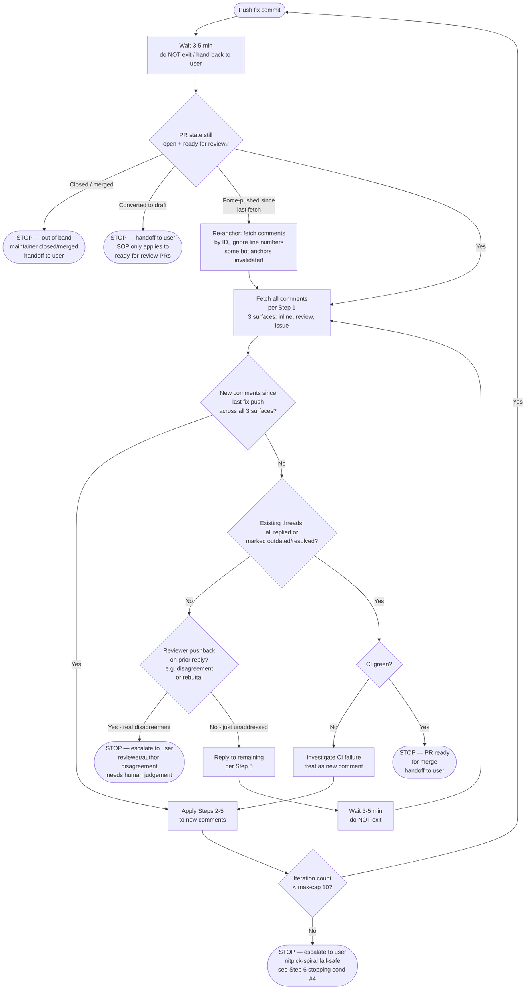

# SOP-1612: Respond To PR Review Comments

**Applies to:** All projects using the COR document system
**Last updated:** 2026-05-02
**Last reviewed:** 2026-05-02
**Status:** Draft

---

## What Is It?

The standard process for responding to review comments on a Pull Request. Covers comments from any source — human reviewers, GitHub-native automated review bots, multi-model panel review tooling (when available), or any other source. This SOP is a universal overlay that works with any workflow (COR-1600–1605).

### Reviewer Detector Classes (orthogonal, not interchangeable)

Different reviewer types catch different failure modes. Always treat them as a **set of orthogonal detectors**, not substitutes. Which classes are available depends on the project's tooling — pick whatever subset applies:

| Detector | Strengths (catches reliably) | Blind spots | Availability |
|---|---|---|---|
| **GitHub-native review bot** — e.g. `chatgpt-codex-connector[bot]` (Codex), `copilot-pull-request-reviewer[bot]` (Copilot), CodeRabbit, Greptile, Sourcery. Auto-runs ~30s after each commit push when the corresponding GitHub App is installed. | Cross-reference inconsistencies, stale references, "shipped" / placeholder elision, shell-example execution failures (`set -e` brittleness, unmatched globs, invalid jq, syntax errors), cross-file contract drift | Architectural judgment, design tradeoffs, calibration scoring, out-of-scope debates | Always check repo settings — exact bot identity varies. The SOP applies identically to any bot of this class. |
| **Multi-model panel review** — N independent LLM reviewers scoring against a rubric (e.g. COR-1608). Project-specific tooling: `/trinity` skill, CodeRabbit Pro, Greptile-team-review, custom orchestration, or none. | Architecture, risk awareness, scope precision, calibration scoring (COR-1608), competing-tradeoff judgments | Cross-reference drift after R+1 (panel internalizes a model and stops re-checking), shell-execution last-mile bugs, "review pack framed-out" issues | **Project-specific.** Many projects have no multi-model panel — that is normal. When unavailable, the bot inline + author self-review is the entire reviewer pool. |
| **CI-side static analyzer** — type checker (`mypy`, `pyright`, `tsc`), linter (`ruff`, `eslint`, `clippy`), security scanner (`bandit`, `semgrep`, `gitleaks`), shellcheck. Runs on every PR via the project's CI workflow. | Type errors, lint violations, dead code, security anti-patterns, shell-script bugs (when `shellcheck` is wired). Deterministic, no LLM. | Architectural judgment, semantic correctness beyond type/lint rules, intent verification. Misses cross-reference drift in prose. | Project-dependent — check `.github/workflows/`. Treat as a hard gate when present (CI fail = blocker). |
| **Human reviewer** | Domain intent, "is this what the user actually wants", historical context, cross-PR strategic decisions | Patience for diff-mode rescanning, real-shell mental simulation | Project-dependent (solo vs team). |
| **Author self-review** | Knows intent + recent context | Author-self bias ("I just wrote this, it's fine"), inability to diff-mode read own work | Always available. |

**Rule of thumb (calibrate to what your project actually has):**
- **Doc-only PR (≤ 5 file changes, no architectural decision)** → GitHub-native review bot inline alone is **likely sufficient** if iterated through every fix round per the §Step 6 loop. Multi-model panel optional.
- **PRP / architectural / cross-vendor protocol PR** → Multi-model panel **strongly recommended when available**; bot still runs in parallel and catches what panel misses. **If your project has no multi-model panel tooling**, lean harder on §Step 8 (`set -euo pipefail` pre-publish testing) and human review.
- **Implementation PR with code** → bot inline + (panel if available). Bot's execution simulator extends to test code.

**Important — multi-model panel is NOT universally available.** This SOP describes how to respond to *whatever* reviewers your project actually has. Don't block a PR waiting for a panel review that the project's tooling doesn't support; don't write fix commits expecting a panel pass that won't happen.

---

## Why

Without a standard process, review comments get fixed without replies, missed entirely, or self-resolved without reviewer confirmation. This leads to unverified fixes and broken review trust.

---

## When to Use

- A PR has received review comments (inline, review summary, or bot suggestions)
- After pushing code to a PR that has pending review threads
- Any workflow that involves a PR merge step

---

## When NOT to Use

- Review scoring during COR-1602 parallel review (that's a separate scoring flow)
- Draft PRs where comments are self-notes
- Comments on closed/merged PRs (address in a follow-up PR if needed)

---

## Steps

### 1. Fetch all PR review feedback

Fetch inline review comments, review summary comments, and top-level PR conversation comments:

```bash
# Inline review comments on changed lines.
# IMPORTANT: keep `in_reply_to_id`, `created_at`, and `user.login` in the
# projection — §Step 6 stopping condition #1 needs them to (a) distinguish
# top-level vs reply comments, (b) detect "since last fix push" boundary,
# (c) attribute the comment to a reviewer (bot vs human).
gh api repos/{owner}/{repo}/pulls/{number}/comments --paginate --jq '.[] | {type: "inline", id, in_reply_to_id, path, line, user: .user.login, created_at, body}'

# Review summary comments (review bodies). Keep CHANGES_REQUESTED reviews even
# if body is empty. Includes `user.login` for bot-vs-human attribution.
# IMPORTANT: GitHub's reviews endpoint exposes `submitted_at` (not `created_at`);
# alias it to `created_at` here so §Step 6 stopping condition #1 can apply a
# UNIFIED `created_at` timestamp filter across all three surfaces. Without the
# alias, a `created_at`-keyed "since last fix push" check silently drops new
# review summaries (including new CHANGES_REQUESTED reviews).
# Reviews don't have `in_reply_to_id` (no thread structure).
gh api repos/{owner}/{repo}/pulls/{number}/reviews --paginate --jq '.[] | select(.state == "CHANGES_REQUESTED" or (.body != null and .body != "")) | {type: "review_summary", id, state, user: .user.login, created_at: .submitted_at, body}'

# Top-level PR conversation comments. Same field rationale.
gh api repos/{owner}/{repo}/issues/{number}/comments --paginate --jq '.[] | {type: "issue_comment", id, user: .user.login, created_at, body}'
```

### 2. Categorize each comment

Read each comment and classify:

| Category | Definition | Action required |
|----------|-----------|----------------|
| **Blocking** | Code bug, logic error, missing test, security issue | Must fix before merge |
| **Advisory** | Style suggestion, naming preference, minor improvement | Fix or explain why not |
| **Question** | Reviewer asks for clarification | Reply with explanation |
| **Incorrect** | Reviewer suggestion is wrong or inapplicable | Reply with reasoning, escalate to user |

### 3. Process each comment

**Blocking:**
1. Fix the code

**Advisory:**
1. If adopting: fix the code
2. If declining: reply with reasoning why the change is not needed

**Question:**
1. Reply with explanation on GitHub

**Incorrect:**
1. Reply on GitHub: explain why the suggestion is incorrect or inapplicable
2. Escalate to user for confirmation before proceeding

### 4. Push all fixes in one commit

If any blocking or adopted advisory comments required code changes, group those fixes into a single commit referencing the PR:

```bash
git add <changed-files>
git commit -m "fix: address PR review comments (#<PR>)"
git push
```

If there were no code changes (for example, only Question, Incorrect, or declined Advisory comments), skip this step and continue to Step 5.

### 5. Reply to each fixed comment — with VERIFIED behavior claims

If Step 4 produced a fix commit, reply on GitHub for each blocking or adopted advisory comment with:

GitHub only auto-marks line-anchored comments as outdated when the referenced diff line changes. Diff position comments with `line: null` (common for Codex/Copilot bot comments) and issue-level/top-level comments are not auto-outdated, so reply to those manually after the fix lands.

1. The commit hash
2. What changed
3. **Behaviour verification (mandatory when the reply asserts behaviour).** If the reply makes a claim about how the fixed code behaves under any condition (e.g., "real errors still surface", "set -e safe", "race resolves to content-identical"), that claim **MUST** be backed by an executed verification: either cite the test fixture that exercises it, or include the local sanity-test command + observed exit code + observed output. Reasoning-only assertions about behaviour are forbidden — they have produced reviewer-self-correction loops where a subsequent bot review caught the assertion was false (PR #84 R6 precedent).

If there was no fix commit, reply only where applicable for Question, Incorrect, or declined Advisory comments.

### 6. Wait for CI **and the next bot review pass** — agent self-driven loop, no user prompting

After every fix push, the agent **MUST** wait 3–5 minutes and self-poll for new comments before handing control back to the user. Asking the user "anything new?" or "should I check again?" is **forbidden** — see §Pitfalls. The agent's job is to drive the loop until a stopping condition is hit.

#### Decision tree (canonical)



#### Why "wait 3-5 min, do not exit" is mandatory

GitHub-native review bots auto-trigger a fresh review pass on every new commit, typically within 30–90 seconds. A reply that arrives later is invisible to an agent that returned control to the user immediately after pushing. PR #84 in the COR-1612 evidence base ran **7 fix rounds**, each round catching new shell / cross-reference bugs introduced by the prior round's fix; if the agent had handed back control after round 1, rounds 2–7 would have required the user to manually prompt "Round N — check again". That is exactly the anti-pattern this Step 6 prevents.

#### How to wait (harness-specific)

| Harness | Mechanism |
|---|---|
| **Claude Code** | Use the `ScheduleWakeup` tool (or `/loop` skill) to schedule a wake-up at +5 min. Do NOT use a long synchronous `sleep` that burns prompt-cache cycles. If neither is available, sleep 180 seconds via `Bash` (cache loss accepted). |
| **GitHub Actions / CI** | `sleep 300 && <re-fetch script>` |
| **Manual / shell** | `sleep 300 && <re-fetch>` |

#### Stopping conditions (all four required)

1. **No new comments since last fix push, across all three surfaces** that §Step 1 fetches. Set `LAST_PUSH_TS` to the ISO timestamp of the most recent fix-commit push (e.g. `LAST_PUSH_TS=$(git log -1 --format=%cI HEAD)`) and the unified `created_at` filter (made possible by the `submitted_at → created_at` alias in §Step 1's review-summary projection) lets one jq predicate apply to all three surfaces:

   ```bash
   PR_OWNER="${PR_OWNER:?set PR_OWNER=<github-login-of-pr-author>}"

   # Stream all 3 surfaces through a single new-since-push filter
   {
     gh api repos/"$OWNER"/"$REPO"/pulls/"$PR_NUM"/comments --paginate \
       --jq '.[] | {type:"inline", id, in_reply_to_id, user:.user.login, created_at, body}'
     gh api repos/"$OWNER"/"$REPO"/pulls/"$PR_NUM"/reviews --paginate \
       --jq '.[] | select(.state == "CHANGES_REQUESTED" or (.body != null and .body != "")) | {type:"review_summary", id, state, user:.user.login, created_at:.submitted_at, body}'
     gh api repos/"$OWNER"/"$REPO"/issues/"$PR_NUM"/comments --paginate \
       --jq '.[] | {type:"issue_comment", id, user:.user.login, created_at, body}'
   } | jq -s --arg push "$LAST_PUSH_TS" --arg owner "$PR_OWNER" '
     map(select(
       .created_at > $push                          # new since fix push
       and (.user != $owner)                        # not authored by PR owner
       and ((.type == "inline" and .in_reply_to_id == null) or .type != "inline")  # top-level only for inline
     ))
   '
   ```

   Stop-condition #1 holds when this jq pipeline returns `[]` (empty array). The earlier draft only counted inline comments and didn't show the actual filter expression, which created a Step 1↔Step 6 contract drift — fetched three surfaces but stopped on one with no executable filter for the other two. All three surfaces are now covered by one composable filter that an implementer can copy-paste.

2. **All existing threads** either have a reply from the author OR have been marked **outdated** by GitHub (line-anchored auto-outdate when the diff line moves) OR explicitly **resolved** by the original reviewer. **For non-resolving bots** (bots that never call the resolve mutation — common for `chatgpt-codex-connector[bot]`, `copilot-pull-request-reviewer[bot]`): an author reply citing the fix commit hash counts as "addressed"; the agent informs the user at handoff so the user can manually resolve if desired (per §Step 7).

3. **CI green** for the most recent commit.

4. **Iteration count below max-iteration fail-safe.** Default cap: **10 fix rounds per PR** (counting each fix commit as one round). On hitting the cap, **escalate to the user** rather than continuing — write a summary of unresolved findings + reviewer-vs-author disagreements + recommend either (a) merge-as-is with explicit accepted-risks list, (b) close the PR and reopen with narrower scope, or (c) bump the cap with explicit justification. Pathological nitpick-spirals (each fix introduces a new bot finding indefinitely) are real failure modes — without a fail-safe the agent loops forever.

If any of the four is not met, loop back to "Wait 3-5 min" — do not exit.

#### Detecting reviewer-side resolution

Verify whether the reviewer marked the thread outdated/resolved (a positive signal that your fix landed). The `gh api` command below is a real shell example and follows the §Step 8 rule — it uses bash variables (not angle-bracket placeholders) so it is copy-paste runnable under `set -euo pipefail`:

```bash
OWNER="${OWNER:?set OWNER=<github-org-or-user>}"
REPO="${REPO:?set REPO=<repo-name>}"
PR_NUM="${PR_NUM:?set PR_NUM=<pr-number>}"

# Per-thread resolution state (GitHub GraphQL — REST doesn't expose isResolved).
# Pagination: GraphQL caps reviewThreads at 100 per page. For PRs with > 100
# threads, page via the cursor below. The pageInfo block + while-loop is the
# canonical pattern.
#
# Cursor handling: the GraphQL `$after` arg must be GraphQL `null` on the FIRST
# request (no prior page). `gh api -f after="..."` sends a JSON STRING value,
# so `-f after="null"` would send the literal string "null" — GraphQL would
# fail. The first request omits `-F after=...` entirely (then $after defaults
# to GraphQL null per the query signature `$after:String`); subsequent
# requests send the real cursor as a string via `-f`.
CURSOR=""   # empty = "no cursor yet, send null"
while :; do
  if [ -z "$CURSOR" ]; then
    AFTER_ARG=()                       # first page: omit $after, defaults to GraphQL null
  else
    AFTER_ARG=(-f "after=$CURSOR")     # subsequent pages: pass cursor as string
  fi
  RESPONSE=$(gh api graphql \
    -f query='
      query($owner:String!, $repo:String!, $pr:Int!, $after:String) {
        repository(owner:$owner, name:$repo) {
          pullRequest(number:$pr) {
            reviewThreads(first:100, after:$after) {
              pageInfo { hasNextPage endCursor }
              nodes { id isResolved isOutdated comments(first:1){nodes{databaseId path line body}} }
            }
          }
        }
      }' \
    -f owner="$OWNER" -f repo="$REPO" -F pr="$PR_NUM" \
    "${AFTER_ARG[@]}" 2>/dev/null) || break
  echo "$RESPONSE" | jq -r '.data.repository.pullRequest.reviewThreads.nodes[]'
  HAS_NEXT=$(echo "$RESPONSE" | jq -r '.data.repository.pullRequest.reviewThreads.pageInfo.hasNextPage')
  [ "$HAS_NEXT" = "true" ] || break
  CURSOR=$(echo "$RESPONSE" | jq -r '.data.repository.pullRequest.reviewThreads.pageInfo.endCursor')
done
```

A thread with `isResolved: true` OR `isOutdated: true` counts as "resolved" for §Step 6 stopping condition #2. Do not self-resolve (per §Step 7).

### 7. Do NOT self-resolve threads

The reviewer (human or bot) must confirm the fix and resolve the thread. Never resolve your own fix.

If the reviewer is an automated tool that cannot resolve, inform the user and let them resolve.

### 8. Doc-shell example mandatory pre-publish test

When a PR adds or modifies any **shell example** intended for users to copy-paste (recipes inside fenced ```bash blocks in SOPs, READMEs, or other docs), the example MUST be executed at least once locally **under `set -euo pipefail`** before push, in **all of the following representative states**:

- Empty / fresh state (no input files, no archive, no rollover) — should exit 0 with no output, not halt.
- Populated state with the expected happy-path content — should produce the documented output.
- Edge cases relevant to the example (e.g., for log-reading recipes: rollover present, archive corrupt, no matching entry, multi-session same-day).

Capture the verification in the commit message or in the Step 5 reply (per the behaviour-verification rule). Doc-shell examples that haven't been run under `set -euo pipefail` consistently produce bot findings in subsequent rounds — pre-testing eliminates the most common source of iteration loops.

---

## Reply Format

When replying to a comment on GitHub, include:

- **Commit reference:** which commit contains the fix
- **What changed:** brief description of the fix
- **If declining:** reasoning for not making the change

Example:
```
Fixed in abc1234. Narrowed exception catch to `(ValueError, OSError, MalformedDocumentError)`.
```

Example (declining):
```
This suggestion is incorrect — the INC template places Date before Severity (see `src/fx_alfred/templates/inc.md`). No change needed.
```

---

## Pitfalls

- **Self-resolving:** Resolving your own thread is meaningless — the reviewer must verify
- **Silent fixes:** Fixing code without replying on GitHub leaves the thread unresolved and untracked
- **Blanket dismiss:** Dismissing bot suggestions without reading them — automated reviewers can catch real bugs
- **Batch replies:** Replying "fixed all" without per-comment responses makes it hard to verify each fix
- **Confident-but-unverified behaviour claims in replies:** Asserting behavioural correctness ("real errors still surface", "race resolves identically") without executing the fixed code under the failure mode is the single highest-frequency way that subsequent bot reviews catch the *replier* rather than the original code (PR #84 R6 precedent). Always verify behaviour before asserting it.
- **Closing the loop after one fix round:** Bot reviewers auto-re-review every new commit. If you push a fix and walk away, you'll miss the next bot pass — which catches bugs your fix introduced (PR #84 ran 7 rounds; rounds 4-7 each caught new shell brittleness introduced by the prior round's fix).
- **Treating bot findings as "just lint":** Bot's static-diff cross-reference detector class catches genuine spec / shell / contract bugs that human and panel reviewers miss systematically (see "Reviewer Detector Classes" above). They are not stylistic suggestions — they are a different failure-mode population.
- **Asking the user to remind you to re-check** (e.g. "Round N — check again", "let me know if there are new comments", "should I look at #84?"). The agent, not the user, owns the §Step 6 wait-and-poll loop. If you find yourself about to ask the user "any new reviews?", that means you exited Step 6 too early — go back, wait 3-5 min, and re-fetch yourself. The user prompts only when overriding the loop (e.g. "stop, merge as-is").
- **Assuming a multi-model panel is available** when this SOP was written. The original draft hardcoded a specific tool (`/trinity` skill) — that was wrong. The "Reviewer Detector Classes" table now describes panel review as project-specific; check what tooling your project has before relying on a panel pass.

## Why bot reviewers catch what humans/panels miss

Five structural mechanisms (PR #78 / #80 / #82 / #84 evidence base, 12+ caught bugs):

1. **Diff-mode vs prose-mode reading.** Bot reads each commit's patch in ~30s; humans/panels read the post-fix document holistically. Cross-reference inconsistencies are systematically caught by diff-mode and missed by prose-mode (which fills "this section is internally consistent" gaps with charity).
2. **No author-self / no internal-model bias.** Bot is stateless — every commit is a fresh look. Author and panel after R+1 have an internal model of the spec; new commits get squeezed into that model rather than re-checked from zero.
3. **Execution-model-aware vs concept-aware.** Bot maintains an effective bash + jq + unzip + posix execution simulator. Humans/panels read shell as "logically reasonable" without mentally executing under `set -euo pipefail`.
4. **Coverage > framing.** Multi-model review packs (verification questions, paranoid scrutiny areas) inadvertently define what reviewers DON'T look at. Bot has no pack: it scans whole-diff. Bugs outside the framed area only surface from unframed scanning.
5. **"Will it run?" vs "Is it correct?"** Bot focuses on last-mile execution; humans/panels work at the concept level. For implementer-facing docs (recipes, examples), the last mile matters most.

These are orthogonal mechanisms — none is "bot is smarter." The defensive practices are: (a) force diff-mode re-reads of own commits; (b) treat just-written code as foreign; (c) mentally execute every shell example; (d) include "free scrutiny" sections in review packs; (e) default-test under `set -euo pipefail`.

---

## Change History

| Date | Change | By |
|------|--------|----|
| 2026-04-04 | Initial version per Issue #28 | Claude Code |
| 2026-04-04 | PR review fix: fetch 3 endpoints (inline + review summary + issue comments), add --paginate, fix declining example to cite template not COR-0002 | Claude Code |
| 2026-04-05 | PR review fix: include empty-body CHANGES_REQUESTED reviews, move replies after commit/push, add explicit git push step | Codex |
| 2026-04-05 | Add note that diff-position and top-level comments do not auto-mark outdated | Codex |
| 2026-04-05 | Make Step 4 conditional when review responses do not require code changes | Codex |
| 2026-05-02 | Major amendment driven by PR #78 / #80 / #82 / #84 evidence (12+ GitHub-native bot real-bug catches missed by panel + author): (a) Add Reviewer Detector Classes table to §What Is It (bot vs panel vs human vs author — orthogonal, not interchangeable). (b) §Step 5 mandates behaviour-verification for any reply that asserts behaviour — reasoning-only assertions are forbidden (PR #84 R6 caught my own reply where I claimed errors surface when they didn't). (c) §Step 6 reframes "wait for CI" as "wait for CI AND the next bot review pass" — bot auto-re-reviews each commit within 30–90s; iteration is normal (PR #84 ran 6 rounds). (d) New §Step 8 mandates `set -euo pipefail` pre-publish testing of every doc-shell example in 3 representative states (fresh / happy-path / edge cases). (e) §Pitfalls expanded with 3 new entries (unverified behaviour claims, single-round closing, treating bot as lint). (f) New §Why bot reviewers catch what humans/panels miss section explains the 5 structural mechanisms (diff-mode, no-author-bias, exec-simulator, no-pack-framing, execution focus) and the 5 derived defensive practices. | Frank + Claude (PR #84 retrospective) |
| 2026-05-02 | Iteration on the same amendment per session feedback: (1) Depersonalised "Trinity 4-reviewer panel" → generic "Multi-model panel review" with project-specific tooling examples (`/trinity`, CodeRabbit Pro, Greptile, custom, or none). Multi-model panel is NOT universally available; SOP applies regardless. (2) Generalised "Codex bot" → "GitHub-native review bot" with examples (Codex, Copilot, CodeRabbit, Greptile, Sourcery) — exact bot identity varies by repo settings. (3) Added explicit Mermaid decision tree to §Step 6 making the agent self-driven loop visual. (4) Added strict "wait 3-5 min, do NOT exit / hand back to user" invariant + harness-specific wait mechanisms (Claude Code ScheduleWakeup, CI sleep, manual). (5) Added §Step 6 sub-section on detecting reviewer-side resolution via GraphQL `isResolved`/`isOutdated`. (6) New §Pitfalls entries: "Asking the user to remind you to re-check" (anti-pattern explicitly forbidden) + "Assuming a multi-model panel is available". | Frank + Claude (post-amendment iteration) |
