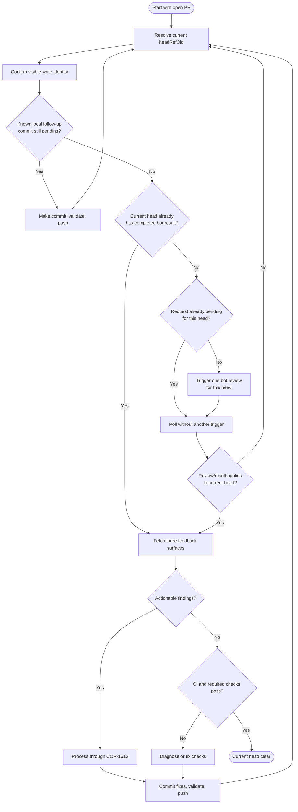

# SOP-1615: GitHub App PR Review Bot Loop

**Applies to:** All projects using the COR document system
**Last updated:** 2026-05-15
**Last reviewed:** 2026-05-15
**Status:** Active
**Related:** COR-1602 (Multi Model Parallel Review), COR-1612 (Respond To PR Review Comments), COR-1613 (Council Review)
**Task tags:** [github, github-app, pull-request, pr-review, review, bot-review, codex, copilot]
**Authored from:** BAB-1504-SOP-GitHub-Codex-PR-Review-Loop

---

## What Is It?

A procedure for driving a GitHub App pull-request review bot loop from trigger to completion. It covers when to request a review, how to interpret reactions and review objects, how to avoid duplicate requests, how to match results to the current PR head commit, and when to hand off actionable findings to COR-1612.

This SOP is bot-agnostic. It covers both first-party GitHub/Copilot review apps and connector-installed reviewers such as `chatgpt-codex-connector[bot]`, as long as the review is produced by a GitHub App or bot on the PR.

---

## Why

GitHub App review bots are useful but easy to misread. A reaction on a request comment can mean "queued" rather than "complete"; a review can cover an older commit; and flat comment APIs can show old inline comments near new diff lines. Without a standard loop, operators can merge without a current-head review, re-fix stale comments, or spam duplicate review requests that make the PR timeline harder to audit.

---

## When to Use

- A PR is open and an operator asks for a GitHub App review bot pass.
- A branch has been pushed after addressing PR feedback and needs review on the new head commit.
- A workflow treats a GitHub App review bot as one detector in the PR readiness gate.
- The operator needs to distinguish pending bot work from a completed review result.
- Before declaring a PR merge-ready, even when an in-conversation panel review such as COR-1602 has already passed. GitHub App bots post asynchronously on GitHub, so their threads can exist outside the panel transcript.

## When NOT to Use

- Local review before a PR exists.
- Multi-reviewer decision making that is not GitHub App bot polling; use COR-1613 and the selected COR-1600 through COR-1605 workflow.
- Responding to already-fetched review findings; use COR-1612 for classification, fixes, replies, and post-fix polling.
- CI failure diagnosis with no PR review comments; use the project CI/debug route.
- The current GitHub identity is not allowed to create visible PR comments under the active USR/PRJ routing policy.

---

## Prerequisites

- Know the repository and PR number, for example `OWNER/REPO` and `PR_NUM`.
- Confirm `gh` is installed and authenticated.
- Confirm the visible-write account is the intended account for this project before creating PR comments.
- Know the local branch state and remote PR head:
  `git status --short --branch` and `gh pr view "$PR_NUM" --repo "$OWNER/$REPO" --json headRefOid`.
- Before manually triggering review, finish and push all known local closeout
  commits, status flips, index updates, PR-body-driven doc edits, and
  validation-only fixups. Trigger only when the next expected commit would be a
  response to review feedback or CI feedback.
- Do not put private hostnames, local filesystem paths, tokens, Tailscale IPs, or other local environment details into public PR text.

---

## Operator Checklist

Core invariant: a PR is not clear until the latest review result applies to the current `headRefOid` and no new actionable findings remain for that head.

- Record the current `headRefOid` before triggering or interpreting a review.
- Before the first manual trigger for a head, complete the local closeout pass:
  no known status-only, index-only, CHG closeout, PR body, or validation fixup
  commit should remain unpushed.
- After every push, return to Step 1 and compare any bot-reviewed commit with the new `headRefOid`.
- Treat `eyes` or similar acknowledgement reactions as queued or in-progress, not approval.
- Do not post duplicate `@codex review` comments or duplicate reviewer requests while a request for the same head is still pending.
- Verify the visible-write identity with `gh auth status` before posting PR comments, reviewer requests, or replies.
- Do not publish private IPs, local filesystem paths, tokens, private hostnames, or host-specific secrets in PR bodies, comments, commits, or review packets.
- For all actionable findings, hand off to COR-1612: classify comments, fix blockers and adopted advisories, rerun relevant validation, commit, push, and reply where needed.
- After pushing fixes from COR-1612, return to this SOP Step 1 for the new `headRefOid`.
- Before saying "merge-ready", run the pre-merge sweep in §Commands. Trinity/panel PASS is necessary for that lane but not sufficient while non-bookkeeping GitHub-side review threads remain unresolved or unreplied.
- For long iteration loops on the same PR, see COR-1612 §Scoping bot reviews via PR body for an optional, bot-vendor-dependent PR-body scope-hint technique.

---

## Status Vocabulary

| Signal | Meaning | What to do |
|--------|---------|------------|
| Request comment such as `@codex review` | A manual review request was posted | Wait; do not post another request immediately |
| Reviewer assignment such as `@copilot` | A GitHub reviewer-style bot was requested | Wait for review; do not also post a comment trigger unless both detectors are intentionally desired |
| Reaction such as `eyes` on the request | The reviewer has noticed or queued the request | Keep polling; review is not complete yet |
| Positive reaction with no new comments | The reviewer may have no suggestions | Confirm the signal applies to the current head before treating it as clear |
| Review body names a reviewed commit | Review completed for that commit | Compare the commit with current `headRefOid` |
| Inline bot comments | Actionable or advisory findings | Classify and handle via COR-1612 |
| Review is for an older commit | Current head is not covered | Request or wait for a review of the current head |
| Thread is outdated or resolved | Comment no longer applies to current diff | Do not treat it as a fresh blocker unless the issue still exists |

---

## Commands

Set variables:

```bash
OWNER="github-owner"
REPO="github-repo"
PR_NUM="123"
```

Confirm identity before visible writes:

```bash
gh auth status
```

Read PR state and recent review objects:

```bash
gh pr view "$PR_NUM" --repo "$OWNER/$REPO" \
  --json number,state,isDraft,mergeable,reviewDecision,headRefName,headRefOid,latestReviews,comments,statusCheckRollup
```

Trigger a manual review when the project uses a comment-requested bot:

```bash
gh pr comment "$PR_NUM" --repo "$OWNER/$REPO" --body '@codex review'
```

Request a review when the project uses a reviewer-assignment bot:

```bash
gh pr edit "$PR_NUM" --repo "$OWNER/$REPO" --add-reviewer @copilot
```

Fetch inline review comments:

```bash
gh api "repos/$OWNER/$REPO/pulls/$PR_NUM/comments" --paginate \
  --jq '.[] | {id, user: .user.login, path, line, commit_id, created_at, body, html_url}'
```

Fetch review summaries:

```bash
gh api "repos/$OWNER/$REPO/pulls/$PR_NUM/reviews" --paginate \
  --jq '.[] | {id, state, user: .user.login, commit_id, submitted_at, body}'
```

When thread state matters, use a GraphQL or project helper that exposes `isOutdated` and `isResolved`; REST flat comments do not expose the full thread state.

Pre-merge sweep, excluding bookkeeping bots:

```bash
OWNER="${OWNER:?set OWNER=<github-org-or-user>}"
REPO="${REPO:?set REPO=<repo-name>}"
PR_NUM="${PR_NUM:?set PR_NUM=<pr-number>}"

# Bots whose comments only mark bookkeeping state, not actionable findings.
BOOKKEEPING_BOTS_JSON='["iterwheel-clearance[bot]"]'

# Inline review comments on changed lines. Keep in_reply_to_id so author
# replies can be distinguished from top-level findings before COR-1612 routing.
gh api "repos/$OWNER/$REPO/pulls/$PR_NUM/comments" --paginate |
  jq -s --argjson bookkeeping "$BOOKKEEPING_BOTS_JSON" '
    flatten
    | map(select(.user.login as $u | ($bookkeeping | index($u) | not)))
    | map({
        type: "inline",
        id,
        in_reply_to_id,
        user: .user.login,
        path,
        line,
        commit_id,
        created_at,
        body,
        html_url
      })
  '

# Review summaries. Empty-body approvals are ignored; CHANGES_REQUESTED reviews
# are retained even if their body is empty.
gh api "repos/$OWNER/$REPO/pulls/$PR_NUM/reviews" --paginate |
  jq -s --argjson bookkeeping "$BOOKKEEPING_BOTS_JSON" '
    flatten
    | map(select((.user.login as $u | ($bookkeeping | index($u) | not))
        and (.state == "CHANGES_REQUESTED" or ((.body // "") != ""))))
    | map({
        type: "review_summary",
        id,
        state,
        user: .user.login,
        commit_id,
        created_at: .submitted_at,
        body
      })
  '
```

Thread-aware state for unresolved vs resolved/outdated:

```bash
OWNER="${OWNER:?set OWNER=<github-org-or-user>}"
REPO="${REPO:?set REPO=<repo-name>}"
PR_NUM="${PR_NUM:?set PR_NUM=<pr-number>}"
BOOKKEEPING_BOTS_JSON='["iterwheel-clearance[bot]"]'

gh api graphql \
  -f query='
    query($owner:String!, $repo:String!, $pr:Int!) {
      repository(owner:$owner, name:$repo) {
        pullRequest(number:$pr) {
          reviewThreads(first:100) {
            pageInfo { hasNextPage endCursor }
            nodes {
              id
              isResolved
              isOutdated
              comments(first:20) {
                nodes { databaseId author { login } body path line url }
              }
            }
          }
        }
      }
    }' \
  -f owner="$OWNER" -f repo="$REPO" -F pr="$PR_NUM" |
  jq --argjson bookkeeping "$BOOKKEEPING_BOTS_JSON" '
    .data.repository.pullRequest.reviewThreads as $threads
    | if $threads.pageInfo.hasNextPage then
        error("reviewThreads truncated; use COR-1612 Detecting reviewer-side resolution pagination")
      else
        $threads.nodes
        | map({
            id,
            isResolved,
            isOutdated,
            comments: [
              .comments.nodes[]
              | select(.author.login as $u | ($bookkeeping | index($u) | not))
              | {id: .databaseId, user: .author.login, path, line, body, url}
            ]
          })
        | map(select((.comments | length) > 0))
      end
  '
```

The pre-merge gate passes when the sweep returns zero non-bookkeeping GitHub-side review threads, or every returned thread is resolved, outdated, or has an author reply that addresses it per COR-1612. If no GitHub App review bot is installed, the same sweep returns no bot findings and the gate is vacuously satisfied after recording the result.

---

## Decision Tree



Read this as a control-flow summary only. The detailed rules below still govern
identity checks, trigger discipline, stale-head matching, feedback handling, and
completion criteria.

---

## Steps

### 1. Resolve the current PR head

Run `gh pr view` and record `headRefOid`. A review only clears the head commit it actually reviewed.

### 2. Confirm write identity before triggering review

Run `gh auth status`. If the authenticated account is not the intended visible-write account for the project, stop and fix authentication before creating PR comments.

### 3. Run the pre-trigger finalization gate

Before posting a manual review trigger, ask: "Do I already know I will make
another commit if this review passes?" If yes, make that commit first. Common
known follow-up commits include CHG closeout, status flips, index updates,
generated-doc refreshes, PR-body-driven corrections, and validation or
whitespace fixups.

Run the project validation that supports the PR readiness claim, confirm
`git status --short --branch` is clean except intentionally untracked unrelated
files, push the final known local commit, and re-read `headRefOid`.

If the only possible next commits are review-response or CI-response fixes, the
head is ready for a manual review trigger.

### 4. Decide whether a trigger is needed

Trigger review only when the current head lacks a completed review result, the operator explicitly requested a new pass, or a push changed the head after the last review request. Do not trigger another review while an existing request for the same head is still pending.

### 5. Trigger one review request for the head

Post or request the project-specific review once. Examples:

- Comment-triggered reviewer: `gh pr comment "$PR_NUM" --repo "$OWNER/$REPO" --body '@codex review'`
- Reviewer-assignment bot: `gh pr edit "$PR_NUM" --repo "$OWNER/$REPO" --add-reviewer @copilot`
- Repository-configured automatic review: no manual trigger; record that the head is waiting for the configured GitHub App reviewer

Record the current `headRefOid`, request mechanism, and request timestamp in the session notes or PR checklist.

### 6. Poll without spamming

Wait 3-5 minutes between polls. Re-read PR state, latest reviews, top-level comments, and inline comments. Repeated request comments before the previous request has resolved add noise and can obscure the audit trail.

### 7. Interpret reactions conservatively

Treat queue or acknowledgement reactions as in-progress signals, not approval. A positive no-comment signal can clear the head only when it is tied to the current request or current head and no newer actionable comments exist.

### 8. Match review result to the current head

If the review body or API object names a reviewed commit, compare it with current `headRefOid`. If the reviewed commit is stale, the current head is not clear. If the reviewer does not expose an explicit reviewed commit, use the best available evidence: request timestamp, review `commit_id`, PR head at review submission time, and absence of newer pushes.

### 9. Fetch actionable findings

Use the COR-1612 three-surface fetch pattern: inline review comments, review summaries, and top-level PR conversation comments. If a comment may be stale, fetch thread-aware state before treating it as a fresh blocker.

### 10. Process findings through COR-1612

Classify each finding as blocking, advisory, question, or incorrect. Fix blocking issues and adopted advisories in focused commits, reply with verified behavior claims, and keep reviewer-thread resolution discipline per COR-1612.

### 11. Restart after every push

Every push creates a new `headRefOid`. Return to Step 1, then request or wait for a review of that new head. A clean review of the old head does not clear the new one. Do not assume re-review is automatic; some reviewers must be explicitly requested again after a push.

### 12. Stop only when the current head is clear

The loop is complete when the latest bot result applies to current `headRefOid`, no new actionable comments remain, required checks are settled, no review request for the current head is still pending, and the pre-merge sweep above has no unresolved or unreplied non-bookkeeping GitHub-side review threads.

If the sweep finds unresolved threads, route them to COR-1612 before declaring merge-ready. If the sweep finds zero non-bookkeeping GitHub-side review threads, record "pre-merge sweep: clear" in the PR checklist or handoff note; that includes repositories with no installed GitHub App review bot.

---

## Completion Criteria

- Current `headRefOid` is recorded.
- The pre-trigger finalization gate passed before the first manual trigger for
  the current head, or any known follow-up commit was pushed before review was
  requested.
- Latest review result is matched to current `headRefOid`, or a no-suggestion signal is tied to the current request/head.
- No new actionable PR comments remain unhandled.
- Pre-merge sweep finds no unresolved or unreplied non-bookkeeping GitHub-side review threads. If the sweep finds zero such threads, the gate is clear.
- Relevant validation or CI has passed after the last fix push.
- Any remaining blockers are explicitly external to the GitHub App review loop.

---

## Pitfalls

- **Mistaking acknowledgement for approval:** queue reactions are not completed reviews.
- **Reviewing the wrong commit:** a review of one SHA does not clear a later push.
- **Duplicate triggers:** repeated request comments while one is pending make the timeline noisy.
- **Triggering before local closeout:** if a known CHG closeout, status flip,
  index update, or validation fixup is still pending, a clean bot result will
  immediately become stale after that push. Finish known local commits first.
- **Flat-comment staleness:** REST comment lists do not prove a thread still applies to the current diff.
- **Wrong visible-write identity:** project/user routing may require a specific GitHub account for public comments.
- **Private environment leakage:** never include local-only network or host details in public PR text.

---

## Examples

### Example 1 - Queue reaction only

1. The operator posts one review request.
2. The reviewer reacts with an acknowledgement.
3. `gh pr view` still shows no review for the current `headRefOid`.
4. Correct action: wait and poll again. Do not treat the reaction as approval and do not post another request.

### Example 2 - Fix push after a blocking comment

1. A review of `abc123` reports a blocking inline comment.
2. The operator fixes it locally, validates, commits, and pushes `def456`.
3. The old review is stale because it covered `abc123`.
4. Correct action: restart the loop for `def456`.

### Example 3 - Copilot reviewer request

1. The PR needs GitHub Copilot code review.
2. The operator requests Copilot as reviewer with `gh pr edit "$PR_NUM" --repo "$OWNER/$REPO" --add-reviewer @copilot`.
3. After a fix push, the operator does not assume Copilot will re-review automatically.
4. Correct action: restart the loop for the new head and request re-review if the project requires it.

### Example 4 - Old inline comment appears near a new diff line

1. The flat comments endpoint returns an old bot comment.
2. The diff line has moved since the original review.
3. The operator fetches thread-aware state and sees the thread is outdated.
4. Correct action: do not re-fix the stale comment unless the underlying issue still exists.

### Example 5 - Clean review before a known closeout commit

1. A PR receives a clean bot result for `abc123`.
2. The operator then notices a planned CHG closeout/status commit was not yet
   made.
3. Pushing that closeout creates `def456`; the clean review for `abc123` is now
   stale.
4. Correct action: avoid this by running Step 3 before the first trigger. If the
   push already happened, restart the loop for `def456` and record the
   sequencing miss in the CHG or retrospective if useful.

### Example 6 - Pre-merge sweep catches a panel-missed thread

1. A docs PR receives in-conversation panel PASS and the agent is ready to say
   "merge-ready."
2. Before handoff, the agent runs the pre-merge sweep. The inline-comments
   surface returns one non-bookkeeping GitHub App bot P2 thread on the current
   head; the thread-aware state shows `isResolved: false` and `isOutdated:
   false`.
3. The agent routes the finding through COR-1612 instead of declaring
   merge-ready. In the real-session evidence behind issue #156, this class of
   sweep caught multiple GitHub-bot findings that the panel transcript did not
   contain, including P1/P2 harness and cross-reference defects.
4. Correct action: fix or reply to the GitHub-side thread, push if needed,
   restart this SOP for the new head, and only hand off once the pre-merge
   sweep is clear.

---

## Portable Operator Prompt

```md
Use the GitHub App PR review bot loop:

- Follow COR-1615 to trigger, poll, and match review results to the current PR head.
- Follow COR-1612 to address fetched review comments.
- Before the first manual trigger, finish all known local closeout/status/index
  commits, validate, push, and re-read headRefOid.
- After every push, compare the reviewed commit with the current headRefOid.
- Treat eyes reactions as queued or in-progress, not approval.
- Do not post duplicate review triggers while one request is in progress.
- Fix all actionable findings, validate, commit, push, and restart the current-head review loop.
- Before declaring merge-ready, run the pre-merge sweep and confirm no non-bookkeeping GitHub-side review thread remains unresolved or unreplied.
- Verify the visible-write identity with gh auth status.
- Do not publish private IPs, local paths, tokens, or host-specific details in public PR text or commits.
```

---

## References

- OpenAI Codex GitHub integration: https://developers.openai.com/codex/integrations/github
- GitHub Copilot code review: https://docs.github.com/en/copilot/how-tos/use-copilot-agents/request-a-code-review/use-code-review

---

## Change History

| Date | Change | By |
|------|--------|----|
| 2026-05-06 | Added pre-trigger finalization gate to avoid wasting bot review passes on heads that already have known local follow-up commits pending. | Codex |
| 2026-05-09 | Added one-line pointer in §Operator Checklist to COR-1612 §Scoping bot reviews via PR body for the optional PR-body scope-hint technique on long iteration loops. CHG-2279. | Claude Opus 4.7 |
| 2026-05-05 | Added compact operator checklist and portable prompt for current-head review-loop non-negotiables. | Codex |
| 2026-05-05 | Initial COR-level version promoted from BAB-1504, generalized from Codex-specific Babs wording to GitHub App PR review bots. | Codex |
| 2026-05-15 | FXA-2285: add pre-merge sweep trigger, non-bookkeeping thread filters, no-bot/zero-thread vacuous pass behavior, and real-session example for panel-missed GitHub App review threads. | Codex |
