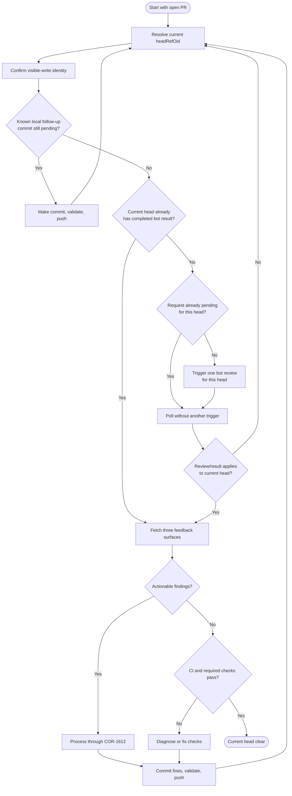

# SOP-1615: GitHub App PR Review Bot Loop

**Applies to:** All projects using the COR document system
**Last updated:** 2026-08-16
**Last reviewed:** 2026-08-16
**Status:** Active
**Tags:** pr, review, loop
**Related:** COR-1602 (Multi Model Parallel Review), COR-1612 (Respond To PR Review Comments), COR-1613 (Council Review), COR-1620 (Self-Pacing Loop Primitives — rung A of §Agent Execution)
**Task tags:** [github, github-app, pull-request, pr-review, review, bot-review, codex, copilot]
**Authored from:** BAB-1504-SOP-GitHub-Codex-PR-Review-Loop
**Workflow loops:** [{id: restart-on-push, from: 11, to: 1, max_iterations: 10, condition: "a push created a new headRefOid without a completed review for it"}, {id: poll-wait, from: 8, to: 6, max_iterations: 10, condition: "a review request for the current headRefOid is pending and no completed result for it has been fetched yet"}]
**Disposition:** inherit-only

---

## What Is It?

A procedure for driving a GitHub App pull-request review bot loop from trigger to completion. It covers when to request a review, how to interpret reactions and review objects, how to avoid duplicate requests, how to match results to the current PR head commit, and when to hand off actionable findings to COR-1612.

This SOP is bot-agnostic. It covers both first-party GitHub/Copilot review apps and connector-installed reviewers such as `chatgpt-codex-connector[bot]`, as long as the review is produced by a GitHub App or bot on the PR.

---

## Why

GitHub App review bots are useful but easy to misread. A reaction on a request comment can mean "queued" rather than "complete"; a review can cover an older commit; and flat comment APIs can show old inline comments near new diff lines. Without a standard loop, operators can merge without a current-head review, re-fix stale comments, or spam duplicate review requests that make the PR timeline harder to audit.

---

## When to Use

- A PR is open and an operator asks for a GitHub App review bot pass.
- A branch has been pushed after addressing PR feedback and needs review on the new head commit.
- A workflow treats a GitHub App review bot as one detector in the PR readiness gate.
- The operator needs to distinguish pending bot work from a completed review result.
- Before declaring a PR merge-ready, even when an in-conversation panel review such as COR-1602 has already passed. GitHub App bots post asynchronously on GitHub, so their threads can exist outside the panel transcript.

## When NOT to Use

- Local review before a PR exists.
- Multi-reviewer decision making that is not GitHub App bot polling; use COR-1613 and the selected COR-1600 through COR-1605 workflow.
- Responding to already-fetched review findings; use COR-1612 for classification, fixes, replies, and post-fix polling.
- CI failure diagnosis with no PR review comments; use the project CI/debug route.
- The current GitHub identity is not allowed to create visible PR comments under the active USR/PRJ routing policy.

---

## Prerequisites

- Know the repository and PR number, for example `OWNER/REPO` and `PR_NUM`.
- Confirm `gh` is installed and authenticated.
- Confirm the visible-write account is the intended account for this project before creating PR comments.
- Know the local branch state and remote PR head:
  `git status --short --branch` and `gh pr view "$PR_NUM" --repo "$OWNER/$REPO" --json headRefOid`.
- Before manually triggering review, finish and push all known local closeout
  commits, status flips, index updates, PR-body-driven doc edits, and
  validation-only fixups. Trigger only when the next expected commit would be a
  response to review feedback or CI feedback.
- Do not put private hostnames, local filesystem paths, tokens, Tailscale IPs, or other local environment details into public PR text.

---

## Operator Checklist

Core invariant: a PR is not clear until the latest review result applies to the current `headRefOid` and no new actionable findings remain for that head.

- Record the current `headRefOid` before triggering or interpreting a review.
- Before the first manual trigger for a head, complete the local closeout pass:
  no known status-only, index-only, CHG closeout, PR body, or validation fixup
  commit should remain unpushed.
- After every push, return to Step 1 and compare any bot-reviewed commit with the new `headRefOid`.
- Treat `eyes` or similar acknowledgement reactions as queued or in-progress, not approval.
- Do not post duplicate `@codex review` comments or duplicate reviewer requests while a request for the same head is still pending.
- Verify the visible-write identity with `gh auth status` before posting PR comments, reviewer requests, or replies.
- Do not publish private IPs, local filesystem paths, tokens, private hostnames, or host-specific secrets in PR bodies, comments, commits, or review packets.
- For all actionable findings, hand off to COR-1612: classify comments, fix blockers and adopted advisories, rerun relevant validation, commit, push, and reply where needed.
- After pushing fixes from COR-1612, return to this SOP Step 1 for the new `headRefOid`.
- Before saying "merge-ready", run the pre-merge sweep in §Commands. Trinity/panel PASS is necessary for that lane but not sufficient while non-bookkeeping GitHub-side review threads remain unresolved or unreplied.
- For long iteration loops on the same PR, see COR-1612 §Scoping bot reviews via PR body for an optional, bot-vendor-dependent PR-body scope-hint technique.
- Agents: never end the task while a review request for the current head is pending. Wait via §Agent Execution rung A or B; end only with a wakeup armed (A) or a resumable handoff note written (C) — rung-B exhaustion always terminates in C.

---

## Status Vocabulary

| Signal | Meaning | What to do |
|--------|---------|------------|
| Request comment such as `@codex review` | A manual review request was posted | Wait; do not post another request immediately |
| Reviewer assignment such as `@copilot` | A GitHub reviewer-style bot was requested | Wait for review; do not also post a comment trigger unless both detectors are intentionally desired |
| Reaction such as `eyes` on the request | The reviewer has noticed or queued the request | Keep polling; review is not complete yet |
| Positive reaction with no new comments | The reviewer may have no suggestions | Confirm the signal applies to the current head before treating it as clear |
| Review body names a reviewed commit | Review completed for that commit | Compare the commit with current `headRefOid` |
| Inline bot comments | Actionable or advisory findings | Classify and handle via COR-1612 |
| Review is for an older commit | Current head is not covered | Request or wait for a review of the current head |
| Thread is outdated or resolved | Comment no longer applies to current diff | Do not treat it as a fresh blocker unless the issue still exists |

---

## Commands

Set variables:

```bash
OWNER="github-owner"
REPO="github-repo"
PR_NUM="123"
```

Confirm identity before visible writes:

```bash
gh auth status
```

Read PR state and recent review objects:

```bash
gh pr view "$PR_NUM" --repo "$OWNER/$REPO" \
  --json number,state,isDraft,mergeable,mergeStateStatus,reviewDecision,headRefName,headRefOid,latestReviews,comments,statusCheckRollup
```

Trigger a manual review when the project uses a comment-requested bot:

```bash
gh pr comment "$PR_NUM" --repo "$OWNER/$REPO" --body '@codex review'
```

Request a review when the project uses a reviewer-assignment bot:

```bash
gh pr edit "$PR_NUM" --repo "$OWNER/$REPO" --add-reviewer @copilot
```

Fetch inline review comments:

```bash
gh api "repos/$OWNER/$REPO/pulls/$PR_NUM/comments" --paginate \
  --jq '.[] | {id, user: .user.login, path, line, commit_id, created_at, body, html_url}'
```

Fetch review summaries:

```bash
gh api "repos/$OWNER/$REPO/pulls/$PR_NUM/reviews" --paginate \
  --jq '.[] | {id, state, user: .user.login, commit_id, submitted_at, body}'
```

When thread state matters, use a GraphQL or project helper that exposes `isOutdated` and `isResolved`; REST flat comments do not expose the full thread state.

Bounded blocking wait (rung B of §Agent Execution) — waits for a review result
inside a single tool call so an agent turn does not end while the request is
pending. Needs only `gh` and `awk`. One invocation of this script is one
`poll-wait` back-edge round. Size `POLL_ROUNDS` and `POLL_INTERVAL` to fit the
harness's per-call timeout: with no sleep after the final poll, the default 3
polls sleep 2 × 180 s ≈ 6 min plus API time, comfortably inside a common
10-minute cap. On exit 1 re-invoke the script, bounded overall by the
`poll-wait` back-edge budget. Pre-set `HEAD_OID` to the head recorded at Step
5 so a push landing before the script starts is detected as exit 2 instead of
being silently adopted as the baseline, and pre-set `SINCE` to the Step-5
request timestamp (ISO-8601 UTC, captured before the trigger was posted — see
Step 5) so a review that predates the request — e.g. an earlier pass on the
same unchanged head — is not miscounted as the awaited result. Pre-set `BOT_USER` to the login the reviewer **submits reviews
under**, which can differ from the request handle — requesting `@copilot`
yields reviews from `copilot-pull-request-reviewer[bot]` (COR-1612); check a
prior PR's review objects when unsure. Leave it empty only when the
submitting identity is genuinely unknown, accepting that bookkeeping-bot
reviews, unrelated same-head reviews, and the author's own thread replies
then register as candidates and can burn the `poll-wait` budget:

```bash
OWNER="${OWNER:?set OWNER=<github-org-or-user>}"
REPO="${REPO:?set REPO=<repo-name>}"
PR_NUM="${PR_NUM:?set PR_NUM=<pr-number>}"

# Exit 0 = a submitted (non-PENDING, non-DISMISSED) review at or after SINCE
#          exists for the recorded head (interpret via Steps 7-8; candidate
#          signal, not clearance)
# Exit 1 = no new review object within the budget. NOT proof the request is
#          still pending: some reviewers complete via a reaction or top-level
#          comment without a review object — check the other feedback surfaces
#          (Steps 6-7) before re-invoking
# Exit 2 = head changed while waiting (return to Step 1)
# Exit 3 = gh/API failure (diagnose before trusting any other signal)
head_oid() { gh pr view "$PR_NUM" --repo "$OWNER/$REPO" --json headRefOid --jq .headRefOid; }
# Baseline: honor a pre-set HEAD_OID (Step-5-recorded head), else fetch. The
# hex-shape guard rejects empty, jq "null", and error text before it can be
# interpolated into the jq filter below.
HEAD_OID="${HEAD_OID:-$(head_oid)}" || exit 3
case "$HEAD_OID" in "" | *[!0-9a-f]*) exit 3 ;; esac
# Optional request timestamp (Step 5); empty matches every review. Shape-guarded
# like HEAD_OID because it is interpolated into the jq filter.
SINCE="${SINCE:-}"
case "$SINCE" in *[!0-9TZ:+.-]*) exit 3 ;; esac
# Requested reviewer's login (e.g. "chatgpt-codex-connector[bot]") — set it
# whenever known (the Step-5 record names it). Empty is a last-resort
# wildcard: bookkeeping bots, unrelated same-head reviews, and the author's
# own thread replies (recorded by GitHub as COMMENTED reviews on the current
# head) then count as candidates. Guard rejects jq-breaking characters
# before interpolation.
BOT_USER="${BOT_USER:-}"
case "$BOT_USER" in *[\"\\]*) exit 3 ;; esac
ROUNDS="${POLL_ROUNDS:-3}"
i=1
while [ "$i" -le "$ROUNDS" ]; do
  NOW_OID="$(head_oid)" && [ -n "$NOW_OID" ] || exit 3
  [ "$NOW_OID" = "$HEAD_OID" ] || exit 2
  # Capture before counting so a gh failure exits 3 instead of reading as data;
  # per-page counts from --paginate are summed by awk.
  PAGES="$(gh api "repos/$OWNER/$REPO/pulls/$PR_NUM/reviews" --paginate \
    --jq "[.[] | select(.commit_id == \"$HEAD_OID\"
                        and .state != \"PENDING\"
                        and .state != \"DISMISSED\"
                        and (.submitted_at // \"\") >= \"$SINCE\"
                        and ((\"$BOT_USER\" == \"\") or .user.login == \"$BOT_USER\"))] | length")" || exit 3
  COUNT="$(printf '%s\n' "$PAGES" | awk '{s+=$1} END {print s+0}')"
  [ "$COUNT" -gt 0 ] && exit 0
  [ "$i" -lt "$ROUNDS" ] && sleep "${POLL_INTERVAL:-180}"
  i=$((i+1))
done
exit 1
```

Pre-merge sweep, excluding bookkeeping bots:

```bash
OWNER="${OWNER:?set OWNER=<github-org-or-user>}"
REPO="${REPO:?set REPO=<repo-name>}"
PR_NUM="${PR_NUM:?set PR_NUM=<pr-number>}"

# Bots whose comments only mark bookkeeping state, not actionable findings.
BOOKKEEPING_BOTS_JSON='["iterwheel-clearance[bot]"]'

# Inline review comments on changed lines. Keep in_reply_to_id so author
# replies can be distinguished from top-level findings before COR-1612 routing.
gh api "repos/$OWNER/$REPO/pulls/$PR_NUM/comments" --paginate |
  jq -s --argjson bookkeeping "$BOOKKEEPING_BOTS_JSON" '
    flatten
    | map(select(.user.login as $u | ($bookkeeping | index($u) | not)))
    | map({
        type: "inline",
        id,
        in_reply_to_id,
        user: .user.login,
        path,
        line,
        commit_id,
        created_at,
        body,
        html_url
      })
  '

# Review summaries. Empty-body approvals are ignored; CHANGES_REQUESTED reviews
# are retained even if their body is empty.
gh api "repos/$OWNER/$REPO/pulls/$PR_NUM/reviews" --paginate |
  jq -s --argjson bookkeeping "$BOOKKEEPING_BOTS_JSON" '
    flatten
    | map(select((.user.login as $u | ($bookkeeping | index($u) | not))
        and (.state == "CHANGES_REQUESTED" or ((.body // "") != ""))))
    | map({
        type: "review_summary",
        id,
        state,
        user: .user.login,
        commit_id,
        created_at: .submitted_at,
        body
      })
  '
```

Thread-aware state for unresolved vs resolved/outdated:

```bash
OWNER="${OWNER:?set OWNER=<github-org-or-user>}"
REPO="${REPO:?set REPO=<repo-name>}"
PR_NUM="${PR_NUM:?set PR_NUM=<pr-number>}"
BOOKKEEPING_BOTS_JSON='["iterwheel-clearance[bot]"]'

gh api graphql \
  -f query='
    query($owner:String!, $repo:String!, $pr:Int!) {
      repository(owner:$owner, name:$repo) {
        pullRequest(number:$pr) {
          reviewThreads(first:100) {
            pageInfo { hasNextPage endCursor }
            nodes {
              id
              isResolved
              isOutdated
              comments(first:100) {
                pageInfo { hasNextPage endCursor }
                nodes { databaseId author { login } body path line url }
              }
            }
          }
        }
      }
    }' \
  -f owner="$OWNER" -f repo="$REPO" -F pr="$PR_NUM" |
  jq --argjson bookkeeping "$BOOKKEEPING_BOTS_JSON" '
    .data.repository.pullRequest.reviewThreads as $threads
    | if $threads.pageInfo.hasNextPage then
        error("reviewThreads truncated; use COR-1612 Detecting reviewer-side resolution pagination")
      elif any($threads.nodes[]; .comments.pageInfo.hasNextPage) then
        error("reviewThread comments truncated; use COR-1612 Detecting reviewer-side resolution pagination")
      else
        $threads.nodes
        | map({
            id,
            isResolved,
            isOutdated,
            comments: [
              .comments.nodes[]
              | select(.author.login as $u | ($bookkeeping | index($u) | not))
              | {id: .databaseId, user: .author.login, path, line, body, url}
            ]
          })
        | map(select((.comments | length) > 0))
      end
  '
```

The pre-merge gate passes when the sweep returns zero non-bookkeeping GitHub-side review threads, or every returned thread is resolved, outdated, or has an author reply that addresses it per COR-1612. If no GitHub App review bot is installed, the bot-specific portion is empty; the gate is still blocked by any unresolved or unreplied human or code-review-app GitHub thread.

---

## Decision Tree


```mermaid
flowchart TD
  A([Start with open PR]) --> B[Resolve current headRefOid]
  B --> C[Confirm visible-write identity]
  C --> D{Known local follow-up<br/>commit still pending?}
  D -->|Yes| E[Make commit, validate, push]
  E --> B
  D -->|No| F{Current head already<br/>has completed bot result?}
  F -->|Yes| G[Fetch three feedback surfaces]
  F -->|No| H{Request already pending<br/>for this head?}
  H -->|Yes| I[Poll without another trigger]
  H -->|No| J[Trigger one bot review<br/>for this head]
  J --> I
  I --> K{Review/result applies<br/>to current head?}
  K -->|No| B
  K -->|Yes| G
  G --> L{Actionable findings?}
  L -->|Yes| M[Process through COR-1612]
  M --> N[Commit fixes, validate, push]
  N --> B
  L -->|No| O{CI and required checks pass?}
  O -->|No| P[Diagnose or fix checks]
  P --> N
  O -->|Yes| Q([Current head clear])
```

Read this as a control-flow summary only. The detailed rules below still govern
identity checks, trigger discipline, stale-head matching, feedback handling, and
completion criteria.

---

## Steps

### 1. Resolve the current PR head

Run `gh pr view` and record `headRefOid`. A review only clears the head commit it actually reviewed.

### 2. Confirm write identity before triggering review

Run `gh auth status`. If the authenticated account is not the intended visible-write account for the project, stop and fix authentication before creating PR comments.

### 3. Run the pre-trigger finalization gate

Before posting a manual review trigger, ask: "Do I already know I will make
another commit if this review passes?" If yes, make that commit first. Common
known follow-up commits include CHG closeout, status flips, index updates,
generated-doc refreshes, PR-body-driven corrections, and validation or
whitespace fixups.

Run the project validation that supports the PR readiness claim, confirm
`git status --short --branch` is clean except intentionally untracked unrelated
files, push the final known local commit, and re-read `headRefOid`.

If the only possible next commits are review-response or CI-response fixes, the
head is ready for a manual review trigger.

If the repository has a configured automatic reviewer, the push itself is the
trigger (Step 5) and it normally creates a brand-new `headRefOid`, so any
review bearing that `commit_id` necessarily postdates the trigger. Run the
wait with `HEAD_OID` and `BOT_USER` set and `SINCE` empty — do not anchor
`SINCE` to the local clock: skew against GitHub's server-side `submitted_at`
could exclude a fast valid review. Exception: a force-push or reset that
repoints the PR to a **previously reviewed** SHA voids the new-SHA guarantee
— there, snapshot that SHA's existing review IDs before the push and treat
only reviews with higher IDs as candidates.

### 4. Decide whether a trigger is needed

Trigger review only when the current head lacks a completed review result, the operator explicitly requested a new pass, or a push changed the head after the last review request. Do not trigger another review while an existing request for the same head is still pending.

### 5. Trigger one review request for the head

Post or request the project-specific review once. Examples:

- Comment-triggered reviewer: `gh pr comment "$PR_NUM" --repo "$OWNER/$REPO" --body '@codex review'`
- Reviewer-assignment bot: `gh pr edit "$PR_NUM" --repo "$OWNER/$REPO" --add-reviewer @copilot`
- Repository-configured automatic review: no manual trigger; record that the head is waiting for the configured GitHub App reviewer. The push is the trigger and creates a new `headRefOid`, so the `commit_id` filter alone already excludes pre-trigger reviews — leave `SINCE` empty rather than anchoring it to the local clock, whose skew against GitHub's `submitted_at` could exclude a fast valid review

Record the current `headRefOid`, request mechanism, and request timestamp in the session notes or PR checklist. Prefer a server-side timestamp — it shares GitHub's clock with review `submitted_at` values, so no skew applies: the trigger comment's `created_at` on the comment path, or the `review_requested` timeline event's `created_at` (`gh api "repos/$OWNER/$REPO/issues/$PR_NUM/timeline"`) on the reviewer-assignment path, which has no trigger comment. A locally captured timestamp is the last-resort fallback and must be taken **before** posting the trigger: one captured afterwards can postdate a fast reviewer's result, and a `SINCE` filter built from it would then exclude the awaited review in every polling round.

### 6. Poll without spamming

Wait 3-5 minutes between polls. Re-read PR state, latest reviews, top-level comments, and inline comments. Repeated request comments before the previous request has resolved add noise and can obscure the audit trail.

Agents implement this wait via §Agent Execution — arm a wakeup, run the bounded
wait script from §Commands, or write a resumable handoff. Ending the task is
not a substitute for waiting.

### 7. Interpret reactions conservatively

Treat queue or acknowledgement reactions as in-progress signals, not approval. A positive no-comment signal can clear the head only when it is tied to the current request or current head and no newer actionable comments exist.

### 8. Match review result to the current head

If the review body or API object names a reviewed commit, compare it with current `headRefOid`. If the reviewed commit is stale, the current head is not clear. If the reviewer does not expose an explicit reviewed commit, use the best available evidence: request timestamp, review `commit_id`, PR head at review submission time, and absence of newer pushes.

If no completed result for the current head has arrived yet, return to Step 6
(declared `poll-wait` back-edge, 8→6; max 10 rounds per pending request, where
one round is one bounded-wait script invocation or one armed-wakeup cycle — on
exhaustion escalate to the operator with a rung-C handoff note rather than
ending silently).

### 9. Fetch actionable findings

Use the COR-1612 three-surface fetch pattern: inline review comments, review summaries, and top-level PR conversation comments. If a comment may be stale, fetch thread-aware state before treating it as a fresh blocker.

### 10. Process findings through COR-1612

Classify each finding as blocking, advisory, question, or incorrect. Fix blocking issues and adopted advisories in focused commits, reply with verified behavior claims, and keep reviewer-thread resolution discipline per COR-1612.

### 11. Restart after every push

Every push creates a new `headRefOid`. Return to Step 1 (declared `restart-on-push` back-edge, 11→1; max 10 restarts per PR, adopting COR-1612's documented 10-fix-round fail-safe since each restart follows a fix push — on exhaustion escalate to the user per COR-1612 stopping condition #4), then request or wait for a review of that new head. A clean review of the old head does not clear the new one. Do not assume re-review is automatic; some reviewers must be explicitly requested again after a push.

### 12. Stop only when the current head is clear

The loop is complete when the latest bot result applies to current `headRefOid`, no new actionable comments remain, required checks are settled, no review request for the current head is still pending, and the pre-merge sweep above has no unresolved or unreplied non-bookkeeping GitHub-side review threads.

If the sweep finds unresolved threads, route them to COR-1612 before declaring merge-ready. If the sweep finds zero non-bookkeeping GitHub-side review threads, record "pre-merge sweep: clear" in the PR checklist or handoff note. In repositories with no installed GitHub App review bot, this clear result still requires checking for human and code-review-app GitHub threads.

---

## Agent Execution

The Steps above are written for an operator who persists over time. An agent's
turn ends, and nothing re-invokes it minutes later — so "wait 3-5 minutes" is
not directly executable. When this SOP is driven by an agent, translate every
wait (Step 6 polling, post-push re-review, CI settling) into the first rung of
this ladder the harness supports:

### Rung A — the harness has a wakeup or scheduler primitive

Bind COR-1620 (Self-Pacing Loop Primitives). Arm **exactly one wake chain per
pending request**: on the manual path, arm after posting the Step-5 trigger
(a post-push wake would predate the request mechanism and timestamp the
prompt must carry); on the repository-configured automatic path, arm after
the push, which is itself the trigger. Two chains polling the same request
duplicate wakes and carry independent counters. Each wake uses delay
180–270 s (never exactly 300 s; follow COR-1620 §Cadence rules) and a
self-contained prompt:
PR number, current `headRefOid`, request mechanism and timestamp, what the last
push fixed, the re-entry point (Step 6), and the poll-wait round counter
(`poll-wait N of 10`, incremented on each re-arm — COR-1620 Primitive 4;
without it, stateless wakes cannot enforce the Step-8 budget and the loop
never produces its rung-C escalation). All five COR-1620 primitives
apply, including the stop-marker check and the status line telling the
operator a wake is armed. Examples: Claude Code `ScheduleWakeup`; a cron entry
plus lock file on runtimes that substitute per COR-1620.

### Rung B — the harness can run shell commands

Run the bounded blocking wait script from §Commands inside a single tool call;
the turn stays open while it waits. One script invocation is one `poll-wait`
back-edge round (at defaults one invocation sleeps 2 × 180 s ≈ 6 min plus API
time, so 10 rounds ≈ 60 minutes of total wait). Route on its exit code:

| Exit | Meaning | Next action |
|------|---------|-------------|
| 0 | A submitted review at or after the request timestamp exists for the recorded head | Interpret via Steps 7–8 (candidate signal, not clearance) |
| 1 | No new review object within the budget | First check top-level comments and reactions (Steps 6–7) — some reviewers complete without a review object. If genuinely still pending, re-invoke (bounded by the `poll-wait` back-edge, max 10 invocations); on final exhaustion write the rung-C note |
| 2 | Head changed while waiting | Return to Step 1 |
| 3 | gh/API failure | Diagnose the failure; do not treat any other signal as trustworthy until resolved. After 3 consecutive exit-3 invocations, stop retrying and escalate with a rung-C note (mirrors COR-1620 stop conditions) |

### Waiting on CI instead of a review

The rungs generalize to any awaited signal, not only a review result. When the
review is complete but required checks are still settling: rung A's wake
prompt names check completion as the awaited signal (still one chain per
awaited signal); rung B's equivalent is a bounded poll of
`gh pr checks "$PR_NUM" --repo "$OWNER/$REPO" --required` — `--required`
honors the Step-12 required-check gate so a pending or failing *optional*
check does not extend the wait. Resolve the project's
`<required-check-policy>` (COR-1622) first: `--required` applies only when
branch protection names required checks; under the fallback policy (no named
checks — every non-skipped context must pass) omit `--required`, since it
would filter out every check and route the poll to diagnosis instead of
waiting. Exit 0 = required checks passed; 8 = still
pending; 4 = authentication failure — diagnose, like the review script's
exit 3; any other non-zero = inspect the output: a check table means a
required check failed, no table means the command itself failed and must be
diagnosed before trusting any signal. Use the same rounds/interval/
no-final-sleep shape as the review wait script — including its per-iteration
`headRefOid` recheck: `gh pr checks` pins only the PR, not a commit, so
without comparing the recorded `HEAD_OID` each round (exit-2 on mismatch, as
in the review script) a push landing mid-wait could pass checks for the new
head while the retained review covers the old one. Do **not** use
`gh pr checks --watch`: it has no timeout, so a stuck check makes the harness
kill the tool call instead of letting the script reach its budget and the
rung-C handoff. Rung C's handoff note records the pending checks instead of a
review request.

### Rung C — neither is available

End only with a resumable handoff note, in the PR checklist or session notes:
PR number, current `headRefOid`, the pending request (mechanism + timestamp),
and the re-entry point ("resume at Step 6"). The next invocation — or the
operator — continues the loop from that state instead of restarting cold.

### Binding rule

An agent MUST NOT end its task while a review request for the current head is
pending, unless it has armed a wakeup (A) or written the rung-C handoff note —
including after exhausting the rung-B wait budget, whose final exhaustion
always terminates in a rung-C note rather than a chat-only status. Ending the
turn without one of these durable states is a SOP violation, equivalent to an
operator walking away from an unmerged PR without telling anyone.

---

## Completion Criteria

- Current `headRefOid` is recorded.
- The pre-trigger finalization gate passed before the first manual trigger for
  the current head, or any known follow-up commit was pushed before review was
  requested.
- Latest review result is matched to current `headRefOid`, or a no-suggestion signal is tied to the current request/head.
- No new actionable PR comments remain unhandled.
- Pre-merge sweep finds no unresolved or unreplied non-bookkeeping GitHub-side review threads. If the sweep finds zero such threads, the gate is clear.
- Relevant validation or CI has passed after the last fix push, using the
  project's `<required-check-policy>` from COR-1622 where the multi-agent loop is
  configured.
- `gh pr view` state is recorded for `state`, `isDraft`, `mergeStateStatus`, and
  `reviewDecision`; the PR is open, not draft, and any non-clean merge state is
  named as the next blocker rather than hidden behind "review clean".
- The handoff note names the remaining human gate, if any: required approval,
  owner merge, branch-protection merge queue, or `none`.
- Any remaining blockers are explicitly external to the GitHub App review loop.
- If the task ended while a request was still pending, a durable §Agent
  Execution state is on record: a wakeup armed (A) or a resumable handoff note
  written (C — including after rung-B budget exhaustion).

---

## Pitfalls

- **Mistaking acknowledgement for approval:** queue reactions are not completed reviews.
- **Reviewing the wrong commit:** a review of one SHA does not clear a later push.
- **Duplicate triggers:** repeated request comments while one is pending make the timeline noisy.
- **Triggering before local closeout:** if a known CHG closeout, status flip,
  index update, or validation fixup is still pending, a clean bot result will
  immediately become stale after that push. Finish known local commits first.
- **Flat-comment staleness:** REST comment lists do not prove a thread still applies to the current diff.
- **Wrong visible-write identity:** project/user routing may require a specific GitHub account for public comments.
- **Private environment leakage:** never include local-only network or host details in public PR text.

---

## Examples

### Example 1 - Queue reaction only

1. The operator posts one review request.
2. The reviewer reacts with an acknowledgement.
3. `gh pr view` still shows no review for the current `headRefOid`.
4. Correct action: wait and poll again. Do not treat the reaction as approval and do not post another request.

### Example 2 - Fix push after a blocking comment

1. A review of `abc123` reports a blocking inline comment.
2. The operator fixes it locally, validates, commits, and pushes `def456`.
3. The old review is stale because it covered `abc123`.
4. Correct action: restart the loop for `def456`.

### Example 3 - Copilot reviewer request

1. The PR needs GitHub Copilot code review.
2. The operator requests Copilot as reviewer with `gh pr edit "$PR_NUM" --repo "$OWNER/$REPO" --add-reviewer @copilot`.
3. After a fix push, the operator does not assume Copilot will re-review automatically.
4. Correct action: restart the loop for the new head and request re-review if the project requires it.

### Example 4 - Old inline comment appears near a new diff line

1. The flat comments endpoint returns an old bot comment.
2. The diff line has moved since the original review.
3. The operator fetches thread-aware state and sees the thread is outdated.
4. Correct action: do not re-fix the stale comment unless the underlying issue still exists.

### Example 5 - Clean review before a known closeout commit

1. A PR receives a clean bot result for `abc123`.
2. The operator then notices a planned CHG closeout/status commit was not yet
   made.
3. Pushing that closeout creates `def456`; the clean review for `abc123` is now
   stale.
4. Correct action: avoid this by running Step 3 before the first trigger. If the
   push already happened, restart the loop for `def456` and record the
   sequencing miss in the CHG or retrospective if useful.

### Example 6 - Pre-merge sweep catches a panel-missed thread

1. A docs PR receives in-conversation panel PASS and the agent is ready to say
   "merge-ready."
2. Before handoff, the agent runs the pre-merge sweep. The inline-comments
   surface returns one non-bookkeeping GitHub App bot P2 thread on the current
   head; the thread-aware state shows `isResolved: false` and `isOutdated:
   false`.
3. The agent routes the finding through COR-1612 instead of declaring
   merge-ready. In the real-session evidence behind issue #156, this class of
   sweep caught multiple GitHub-bot findings that the panel transcript did not
   contain, including P1/P2 harness and cross-reference defects.
4. Correct action: fix or reply to the GitHub-side thread, push if needed,
   restart this SOP for the new head, and only hand off once the pre-merge
   sweep is clear.

---

## Portable Operator Prompt

```md
Use the GitHub App PR review bot loop:

- Follow COR-1615 to trigger, poll, and match review results to the current PR head.
- Follow COR-1612 to address fetched review comments.
- Before the first manual trigger, finish all known local closeout/status/index
  commits, validate, push, and re-read headRefOid.
- After every push, compare the reviewed commit with the current headRefOid.
- Treat eyes reactions as queued or in-progress, not approval.
- Do not post duplicate review triggers while one request is in progress.
- Fix all actionable findings, validate, commit, push, and restart the current-head review loop.
- Before declaring merge-ready, run the pre-merge sweep and confirm no non-bookkeeping GitHub-side review thread remains unresolved or unreplied.
- Verify the visible-write identity with gh auth status.
- Do not publish private IPs, local paths, tokens, or host-specific details in public PR text or commits.
- If you are an agent, follow §Agent Execution for every wait: arm a wakeup
  or run the bounded wait script. End only with a wakeup armed or a resumable
  handoff note written — never silently while a review request for the
  current head is pending.
```

---

## References

- OpenAI Codex GitHub integration: https://developers.openai.com/codex/integrations/github
- GitHub Copilot code review: https://docs.github.com/en/copilot/how-tos/use-copilot-agents/request-a-code-review/use-code-review

---

## Change History

| Date | Change | By |
|------|--------|----|
| 2026-05-06 | Added pre-trigger finalization gate to avoid wasting bot review passes on heads that already have known local follow-up commits pending. | Codex |
| 2026-05-09 | Added one-line pointer in §Operator Checklist to COR-1612 §Scoping bot reviews via PR body for the optional PR-body scope-hint technique on long iteration loops. CHG-2279. | Claude Opus 4.7 |
| 2026-05-05 | Added compact operator checklist and portable prompt for current-head review-loop non-negotiables. | Codex |
| 2026-05-05 | Initial COR-level version promoted from BAB-1504, generalized from Codex-specific Babs wording to GitHub App PR review bots. | Codex |
| 2026-05-15 | FXA-2285: add pre-merge sweep trigger, non-bookkeeping thread filters, no-bot/zero-thread vacuous pass behavior, and real-session example for panel-missed GitHub App review threads. | Codex |
| 2026-05-15 | FXA-2285 R1: add fail-closed nested comment pagination guard to the GraphQL review-thread sweep example. | Codex |
| 2026-05-15 | FXA-2285 R2: clarify no-bot repos do not waive unresolved human or code-review-app GitHub threads. | Codex |
| 2026-06-26 | FXA-2311: completion criteria now require required-check policy evidence, merge state, review decision, draft/open state, and explicit human-gate handoff. | Codex |
| 2026-06-26 | FXA-2311 R1 (codex bot P2): added `mergeStateStatus` to the §Commands `gh pr view` field list so operators following the SOP can record the value the completion gate now requires. | Codex |
| 2026-08-12 | CHG FXA-2324: declare restart-on-push back-edge (11→1) per COR-1005; max 10 restarts adopted from COR-1612's documented 10-fix-round fail-safe (no own cap existed), exhaustion escalates per COR-1612 stopping condition #4 | Claude Code |
| 2026-08-16 | FXA-2327: new §Agent Execution capability ladder (wakeup / bounded shell wait / resumable handoff) with binding no-silent-ending rule; bounded blocking wait script in §Commands; declared `poll-wait` back-edge (8→6); Step 6/8, Operator Checklist, Completion Criteria, and Portable Operator Prompt wired to the ladder. | Claude Code |
| 2026-08-16 | FXA-2327 R1 (trinity panel): wait script hardened — gh failures exit 3 instead of false exit 0, empty-OID guard, PENDING/DISMISSED reviews excluded, per-page counts summed, no trailing sleep; rung-A delay corrected to 180–270 s per COR-1620 §Cadence rules; poll-wait round unit defined as one bounded-wait invocation; rung-B exhaustion now terminates in a rung-C note; Change History order restored. | Claude Code |
| 2026-08-16 | FXA-2327 R2 (trinity panel): Operator Checklist and Portable Operator Prompt aligned with the A-or-C binding rule (rung B waits, only A/C end); wait-time arithmetic corrected to ≈60 min per 10 rounds; exit-3 bounded at 3 consecutive failures then rung-C escalation; script honors pre-set Step-5 `HEAD_OID` baseline and hex-shape-guards the OID before jq interpolation. | Claude Code |
| 2026-08-16 | FXA-2327 R3 (codex bot on PR #327): wait script gains `SINCE` request-timestamp filter so a pre-existing review of the same unchanged head is not miscounted as the awaited result (P1); exit-1 semantics corrected — not proof of pending; check top-level comments and reactions per Steps 6–7 before re-invoking, since some reviewers complete without a review object (P2). | Claude Code |
| 2026-08-16 | FXA-2327 R4 (live dogfood on PR #327): wait script gains optional `BOT_USER` reviewer filter — the author's own thread replies are recorded by GitHub as COMMENTED reviews on the current head and, like bookkeeping-bot reviews, registered as candidate results, causing immediate spurious exit 0s. | Claude Code |
| 2026-08-16 | FXA-2327 R5 (codex bot, head cd07f9a): Step 5 now requires capturing the request timestamp before posting the trigger (a post-trigger timestamp can postdate a fast reviewer's result and starve the `SINCE` filter); rung-A wake prompts must carry a stateless `poll-wait N of 10` counter (COR-1620 Primitive 4) so the Step-8 budget stays enforceable across wakes. | Claude Code |
| 2026-08-16 | FXA-2327 R6 (codex bot, head 3e3e467): automatic-review path anchors the request timestamp before `git push` (no trigger comment exists to take `created_at` from); contract no-bot reduction now includes COR-1612's top-level conversation surface; contract event rule gains a self-healing version check (`af read COR-1615` must show §Agent Execution, else upgrade). | Claude Code |
| 2026-08-16 | FXA-2327 R7 (codex bot, head 2f87e28): rung A arms exactly one wake chain per pending request — manual path arms after the Step-5 trigger, automatic path after the push — preventing duplicate wake chains with independent counters. | Claude Code |
| 2026-08-16 | FXA-2327 R8 (codex bot, head 8bb15b0): Step 3 captures the auto-review request timestamp immediately before the final push (the numbered flow previously made pre-trigger capture impossible on that path); new §Agent Execution subsection generalizes the rungs to CI settling (`gh pr checks --watch` as rung B's equivalent; wake prompts and handoff notes name the awaited signal). | Claude Code |
| 2026-08-16 | FXA-2327 R9 (codex bot, head 4e49411): CI-settling rung-B wait changed from unbounded `gh pr checks --watch` (no timeout — harness kills the call before the rung-C handoff) to a bounded poll of `gh pr checks` exit codes (0 passed / 8 pending / other failed) in the review-wait script's shape. | Claude Code |
| 2026-08-16 | FXA-2327 R10 (codex bot, head 6304b96): CI poll uses `--required` so optional checks cannot extend the wait beyond the Step-12 gate; exit-code routing distinguishes auth/CLI failures (4, or non-zero with no check table) from genuinely failed required checks. | Claude Code |
| 2026-08-16 | FXA-2327 R11 (codex bot, head 5ace93f; operator-extended past the 10-round budget): CI poll requires the review script's per-iteration `headRefOid` recheck (`gh pr checks` cannot pin a commit); contract no-bot reduction preserves the CI-settling ladder until required checks pass. | Claude Code |
| 2026-08-16 | FXA-2327 R12 (codex bot, head c6f9f3e): CI poll resolves the COR-1622 `<required-check-policy>` first — `--required` only when branch protection names required checks; under the all-non-skipped fallback omit it, since it filters out every check. | Claude Code |
| 2026-08-16 | FXA-2327 R13 (codex bot, head 04b44ea): `BOT_USER` upgraded from optional to set-whenever-known (empty wildcard burns the poll-wait budget on unrelated same-head reviews); request timestamps prefer GitHub's server-side clock (trigger comment `created_at`), and the automatic path drops the local-clock anchor entirely — a new `headRefOid` cannot carry pre-trigger reviews. | Claude Code |
| 2026-08-16 | FXA-2327 R14 (codex bot, head f25f5c3): `BOT_USER` documented as the submitting actor, not the request handle (`@copilot` → `copilot-pull-request-reviewer[bot]`); force-push/reset onto a previously reviewed SHA voids the new-SHA guarantee — snapshot pre-trigger review IDs there; reviewer-assignment path takes the `review_requested` timeline event's server-side `created_at`. | Claude Code |
