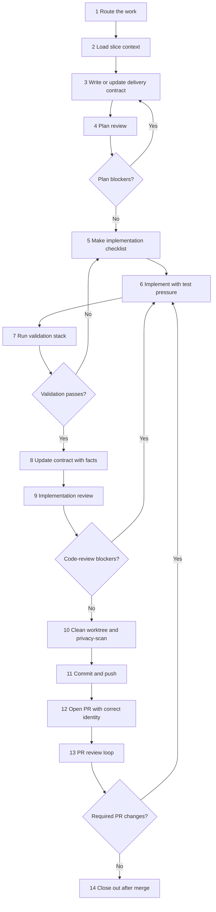

# SOP-1616: Contract-First Delivery Workflow

**Applies to:** All projects using the COR document system
**Last updated:** 2026-05-07
**Last reviewed:** 2026-05-07
**Status:** Active
**Related:** COR-1500 (TDD), COR-1602 (Multi-Model Parallel Review), COR-1612 (Respond To PR Review Comments), COR-1613 (Council Review), COR-1615 (GitHub App PR Review Bot Loop)
**Task tags:** [delivery, slice, contract, prp, chg, pln, plan-review, code-review, tdd, bdd, e2e, pr-review]
**Authored from:** BAB-1503-SOP-Phase-Delivery-Workflow

---

## What Is It?

A reusable, project-neutral loop for delivering a single reviewed slice of work: route the task, write a delivery contract before code, review the plan, implement under test pressure, run the project validation stack, run an implementation review, clean artifacts and privacy-sensitive output, publish a PR with the correct identity, and follow the PR review loop until merge.

The "contract" is whichever document the project uses to commit to scope and acceptance — a PRP, CHG, PLN, ADR, or a project-specific phase/roadmap document. The contract is the unit of review, and it is reviewed *before* implementation.

## Why

Skipping the early plan-review step makes blockers surface as code review or PR review findings, which forces rework. Writing and reviewing a contract first turns scope, acceptance, and validation expectations into something concrete that reviewers (human or LLM) can disagree with cheaply.

Without a standard loop, projects accumulate ad-hoc delivery patterns: PRs that merge without a current-head review, validation gates that get skipped silently, runtime artifacts that leak into commits, and PRs that publish under the wrong GitHub identity. This SOP is the project-neutral spine; project-specific SOPs adapt it by listing their own validation commands, review providers, and identity rules.

---

## When to Use

- Starting or continuing any non-trivial implementation slice that has scope, acceptance, and validation gates.
- Turning a discussion into a delivery contract (PRP/CHG/PLN/phase doc) and a PR.
- Preparing a PR that closes or materially advances a defined contract.
- Any work where "merging without a fresh plan and code review" would be the failure mode.

## When NOT to Use

- Tiny documentation edits with no scope or acceptance shift.
- Runtime incidents or regressions — route through the project's incident SOP.
- Pure evolve/compression cycles — route through the project's evolve SOP.
- Long-running validation harnesses that have their own dedicated SOP.
- Approved multi-phase continuous execution that crosses *several* PR slices under a single execution contract — use COR-1614 instead. COR-1616 is for delivering one reviewed slice; COR-1614 is for the meta-contract that authorizes the run of slices.
- Work in another repository.

---

## Prerequisites

- Read the project's `CLAUDE.md`, project routing SOP, and the relevant roadmap or phase document for the slice.
- For architecture-touching changes, read the affected ADRs before proposing alternatives.
- Run `af guide --root <repo>` and use `af plan` when the slice spans multiple SOPs.
- Confirm the project/user identity policy for GitHub-visible writes (which `gh` account publishes PRs, comments, and reviews). Do not publish under the wrong account.
- Apply the project's private-host/IP/token hygiene policy: no private hostnames, internal IPs, or secrets in public docs, commits, PR bodies, or review packets.

---

## Outputs

A completed delivery slice produces:

- an updated delivery contract (PRP/CHG/PLN/phase doc) with clear scope, acceptance, validation, and result
- implementation commits with focused tests
- local validation evidence captured in the contract
- plan-review and code-review records when required by the project
- a GitHub PR opened under the project's correct identity
- follow-up handling of PR review comments until merge or explicit defer

## Workflow Graph

The numbered steps below are authoritative; the graph is a quick visual map of the normal control flow and the two review loops.



## Steps

1. **Route the work.**
   Read the project routing SOP and identify whether the slice needs a new PRP, CHG, PLN, ADR, or fits an existing contract. Declare the active SOP before starting and at major transitions (per COR-1402).

2. **Load slice context.**
   Read the roadmap / phase document, relevant ADRs, recent discussion-tracker entries, and any prior contracts the slice continues. State the current objective, deferred items, and explicit out-of-scope items.

3. **Write or update the delivery contract before code.**
   For a new capability, draft/update a PRP. For a scoped change to accepted work, draft/update a CHG. For an internally-phased single slice (multiple steps inside one PR), use a PLN — note that a slice that *spans multiple PRs under one execution contract* is COR-1614 territory, not COR-1616. The contract must include:
   - what changes
   - why it matters now
   - impact and risk
   - implementation plan
   - test / BDD / coverage expectations
   - acceptance criteria
   - validation commands
   - out-of-scope / deferred items

4. **Review the plan before implementation.**
   Run a plan review on the contract or review packet *before* coding. Trinity multi-model review (COR-1602) is the recommended default when installed; otherwise use the project's configured review provider. Default reviewer set is project-defined; Council Review (COR-1613) is the heavier path for high-risk slices. Inspect raw outputs, not only the synthesis. Fix blockers in the contract and rerun until blockers are resolved.

5. **Make an implementation checklist.**
   Convert the accepted plan into a short task list. Identify the first RED tests or BDD scenarios before touching production code. For browser-driven slices, pick the browser harness mode per the project's policy (see "Browser-Harness BDD Policy" below) before running browser commands.

6. **Implement with test pressure.**
   Add or update tests first where practical, then implement narrowly. Follow COR-1500 (TDD) cadence. Stay inside existing repo patterns and ADR boundaries. Avoid unrelated refactors. Keep generated/runtime artifacts out of git.

7. **Run the project validation stack.**
   At minimum, run the commands the project defines for this slice — formatter, compiler/type-checker, unit tests, BDD, E2E, coverage gates where they apply, plus any phase- or scope-specific gates. Always include `af validate --root <repo>` for Alfred-managed document checks. The validation stack is project-specific; this SOP commits only to "run what the project declares; record real results."

   **Fallback when no validation stack is declared.** If the project has not declared any validation commands beyond `af validate`, treat that as a slice-blocking gap: record it in the contract before continuing, ask the operator to declare at least the minimum gates, and only proceed once the contract names the validation commands the slice will actually run. Do not silently fall through with `af validate` alone as the sole gate.

8. **Update the contract with facts.**
   Record real validation results, coverage percentages, skipped/deferred gates, and any deliberate deviations from the original plan. Do not mark the slice complete while required gates remain unrun, except where the operator has explicitly deferred a gate and the contract records the deferral.

9. **Run implementation review before PR.**
   Run a code review on the working tree or changed scope. Trinity multi-model code review (COR-1602) is the recommended default; for high-risk slices use COR-1613 Council Review. Fix blocking findings, rerun focused validation, and rerun review if the fix materially changes behavior. Advisory findings may be documented or deferred.

10. **Clean the worktree.**
    Before commit, check:
    - `git diff --check`
    - no private hostnames, internal IPs, or secrets via `rg`
    - no coverage directories, `__pycache__`, `.pyc`, `test-results`, or browser test reports
    - no runtime transcripts or session logs
    - `git status --short` contains only intended slice files

11. **Commit and push intentionally.**
    Use a terse commit message that names the slice or deliverable. Push the branch. If rebasing or force-pushing is needed, get explicit operator approval first.

12. **Open the PR with the correct identity.**
    Use `gh` authenticated under the project's declared identity. Confirm with `gh auth status` before creation. Do not use a GitHub connector for public mutations when it would publish under the wrong account. Create a non-draft PR when the operator asks for a real PR; otherwise follow their requested draft/non-draft state. The PR body must include summary, validation, deferred gates, and no private machine details.

13. **Handle PR review loops.**
    Follow `COR-1615` for the GitHub App PR review bot trigger/status/current-head loop, then use `COR-1612` for fetched review findings. For each review round, inspect comments, fix actionable blockers, rerun relevant validation, push, and keep monitoring until no new required changes remain or the operator pauses the loop. When actively monitoring an open PR, poll every few minutes rather than assuming silence means completion. After every push, resume monitoring the new head commit until reviews/checks settle.

14. **Close out after merge.**
    After the operator merges, pull the default branch, verify the local branch state, update trackers or contract docs if needed, and identify the next slice on the roadmap.

---

## Browser-Harness BDD Policy

For slices that exercise a browser, use two different connection modes deliberately:

- **Repeatable validation / CI-like BDD:** launch an isolated Chrome profile with a remote-debugging port, then run the BDD harness against that profile via a CDP URL. This avoids Chrome's per-attach remote-debugging popup and keeps automated validation independent from the operator's everyday browser session.

  ```bash
  /Applications/Google\ Chrome.app/Contents/MacOS/Google\ Chrome \
    --remote-debugging-port=9222 \
    --user-data-dir=/tmp/<project>-bdd-profile \
    --no-first-run \
    --no-default-browser-check

  # Project-specific env var (example): CDP_URL=http://127.0.0.1:9222
  CDP_URL=http://127.0.0.1:9222 <project bdd command>
  ```

- **Operator real-browser assistance:** using the operator's normal Chrome profile is acceptable for manual workflows where saved logins / extensions are needed. In this mode, `chrome://inspect/#remote-debugging` may be sticky per profile, but recent Chrome versions (observed on Chrome 144 and later) can still show the `Allow remote debugging?` popup on later attaches. Do not treat repeated popups as user error. If automation is blocked by that popup, record the exact failure in the contract's validation section and rerun with the isolated-profile mode when the BDD gate is required.

---

## Review Defaults

| Stage | Recommended default | Notes |
|-------|---------------------|-------|
| Plan review | Trinity multi-model fast-review (COR-1602) when installed; otherwise project-configured reviewer | Council Review (COR-1613) for high-risk slices. Inspect raw outputs. |
| Code review | Trinity multi-model fast-review (COR-1602) when installed; otherwise project-configured reviewer | Council Review (COR-1613) for high-risk slices. Fix blockers before PR. |
| GitHub PR review | `COR-1615` bot loop, then `COR-1612` findings loop | Continue fixing/pushing until no new required changes remain. |

"Recommended default" means: if Trinity is installed and configured, prefer it; if not, the project's existing review path stands in. This SOP does not require Trinity.

---

## PR Safety Rules

- GitHub-visible writes must publish under the project's declared identity. Verify with `gh auth status` before creating PRs, comments, or reviews.
- Do not use a GitHub connector for public mutations when it would publish under the wrong account.
- Public docs and PR bodies must not include private hostnames, internal IPs, or operator-specific secrets. Use placeholder values (e.g., `100.x.y.z`, `0.0.0.0`) or describe the env var that holds the real value.
- Runtime transcripts, generated coverage, caches, and browser test artifacts are not review artifacts unless the contract explicitly says otherwise.
- Existing user changes must not be reverted unless the operator explicitly asks.

---

## Pitfalls

Common failure modes when running this loop:

- **Non-converging plan review.** Plan-review cycles past three rounds usually mean the contract is the wrong shape (scope too broad, acceptance unclear), not that reviewers are picky. Stop, reset the contract, and consider escalating to Council Review (COR-1613) instead of more parallel-review rounds.
- **Silent gate skipping.** Treating Step 7 as "run whatever's easy" instead of the project's declared validation stack lets gaps merge. Step 7's fallback rule (record undeclared validation as a slice-blocking gap) is mandatory, not advisory.
- **Wrong-identity PR.** A connector or a stale `gh` login can publish under the wrong account. Always run `gh auth status` *before* PR creation, not after.
- **Stale review on new head.** Pushing a fix and assuming the prior review still applies. Per Step 13, every push restarts the PR-review-loop monitoring on the new head commit.
- **Cleanup-after-commit.** Running Step 10 (worktree clean / privacy scan) *after* `git commit` instead of before guarantees you'll commit at least one round of leaks. The order in this SOP is deliberate: scan, then commit.
- **Half-diagnosed fixes during PR review loop.** Patching one symptom of a reviewer's finding without addressing the root cause invites the same finding on the next round. If a reviewer flag does not have a known root cause, route through COR-1503 (Diagnose Feedback Loop) before continuing this SOP.

---

## Examples

### Example 1 — New capability slice

1. Read the project routing SOP and the roadmap entry; identify that a new PRP is needed.
2. Draft the PRP with scope, acceptance, validation commands, and out-of-scope items.
3. Run plan review (Trinity fast-review or project-configured reviewer); resolve blockers in the PRP.
4. Add RED tests, implement narrowly, run the project validation stack, record results in the PRP.
5. Run code review, fix blockers, then create the PR under the correct identity and follow the PR review loop until merge.

### Example 2 — Hardening change after implementation

1. Create a CHG that records the current gap as RED evidence.
2. Review the CHG with the project's plan-review path before code.
3. Add the missing test tier or coverage gate, implement the refactor, and record exact validation results in the CHG.
4. Open the PR only after local validation and code review pass.

### Example 3 — Project adapter SOP

A project can keep a thin adapter SOP that inherits this COR SOP and adds:

- the project's specific validation commands (e.g., the project's test runner, type checker, formatter — concrete commands like `pytest`, `npm run test`, `mix test` are illustrative only)
- the project's GitHub identity rule (which `gh` account publishes)
- the project's roadmap / phase document identifier (whatever ID the project assigns its main roadmap or phase tracker)
- any project-specific gates (e.g., a custom build target, coverage threshold check, or release gate that only that project defines)

The adapter declares "Inherits from: COR-1616" in its metadata and only overrides what is genuinely project-specific. Concrete adopter SOPs are listed in this SOP's Change History or `Authored from:` provenance, not in its body, so the body stays project-neutral.

---

## Change History

| Date | Change | By |
|------|--------|----|
| 2026-05-07 | Initial version — promoted from BAB-1503 (Babs phase delivery workflow) into a project-neutral SOP per issue #106 | Claude Code |
| 2026-05-07 | Trinity review round 1: Gemini 10.0 PASS, GLM 9.05 PASS, Codex 9.20 CONCERNS (1 blocking), DeepSeek 9.00 PASS. Fix Codex blocker (de-Babs Example 3: drop literal `BAB-2300`/`FXA-21xx`/`babs.gate_a`); fix convergent advisory (Step 7 fallback when no validation stack declared); fold in Pitfalls section, COR-1614 boundary line, Chrome-version softening | Claude Code |
| 2026-05-07 | Trinity review round 2: Gemini 9.35 PASS, GLM 9.28 PASS, Codex 9.70 PASS, DeepSeek 9.45 PASS — all four reviewers PASS, zero blocking. Fix 2/4-convergent advisory (Gemini + DeepSeek): drop self-referential `BAB-1503` parenthetical from Example 3 line 238. Fix single-reviewer ambiguity (Gemini): clarify Step 3 PLN guidance vs. COR-1614 multi-PR territory | Claude Code |
