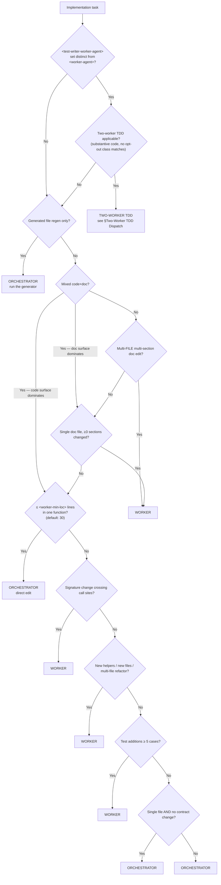

# SOP-1619: Orchestrator vs Worker Dispatch

**Applies to:** All projects adopting COR-1617 with a coding-worker layer
**Last updated:** 2026-05-17
**Last reviewed:** 2026-05-17
**Status:** Active
**Related:** COR-1617 (umbrella), COR-1622 (parameter schema — `<worker-agent>`, `<worker-min-loc>`)

---

## What Is It?

The decision tree that decides whether the orchestrator implements a change directly (in-context edit) or dispatches to `<worker-agent>` (sub-agent or external CLI). Plus the contract the orchestrator MUST honor when constructing a worker dispatch prompt.

The two lanes are not interchangeable. Orchestrator-direct is fast and keeps context coherent for downstream phases (panel-review, triage). Worker dispatch buys parallelism and isolates large diffs from the orchestrator's context window, but pays a per-call latency tax and requires explicit verification of every worker claim.

---

## Why

Two failure modes:

1. **Wrong dispatch lane** — orchestrator hand-edits a 200-line refactor that should go to a worker, exhausts its context window, and panel-review prompts get truncated. Or: a 2-line typo fix round-trips through `<worker-agent>` for ~30–90 s + a worker-side context window, for no gain.
2. **Trust-but-don't-verify** — accepting "tests green" / "lint clean" from a worker without re-running locally; subtle errors (regex flag mismatches, off-by-one, wrong constant) ship to PR review.

The decision tree forces the call before dispatch; the worker contract makes verification non-optional.

---

## When to Use

- Any time a CHG (per COR-1104) is approved and implementation is about to start.
- Any time mid-PR a new change scope appears and the orchestrator must decide direct-vs-dispatch.

## When NOT to Use

- Generated-file regeneration (`make build`, `af index`). The generator is the implementation; no dispatch decision needed.
- Investigations that may or may not require code. Orchestrator first; promote to worker only if the diagnosis grows into a real change.

---

## Decision Tree



The `<worker-min-loc>` parameter (default 30) sets the LoC threshold for the single-function trivial-fix branch — at or below this line count, the orchestrator edits directly; above, dispatch to `<worker-agent>`. Projects with different worker latency profiles tune this value. The structural questions (signature crossing, multi-file, multi-section doc, test count) are NOT LoC-bounded — they dispatch to the worker regardless of `<worker-min-loc>`.

### Edge cases not in the tree

- **Symbol rename across N files** → WORKER (even if each per-file change is small; the conceptual change crosses files).
- **Coordinated edit to one section + one test** → ORCHESTRATOR (still single conceptual change).
- **5+ small fixes from a bot batch** → ORCHESTRATOR, sequentially. Don't dispatch a worker for a list of grep-and-replaces.
- **Investigation that may or may not require code** → ORCHESTRATOR first; promote to worker only if the diagnosis grows.

---

## Worker Dispatch Contract

When dispatching to `<worker-agent>`, the prompt MUST include all of the following. Omitting any item is a guard-rail violation.

| Item | Value |
|------|-------|
| Spec pointer | The CHG path (e.g. `rules/<PRJ>-<ACID>-CHG-*.md`). Do NOT inline the spec body — the worker reads the file. |
| Implementation order | Verbatim from the CHG's `## Implementation Order` section. |
| Verification commands | Exact commands the worker MUST run before reporting done. Examples: `pytest`, `ruff check`, `ruff format --check`, project-specific verifiers, `af validate --root .`. Repo-relative paths so the prompt is portable across clones. |
| Push/commit constraint | "Do NOT push or commit. Report files modified; orchestrator stages and commits." |
| Structured report request | Files modified; helpers added with `file:line`; modified signatures; test count + new test names; verification outputs (last 5 lines of each); ambiguities resolved with the resolution chosen. |

The worker's report is a *claim*, not proof. The orchestrator MUST re-run the verification commands locally before staging — see §Verification.

---

## Two-Worker TDD Dispatch

When COR-1500 §Phase 1's "Worker assignment" rule applies (substantive code change, `<test-writer-worker-agent>` set distinct from `<worker-agent>`, no opt-out class matching), the orchestrator runs the following handoff contract instead of a single worker dispatch:

1. **Dispatch test-writer worker** (`<test-writer-worker-agent>`) with the COR-1619 §Worker Dispatch Contract items, plus:
   - Spec pointer: the CHG/PRP path.
   - Output constraint: failing tests only — NO implementation, NO stubs in production source.
   - Verification commands: `<test-runner> <test-paths>` MUST report failures (RED).
   - Push/commit constraint: do NOT push or commit; report files modified.
   - *Enforcement note:* the push/commit constraint is orchestrator-trust-based; the dispatch backend may not enforce read-only mounts or commit-blocking flags. Orchestrator detects violations post-dispatch by comparing the worker's reported file list against `git status --porcelain` after the dispatch returns (since both workers commit through the orchestrator's identity, `git log --author=` does not differentiate them). **On detection of a violation** (worker modified production source files outside the reported list, OR reported a production-source edit, OR wrote files outside the test paths): orchestrator runs `git restore` on **every modified path outside the approved test paths** — whether or not it appeared in the worker's reported list, since a reported production-source edit is itself a violation of the RED-phase output constraint — surfaces the violation in the dispatch log + CHG `## Implementation Order`, and re-dispatches the test-writer with the violation as explicit feedback. Repeated violations (≥2 from the same worker on the same task) escalate per step 2's retry cap.
2. **Orchestrator verifies** the tests fail on current HEAD by re-running `<test-runner>`. If any new test passes (i.e., the test does not actually fail on the un-implemented code), reject the test-writer's work and re-dispatch with the specific failing assertion as feedback. **Maximum 2 re-dispatches** of the test-writer per task; on the third failed attempt, escalate: the orchestrator either authors the test inline (only if the test fits the ≤ `<worker-min-loc>` single-function rule per COR-1619) or routes back to plan-review with a spec-ambiguity finding.
3. **Orchestrator commits** the test files with prefix `test:` per COR-1500 §Commit Strategy Option A.
4. **Dispatch implementer worker** (`<worker-agent>`) with the COR-1619 §Worker Dispatch Contract items, plus:
   - Spec pointer: the CHG/PRP path PLUS the failing-test commit SHA (so the implementer can `git show` the tests).
   - Reading constraint: do NOT read the test-writer's structured report or any worker-output channel; the failing tests, CHG/PRP body, and existing production source are the only inputs.
   - **Test-file edit constraint**: the implementer MUST NOT modify, delete, weaken, or skip any test file the test-writer committed in step 3. The implementer MAY add NEW test files (different paths from the test-writer's commit) that exercise the implementation's internal scaffolding, but these new tests are advisory and do NOT replace the test-writer's tests as the cross-validation surface. If the implementer believes a test-writer test is incorrect, the implementer reports the issue in its structured output and the orchestrator routes to step 2's escalation (re-dispatch test-writer or plan-review spec-ambiguity) — the implementer does not unilaterally fix it.
   - Verification commands: `<test-runner>` MUST report all green (including tests the test-writer added — verify they are present and passing, not removed or skipped).
   - *Enforcement note:* orchestrator runs `git diff <test-writer-commit> -- <test-writer-paths>` (where `<test-writer-paths>` is the exact file list the test-writer committed in step 3, not a broader glob) after the implementer's dispatch returns; any non-empty diff on those specific paths fires the test-file edit constraint violation handling (`git restore <test-writer-paths>` to the test-writer commit, surface the violation, re-dispatch implementer with the violation as explicit feedback). Implementer-added test files at OTHER paths are NOT subject to the diff check — they are advisory and stay on the branch.
5. **Orchestrator verifies** all tests pass by re-running `<test-runner>` plus the standard verification gates (`<linter>`, `<formatter> --check`, `af validate --root .`). Triage of any failures:
   - Test added by test-writer fails on implementer's commit → re-dispatch implementer with the specific failing test name. Same 2-retry cap as step 2; on third failure, escalate to plan-review for spec ambiguity.
   - Test in an unrelated module fails (regression in pre-existing code) → orchestrator triages per COR-1621: if scope is single-function and within `<worker-min-loc>`, orchestrator fixes inline; otherwise re-dispatch implementer with the regressed test paths added to the spec pointer. Do NOT silently skip / xfail the regression.
6. **Orchestrator commits** the implementation with prefix `feat:` / `fix:` per COR-1500 §Commit Strategy Option A.
7. **Refactor pass** (Phase 3 of COR-1500): the **implementer worker** runs the refactor by default per §Decisions item 2; the orchestrator may substitute only when the post-refactor diff fits the ≤ `<worker-min-loc>` single-function rule per COR-1619. The test-writer does NOT run the refactor in v1 (this preserves test-writer independence for the next cycle: the test-writer never sees the GREEN implementation, keeping its edge-case-probing posture for future tasks on the same module). During refactor only, the **reading constraint** of step 4 is lifted — the refactorer MAY read any artifact produced in this dispatch (tests, implementation, commentary), since the cross-validation served its purpose at GREEN. The **test-file edit constraint** of step 4 persists with a narrow carve-out: the refactorer MAY reorganise test structure (rename helpers, extract fixtures, reorder imports) but MUST NOT (a) weaken, remove, or skip any assertion from the test-writer's tests, (b) move tests between files (file-path changes alter test node IDs, which break the test-name-set check below and hide weakening behind movement), or (c) rename test functions in ways that change tested semantics.

   **Enforcement is two-tier, because semantic weakening cannot be reliably detected by automation:**
   - *Tier 1 (automated, fast)*: orchestrator runs `<test-runner>` with `--collect-only` (or equivalent) before and after the refactor and compares the test-name-set (qualified `file::class::test_name` IDs). Any removed test name, any test-name-set difference at all (additions OR removals), and any reduction in pass-count fires the violation handler immediately: revert refactor, re-dispatch implementer with explicit feedback. This catches removed tests, moved tests (file-path changes), and renamed tests — but does NOT catch in-place assertion weakening (same test name, same pass count, weakened assertion still passes).
   - *Tier 2 (human review, surfaced in PR body)*: orchestrator emits the per-file diff under `<test-writer-paths>` in the CHG `## Implementation Order` AND in the PR body under a `### Refactor test-file changes` heading. The plan-review panel and code-review bot are explicitly asked to scan this diff for assertion weakening. This is a documented enforcement gap: in-place assertion weakening is detectable only by reading the diff, not by running tests. The PR is gated on Tier 2 reviewer attention; CHGs SHOULD NOT merge with Tier 1 green if Tier 2 review was skipped.

   Subsequent cycles re-apply the test-writer/implementer separation from step 1.
8. **Phase 8 (Iterate) re-dispatch routing.** When COR-1617 §Phase 8 surfaces a new finding requiring code (bot review comment, CI failure, panel finding), the orchestrator decides between four mutually exclusive cases:
   - **(a) New test+implementation pair needed** (e.g., reviewer asks "add a test for the empty-input edge case and handle it") → re-enter this contract from step 1 with the new scope. Test-writer authors the new failing test; orchestrator commits it per step 3 with `test:` prefix. Orchestrator runs `<test-runner>` locally on the just-committed test; **if the test fails** (expected RED — the implementation does not yet cover the requested behaviour), continue to step 4 to dispatch implementer (which produces a `feat:`/`fix:` commit per step 6); **if the test unexpectedly passes** (the existing implementation already covers the requested behaviour, so the new test is additive coverage rather than a new behavioural constraint), skip implementer dispatch entirely — the test-writer's step-3 `test:` commit is the final commit for this iteration, no implementation commit is produced, and the iteration is done. This local-run gate exists because additive-coverage requests are common in PR review and forcing a redundant implementer round-trip burns latency and risks hallucinated changes.
   - **(b) Implementation-only fix to satisfy existing tests** (e.g., CI failure on a test the test-writer already authored; reviewer asks to fix a regression flagged by an existing test) → if the fix scope is ≤ `<worker-min-loc>` lines in a single function per COR-1619's single-function rule, the orchestrator handles inline (no worker dispatch); otherwise dispatch implementer worker only, with the failing test name as feedback. No new test authorship, so no test-writer dispatch. This matches step 5's precedent (small-scope regression fix routes through the orchestrator; larger fixes route through the implementer).
   - **(c) Test-only edit to existing tests** (e.g., reviewer asks to tighten an assertion) → dispatch `<test-writer-worker-agent>` to author the edit. Orchestrator commits the edit per step 3 with `test:` prefix. Orchestrator runs `<test-runner>` locally on the just-committed test; **if the test fails on the current implementation** (the tightening surfaces a real defect or imposes a new constraint), dispatch implementer per step 4 (which produces a `feat:`/`fix:` commit per step 6); **if the test still passes** (the edit is a clarification or additive assertion that current code already satisfies), skip implementer dispatch — the test-writer's step-3 `test:` commit is the final commit for this iteration, no implementation commit is produced, and the iteration is done.
   - **(d) Documentation / comment / config-only fix** → orchestrator handles directly per COR-1619's existing tree (no worker dispatch needed).
   Each iteration round is logged in the CHG `## Implementation Order` with the case (a/b/c/d) selected, the local-run gate outcome (for a/c), the orchestrator-inline-vs-worker decision (for b), and the rationale. Cases (a) and (c) re-apply the §Worker assignment rule for the test-writer; the implementer is dispatched only when the local-run gate confirms a real failure. Case (b) is a degenerate single-worker dispatch when above the inline threshold, or orchestrator-direct when below. Case (d) bypasses worker dispatch entirely.

**Worker unavailability fallback.** Two symmetric branches per COR-1622 §Resilience retry policy when `<cli-retry-on-failure>` is `mark-non-viable`:

- **Test-writer outage** (`<test-writer-worker-agent>` CLI fails before step 3 commits): orchestrator authors the tests inline (effectively `test-writer = orchestrator` for this dispatch) if the test surface fits the ≤ `<worker-min-loc>` single-function rule per COR-1619; otherwise the dispatch is paused, the orchestrator surfaces the outage in the CHG `## Implementation Order`, and the loop arms a 1800 s wake per COR-1620 to retry the worker.
- **Implementer outage** (`<worker-agent>` CLI fails after step 3 commits the test-writer's tests but before step 6): the test-writer's failing-test commit stays on the branch (it is already pushed in the orchestrator-commits-after-step-3 path; or held locally if not yet pushed — orchestrator records which case applies). Orchestrator falls back to authoring the implementation inline only if the implementation surface fits the ≤ `<worker-min-loc>` single-function rule per COR-1619; otherwise the dispatch is paused, the test-writer's commit remains (do NOT revert it — it is already validated cross-spec by the test-writer), the orchestrator surfaces the outage, and the loop arms a 1800 s wake per COR-1620 to retry the worker. **Refactor-phase outage** (both workers fail at step 7): orchestrator runs the refactor inline if the diff fits the ≤ `<worker-min-loc>` rule; otherwise the refactor is deferred to a follow-up CHG (the GREEN implementation already shipped a passing test suite).

All fallbacks MUST be recorded in the CHG `## Implementation Order` section and surfaced in the PR body. Falling back does NOT alter the §Worker assignment rule for future dispatches.

**Cost note.** Two-worker dispatch roughly doubles per-task worker latency and token cost vs single-worker (one test-writer round-trip + one implementer round-trip in series, vs one combined round-trip). The PRP §Validation plan tracks defect-density and panel-review findings vs the single-worker baseline; if no measurable benefit appears after the first three two-worker dispatches, the default is revisited per a follow-up CHG.

---

## Verification (post-dispatch and post-direct-edit)

The same verification applies whether the diff came from `<worker-agent>` or the orchestrator's own direct edits — the dispatch lane does not change the trust model:

```bash
grep -n "<each-helper-name>" <changed-files>     # symbols exist
<test-runner> <changed-paths>                    # all green
<linter> <changed-paths>                         # clean
<formatter> --check <changed-paths>              # clean
af validate --root .                             # repo-relative; works on any clone
```

Spot-check one or two key invariants from the CHG by reading code (regex flags, constants, error-handler exception lists). The worker says "done"; the orchestrator verifies "done."

If any check fails, fix locally before push (or re-dispatch worker for substantial gaps).

---

## Guard Rails

- Never trust worker claims without spot-checking. The worker reports; the orchestrator verifies.
- Never inline the CHG body in a worker prompt. Pass the path; the worker reads the file.
- Never skip the push/commit constraint in the dispatch prompt. The orchestrator stages and commits; the worker reports modifications.
- Never dispatch a worker for a 2-line typo fix. The latency tax is pure loss.
- Never hand-edit a multi-file refactor in the orchestrator. Context window cost compounds across downstream phases.

---

## Examples

| Change | Lane | Why |
|--------|------|-----|
| Fix a missing import | ORCHESTRATOR | ≤ 2 lines, one function |
| Rename a function across 8 call sites | WORKER | Signature change crossing call sites |
| Add a new helper module + 12 tests | WORKER | New file + ≥ 5 tests |
| Edit one section of a SOP | ORCHESTRATOR | Single doc, single section |
| Edit 4 sections of a SOP | WORKER | Single doc, ≥ 3 sections |
| Apply 6 grep-and-replace fixes from a bot batch | ORCHESTRATOR | Sequential small fixes; worker latency wastes time |
| Investigate a failing test | ORCHESTRATOR | Investigation; promote to worker only if a real change emerges |

---

## Change History

| Date | Change | By |
|------|--------|----|
| 2026-05-09 | Initial version — extracted from TRN-1008 §5 + §6 for COR-1617 cluster promotion (alfred#115) | Claude Opus 4.7 |
| 2026-05-09 | R2: tree node C parameterized as `≤ <worker-min-loc> lines` (was hardcoded `≤ 2 lines`); prose tightened to scope `<worker-min-loc>` to the single-function trivial-fix branch only — per deepseek R1 P1 (tree-vs-prose contradiction) + glm R1 advisory convergent | Claude Opus 4.7 |
| 2026-05-17 | FXA-2289 (CHG-C1 of PRP-1507): inserted §Two-Worker TDD Dispatch sub-section between §Worker Dispatch Contract and §Verification — 8-step handoff contract, symmetric worker-unavailability fallback (test-writer / implementer / refactor outage), cost note. FXA-2290 (CHG-C2 of PRP-1507): patched §Decision Tree mermaid block to insert `P` (`<test-writer-worker-agent>` set distinct?) and `TW` (Two-worker TDD applicable?) gating nodes ahead of `B`; existing chain from `MIX` onward preserved verbatim. Two CHGs bundled in PR closing issue #175. | Claude Opus 4.7 |
| 2026-05-17 | FXA-2289 R2 (PR #177 codex bot P2): step 1 enforcement note's `git restore` recovery scope broadened from "off-list paths" to "every modified path outside the approved test paths" — covers the case where a worker *reports* a production-source edit (in-list but outside test paths). Refinement of PRP-1507 §Proposed Solution line 104 verbatim text; PRP source has the same gap and will be amended by a separate cleanup CHG. | Claude Opus 4.7 |
