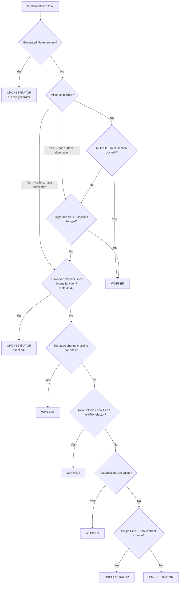

# SOP-1619: Orchestrator vs Worker Dispatch

**Applies to:** All projects adopting COR-1617 with a coding-worker layer
**Last updated:** 2026-05-09
**Last reviewed:** 2026-05-09
**Status:** Active
**Related:** COR-1617 (umbrella), COR-1622 (parameter schema — `<worker-agent>`, `<worker-min-loc>`)

---

## What Is It?

The decision tree that decides whether the orchestrator implements a change directly (in-context edit) or dispatches to `<worker-agent>` (sub-agent or external CLI). Plus the contract the orchestrator MUST honor when constructing a worker dispatch prompt.

The two lanes are not interchangeable. Orchestrator-direct is fast and keeps context coherent for downstream phases (panel-review, triage). Worker dispatch buys parallelism and isolates large diffs from the orchestrator's context window, but pays a per-call latency tax and requires explicit verification of every worker claim.

---

## Why

Two failure modes:

1. **Wrong dispatch lane** — orchestrator hand-edits a 200-line refactor that should go to a worker, exhausts its context window, and panel-review prompts get truncated. Or: a 2-line typo fix round-trips through `<worker-agent>` for ~30–90 s + a worker-side context window, for no gain.
2. **Trust-but-don't-verify** — accepting "tests green" / "lint clean" from a worker without re-running locally; subtle errors (regex flag mismatches, off-by-one, wrong constant) ship to PR review.

The decision tree forces the call before dispatch; the worker contract makes verification non-optional.

---

## When to Use

- Any time a CHG (per COR-1104) is approved and implementation is about to start.
- Any time mid-PR a new change scope appears and the orchestrator must decide direct-vs-dispatch.

## When NOT to Use

- Generated-file regeneration (`make build`, `af index`). The generator is the implementation; no dispatch decision needed.
- Investigations that may or may not require code. Orchestrator first; promote to worker only if the diagnosis grows into a real change.

---

## Decision Tree



The `<worker-min-loc>` parameter (default 30) sets the LoC threshold for the single-function trivial-fix branch — at or below this line count, the orchestrator edits directly; above, dispatch to `<worker-agent>`. Projects with different worker latency profiles tune this value. The structural questions (signature crossing, multi-file, multi-section doc, test count) are NOT LoC-bounded — they dispatch to the worker regardless of `<worker-min-loc>`.

### Edge cases not in the tree

- **Symbol rename across N files** → WORKER (even if each per-file change is small; the conceptual change crosses files).
- **Coordinated edit to one section + one test** → ORCHESTRATOR (still single conceptual change).
- **5+ small fixes from a bot batch** → ORCHESTRATOR, sequentially. Don't dispatch a worker for a list of grep-and-replaces.
- **Investigation that may or may not require code** → ORCHESTRATOR first; promote to worker only if the diagnosis grows.

---

## Worker Dispatch Contract

When dispatching to `<worker-agent>`, the prompt MUST include all of the following. Omitting any item is a guard-rail violation.

| Item | Value |
|------|-------|
| Spec pointer | The CHG path (e.g. `rules/<PRJ>-<ACID>-CHG-*.md`). Do NOT inline the spec body — the worker reads the file. |
| Implementation order | Verbatim from the CHG's `## Implementation Order` section. |
| Verification commands | Exact commands the worker MUST run before reporting done. Examples: `pytest`, `ruff check`, `ruff format --check`, project-specific verifiers, `af validate --root .`. Repo-relative paths so the prompt is portable across clones. |
| Push/commit constraint | "Do NOT push or commit. Report files modified; orchestrator stages and commits." |
| Structured report request | Files modified; helpers added with `file:line`; modified signatures; test count + new test names; verification outputs (last 5 lines of each); ambiguities resolved with the resolution chosen. |

The worker's report is a *claim*, not proof. The orchestrator MUST re-run the verification commands locally before staging — see §Verification.

---

## Verification (post-dispatch and post-direct-edit)

The same verification applies whether the diff came from `<worker-agent>` or the orchestrator's own direct edits — the dispatch lane does not change the trust model:

```bash
grep -n "<each-helper-name>" <changed-files>     # symbols exist
<test-runner> <changed-paths>                    # all green
<linter> <changed-paths>                         # clean
<formatter> --check <changed-paths>              # clean
af validate --root .                             # repo-relative; works on any clone
```

Spot-check one or two key invariants from the CHG by reading code (regex flags, constants, error-handler exception lists). The worker says "done"; the orchestrator verifies "done."

If any check fails, fix locally before push (or re-dispatch worker for substantial gaps).

---

## Guard Rails

- Never trust worker claims without spot-checking. The worker reports; the orchestrator verifies.
- Never inline the CHG body in a worker prompt. Pass the path; the worker reads the file.
- Never skip the push/commit constraint in the dispatch prompt. The orchestrator stages and commits; the worker reports modifications.
- Never dispatch a worker for a 2-line typo fix. The latency tax is pure loss.
- Never hand-edit a multi-file refactor in the orchestrator. Context window cost compounds across downstream phases.

---

## Examples

| Change | Lane | Why |
|--------|------|-----|
| Fix a missing import | ORCHESTRATOR | ≤ 2 lines, one function |
| Rename a function across 8 call sites | WORKER | Signature change crossing call sites |
| Add a new helper module + 12 tests | WORKER | New file + ≥ 5 tests |
| Edit one section of a SOP | ORCHESTRATOR | Single doc, single section |
| Edit 4 sections of a SOP | WORKER | Single doc, ≥ 3 sections |
| Apply 6 grep-and-replace fixes from a bot batch | ORCHESTRATOR | Sequential small fixes; worker latency wastes time |
| Investigate a failing test | ORCHESTRATOR | Investigation; promote to worker only if a real change emerges |

---

## Change History

| Date | Change | By |
|------|--------|----|
| 2026-05-09 | Initial version — extracted from TRN-1008 §5 + §6 for COR-1617 cluster promotion (alfred#115) | Claude Opus 4.7 |
| 2026-05-09 | R2: tree node C parameterized as `≤ <worker-min-loc> lines` (was hardcoded `≤ 2 lines`); prose tightened to scope `<worker-min-loc>` to the single-function trivial-fix branch only — per deepseek R1 P1 (tree-vs-prose contradiction) + glm R1 advisory convergent | Claude Opus 4.7 |
