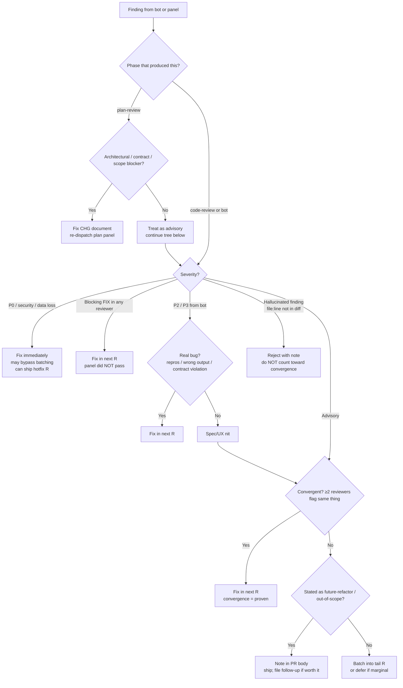

# SOP-1621: Multi-Reviewer Triage and Severity

**Applies to:** All projects adopting COR-1617; usable standalone wherever multiple reviewers (panel + bot) produce findings on the same artifact
**Last updated:** 2026-05-09
**Last reviewed:** 2026-05-09
**Status:** Active
**Related:** COR-1602 (Multi Model Parallel Review — composes), COR-1615 (GitHub App PR Review Bot Loop — feeds), COR-1617 (umbrella; phase 9), COR-1622 (parameter schema — `<panel-providers>`, `<panel-pass-threshold>`)
**Disposition:** inherit-only

---

## What Is It?

The triage tree applied to every finding produced by a panel-review (per COR-1602) or a PR-review bot (per COR-1615), plus the severity vocabulary (P0–P3) used to decide whether to fix immediately, fix in the next round, batch, or defer.

The tree's job is to convert heterogeneous findings (architectural blockers, P0 security issues, single-reviewer style nits, hallucinated file:line references) into a small set of next-round actions.

---

## Why

Three failure modes when triage is improvised:

1. **Accept 3-of-N PASS as good enough** — the dissenter caught a real bug that ships anyway. Convergence is the correctness signal; a single dissent on a fundamental issue is not noise.
2. **Treat advisories like blockers** — every panel round becomes a polish-fest; PRs balloon to 30+ rounds without addressing the original spec. The convergence rule below cuts this.
3. **Trust hallucinated findings** — a reviewer references a `file:line` that doesn't exist in the diff. Counting that toward "convergent advisories" inflates round count and erodes trust in the panel.

---

## When to Use

- Every plan-review round (per COR-1617 §4) and code-review round (§8).
- Every bot-review round (§8 iterate); bot findings feed the same tree.
- Post-handoff rejections by the user — triage tree treats the rejection as a new finding.

## When NOT to Use

- Self-review (no panel, no bot). Severity vocabulary may still help the orchestrator prioritize self-noted improvements but the convergence rule does not apply.

---

## Triage tree

---

## Severity vocabulary

| Severity | Examples | Action |
|----------|----------|--------|
| **P0** | Security hole, data loss, credential leak, `rm -rf` risk, broken auth | Fix immediately; may bypass batching; hotfix R if PR already merged |
| **P1** | Correctness regression, contract widening, broken test, panel-blocking FIX | Fix in next R |
| **P2** | UX nit, missing error message, poor log line | Batch into tail R |
| **P3** | Cosmetic, naming preference, doc polish | Optional / defer |

---

## Convergence rule

**Definition**: a finding is *convergent* when ≥ 2 reviewers (across panel + bot) flag the same thing in the same round.

- Convergent advisory → fix in next R (treat as proven).
- Single-reviewer advisory → batch into tail R or defer (per the tree).
- Single-reviewer **blocker** (P0/P1) → fix in next R (severity overrides convergence).

The rule prevents two opposite failure modes: ignoring a dissenter on a P0 issue, and chasing every individual nit into a 30-round PR.

---

## Hallucinated-finding rejection

A finding that references a `file:line`, function name, or symbol not present in the diff (or not present in the repo at all) is **rejected with a note** and does NOT count toward convergence. Examples:

- "The new `parse_token` helper at `src/auth.py:142` lacks input validation" — but no `parse_token` was added in this PR.
- "Line 89 of `tests/test_foo.py` is duplicated below at line 145" — but the file is 60 lines long.

The orchestrator records the rejection in the triage notes (so the convergence count stays honest) and surfaces the pattern if a single reviewer hallucinates repeatedly across rounds.

---

## Re-dispatching the panel

Re-dispatch the panel only when **blockers** (or convergent advisories) were addressed. Pure single-advisory polish does not need re-scoring — the prior gate stands. This prevents the panel from being burned on rounds that don't materially change the artifact.

When re-dispatching after fixes:

- Plan-review: re-run all `<panel-providers>` in parallel; gate per COR-1617 §4 (`all-individual ≥ <panel-pass-threshold>` AND `blocking == []`).
- Code-review: same gate; head-SHA-anchored bot polling per COR-1615.

---

## Worked example (PR #69 R3 → R4 triage)

| Finding | Reviewer(s) | Severity | Decision |
|---------|-------------|----------|----------|
| `results.index(result)` fragile | codex + glm + deepseek | Convergent advisory | Fix R4 |
| Surface 3 doc gap (3 of 6 providers miss section) | codex + deepseek | Convergent advisory | Fix R4 |
| `_render_findings_for` duplicate logic | deepseek | Single advisory | Fix R4 (compression boost) |
| Multi-provider all-legacy snapshot test | deepseek | Single advisory | Fix R4 |
| `task_type` case normalization | deepseek | Single advisory | Fix R4 |
| Future write_synthesis refactor | deepseek | Future-refactor | Note in PR body, ship |

Most single advisories above were also fixed because R3 was running with margin and the diffs were trivial; the rule does not forbid fixing single advisories — it forbids *requiring* their fix to pass the gate.

---

## Guard Rails

- Never accept 3-of-N PASS as gate-met when the dissenter raises a blocker. The dissent may be the truth.
- Never count a hallucinated finding toward convergence. Reject with note; surface the pattern if recurring.
- Never re-dispatch a full panel for pure cosmetic polish. The prior gate stands.
- Never batch a P0 finding. Hotfix or in-line fix; severity overrides.

---

## Change History

| Date | Change | By |
|------|--------|----|
| 2026-05-09 | Initial version — extracted from TRN-1008 §9 for COR-1617 cluster promotion (alfred#115) | Claude Opus 4.7 |
